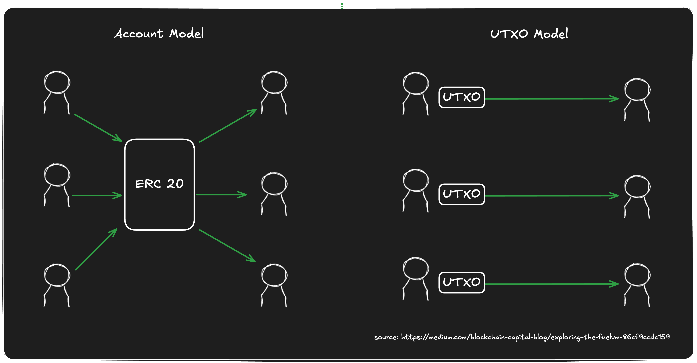
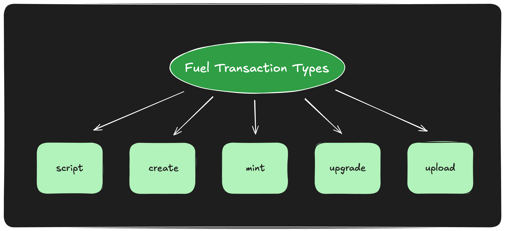
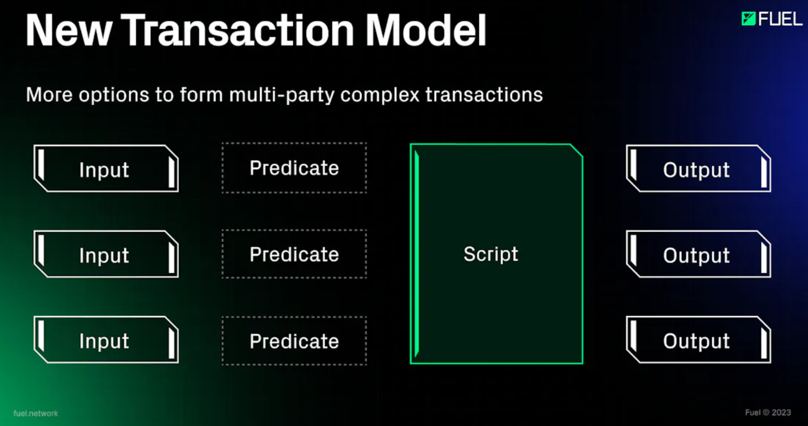
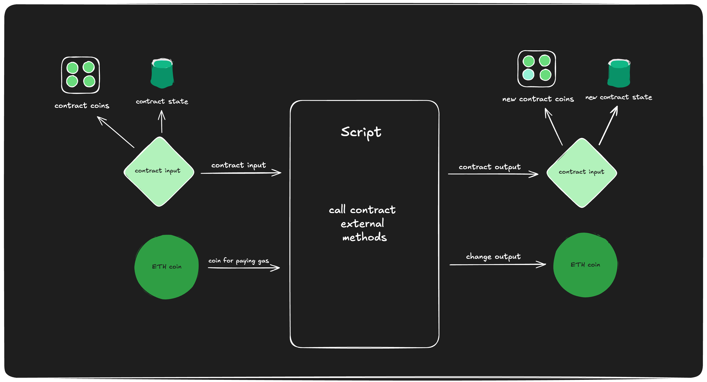
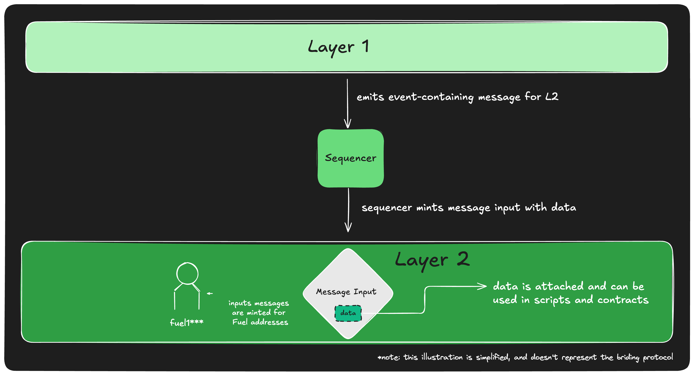
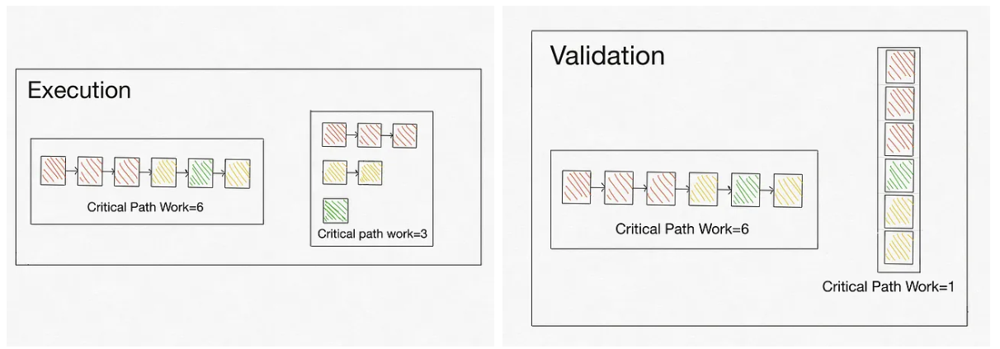
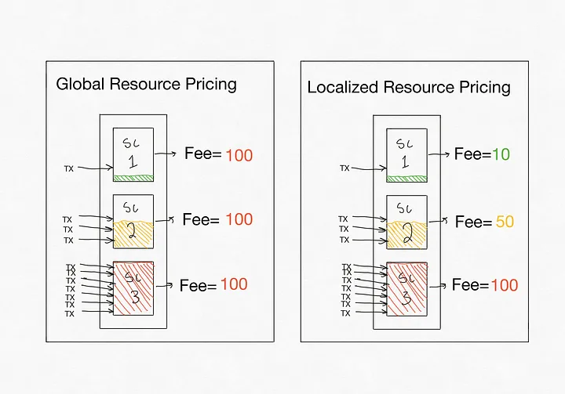

# Fuel

## Design Philosophy
Fuel V2's vision: an operating system for rollups—the "Rollup OS."

This framework empowers developers to build and customize their own rollups while leveraging the security and robustness of underlying L1s like Ethereum for settlement and access to Ethereum’s vast liquidity and assets.

### Modular, Decentralized World 
Performance limitations, poor scalability, unsustainable state growth, and minimal interoperability plague the blockchain landscape. These issues threaten blockchain decentralization and constrain thriving applications.

Fuel's innovations—UTXO-based parallelism, modular architecture, and cross-chain capabilities—overcome these limitations, setting a new blockchain infrastructure standard.

Fuel is a next-generation execution layer for Ethereum, designed to offer unparalleled speed, flexibility, and scalability for developers and users.

## Key Features
* Parallel transaction execution 
* The Fuel Virtual Machine (FuelVM)
* A superior developer experience (with Sway and Forc)

As of May 2024, the e FuelVM can achieve asset transfer benchmarks of 21,000 transactions per second (TPS) per core on high-end CPUs, offering unparalleled speed for modern blockchain applications.

## Parallelization: UTXO Model

The UTXO model facilitates parallelized transaction execution, enhancing throughput and reducing latency by allowing concurrent processing of non-conflicting transactions. The UTXO model inherently supports conflict checking for transactions because each transaction must reference a specific UTXO. When creating a transaction, the system ensures that the referenced UTXOs have not been used by other transactions.

The UTXO model is not sufficient for Fuel, as Fuel not only supports native asset transfers but also accommodates stateful transaction types such as scripts and contracts.

Fuel uses [Access Lists](https://docs.fuel.network/docs/specs/protocol/tx-validity/#access-lists) for conflict detection, mapping the transaction's input set to UTXO IDs (with each input having its own mapping method: Contract, Script, Message) divided into Read-only and Write-destroy categories for precondition validity verification.

Parallelization is built upon a foundation of Access Lists and the UTXO (Unspent Transaction Output) model, which works in tandem to enable concurrent processing of non-conflicting transactions.

## FuelVM
There are five distinct categories of transactions in Fuel, classified based on their operations: Script, Create, Mint, Upgrade, and Upload. Categorization helps define the various functionalities that users can perform within the Fuel ecosystem.

### Key Components
Fuel uses the UTXO model for transactions, introducing specific constructs we'll explore before examining the various transaction types:

* Inputs 
* Predicates 
* Script 
* Outputs 
* Witnesses

#### Inputs
Inputs the inputs of a transaction, which in the UTXO model refer to UTXOs. However, since Fuel supports not only native asset transfers but also other types of transactions, Fuel supports three types of Inputs.

* Coins 
* Contracts 
* Messages

##### Coins
Coins are units for some asset that a user can spend as part of the transaction. Fuel natively supports multiple assets, unlike chains that only support one base asset (such as ETH for Ethereum). Asset creation is built into Fuel's protocol. 

|name|type|description|
| --- | ---- | ---- |
|txID|byte[32]|Hash of transaction.|
|outputIndex|uint16|Index of transaction output.|
|owner|	byte[32]|	Owning address or predicate root.|
|amount	|uint64	|Amount of coins.|
|asset_id	|byte[32]	|Asset ID of the coins.|
|txPointer	|TXPointer	|Points to the TX whose output is being spent.|
|witnessIndex	|uint16	|Index of witness that authorizes spending the coin.|
|predicateGasUsed	|uint64	|Gas used by predicate.|
|predicateLength	|uint64	|Length of predicate, in instructions.|
|predicateDataLength	|uint64	|Length of predicate input data, in bytes.|
|predicate	|byte[]	|Predicate bytecode.|
|predicateData	|byte[]	|Predicate input data (parameters).|

[Coins Field Table]()

##### Contracts
A common question about the UTXO model concerns implementing smart contracts beyond ephemeral scripts.

Fuel embraces the UTXO model while supporting full Turing-complete smart contracts with persistent storage. We solve this problem by making stateful smart contracts an input for Fuel transactions.

Contracts have persistent storage and can own native assets. Users consume contracts by using the contracts as input for transactions. Then, users can call various external functions attached to contracts via the ephemeral script attached to the transaction.

The state root `stateRoot` is the root of the [SMT](https://docs.fuel.network/docs/specs/protocol/cryptographic-primitives/#sparse-merkle-tree) of storage slots. Each storage slot is a `byte[32]`, keyed by a `byte[32]`.

|name|type|description|
| --- | ---- | ---- |
|txID	|byte[32]	|Hash of transaction.|
|outputIndex	|uint16	|Index of transaction output.|
|balanceRoot	|byte[32]	|Root of amount of coins owned by contract before transaction execution.|
|stateRoot	|byte[32]	|State root of contract before transaction execution.|
|txPointer	|TXPointer	|Points to the TX whose output is being spent.|
|contractID	|byte[32]	|Contract ID.|

##### Messages
The Block Builder creates messages created as part of sending messages from the L1 to the L2. Messages make deposits to the Fuel rollups from the L1 possible.

|name|type|description|
| --- | ---- | ---- |
|sender	|byte[32]	|The address of the message sender.|
|recipient	|byte[32]	|The address or predicate root of the message recipient.|
|amount	|uint64	|Amount of base asset coins sent with message.|
|nonce	|byte[32]	|The message nonce.|
|witnessIndex	|uint16	|Index of witness that authorizes spending the coin.|
|predicateGasUsed	|uint64	|Gas used by predicate execution.|
|dataLength	|uint64	|Length of message data, in bytes.|
|predicateLength	|uint64	|Length of predicate, in instructions.|
|predicateDataLength	|uint64	|Length of predicate input data, in bytes.|
|data	|byte[]	|The message data.|
|predicate	|byte[]	|Predicate bytecode.|
|predicateData	|byte[]	|Predicate input data (parameters).|

#### Script
Fuel scripts are ephemeral scripts that express the various actions taken during a transaction; a script can call the contracts provided as inputs or perform other arbitrary computations.
Fuel implements multi-call functionality through scripts, enabling efficient batch transactions. This approach allows users to:
1. Provide up to [MAX_INPUTSIcon Link](https://docs.fuel.network/docs/specs/tx-format/consensus_parameters/) contracts in a single transaction.
2. all external methods on these multiple contracts.

**Note: scripts cannot have their own persistent storage.**

#### Outputs
Fuel transactions have Outputs, which define the creation of new UTXOs post-transaction; these Outputs can then be inputs for the next set of transactions.
There are five types of possible Output types in a Fuel transaction:

* OutputCoin 
* OutputChange 
* OutputVariable 
* OutputContract 
* OutputContractCreated

##### OutputCoin
Output Coins are new coins sent to a Fuel Address, which become spendable as Input Coins in further transactions.

|name|type|description|
| --- | ---- | ---- |
|to	|byte[32]	|Receiving address or predicate root.|
|amount	|uint64	|Amount of coins to send.|
|asset_id	|byte[32]	|Asset ID of coins.|

##### OutputChange
An OutputChange included as one of our outputs for a specific assetId, enables the recovery of any unused balance from the total input balance provided in the transaction for that assetId.

For example, an OutputChange can collect any ETH not spent as gas or any USDC not swapped as part of a DEX transaction.

|name|type|description|
| --- | ---- | ---- |
|to	|byte[32]	|Receiving address or predicate root.|
|amount	|uint64	|Amount of coins to send.|
|asset_id	|byte[32]	|Asset ID of coins.|

This output type indicates that the output's amount may vary based on transaction execution.

##### OutputVariable
OutputVariable acts as a placeholder for coins created in the execution of scripts and contracts since they can create a coin of an arbitrary amount and to an arbitrary user. This is useful in scenarios where the exact output amount and owner cannot be determined beforehand.

| name |type|description|
|----| ---- | ---- |
| to	 |byte[32]	|Receiving address or predicate root. |
| amount	 |uint64	|Amount of coins to send.           |
| asset_id	 |byte[32]	|Asset ID of coins.             |

##### OutputContract
OutputContracts are newly generated contract outputs that become available as InputContracts for a specific contract ID in subsequent transactions utilizing this contract as an Input. They contain the newly updated index, balanceRoot, and stateRoot of the contract after being processed as part of the transaction.

|name|type|description|
| --- | ---- | ---- |
|inputIndex	|uint16	|Index of input contract.|
|balanceRoot	|byte[32]	|Root of amount of coins owned by contract after transaction execution.|
|stateRoot	|byte[32]	|State root of contract after transaction execution.|

* The balance root `balanceRoot` is the root of the [SMT](https://docs.fuel.network/docs/specs/protocol/cryptographic-primitives/#sparse-merkle-tree) of balance leaves. Each balance is a `uint64`, keyed by asset ID (a `byte[32]`).
* The state root `stateRoot` is the root of the [SMT](https://docs.fuel.network/docs/specs/protocol/cryptographic-primitives/#sparse-merkle-tree) of storage slots. Each storage slot is a `byte[32]`, keyed by a `byte[32]`.

##### OutputContractCreated
The `OutputContractCreated` output indicates that a new contract was created as part of the transaction.

|name|type|description|
| --- | ---- | ---- |
|contractID	|byte[32]	|Contract ID.|
|stateRoot	|byte[32]	|Initial state root of contract.|

#### Predicates
Predicates are stateless programs that define spending conditions for native assets. Native assets go to predicates, and to determine whether they are spendable in a transaction, the FuelVM executes the bytecode and checks the boolean return value. If the returned value is true, the asset can be spent; if the returned value is false, then the transaction is invalid!

People can program various spending conditions, such as spending only if three out of five approve a transaction or if a transaction includes specific desired inputs and outputs, commonly known as intents.

**Note: Predicates operate statelessly, without persistent storage, and cannot call other smart contracts.**

#### Witnesses
The witness is a parameter attached to transactions. The block builders fill in witnesses and are not part of the transaction ID. A Witness is usually used to provide digital signatures for verification purposes, for example, the signature to prove the spending of a Coin or anything else.
Witnesses are not part of the transaction ID, which allows someone to sign over a transaction and provide it as part of the transaction.

NOTE:The protocol doesn't limit witnesses to providing signatures only; they serve to fill in any data and enable various interesting use cases, like State Rehydration.
Each witness contains a byte array data along with the field dataLength helping know the length of this data.

### Transaction
#### TransactionScript
Script transactions are transactions that, as the name suggests, have Inputs, Outputs, and a Script that dictates what happens as part of the transaction.

Scripts are optional in transactions of type TransactionScript. For example, a simple token transfer can work only on inputs and outputs, with no requirement for a script. Scripts are mainly leveraged when you want to do other things as part of your transaction beyond simply transferring or burning assets.

Script transactions lack the ability to create contracts, therefore they cannot produce a ContractCreated output type.

|name|type|description|
| --- | ---- | ---- |
|scriptGasLimit	|uint64	|Gas limits the script execution.|
|receiptsRoot	|byte[32]	|Merkle root of receipts.|
|scriptLength	|uint64	|Script length, in instructions.|
|scriptDataLength	|uint64	|Length of script input data, in bytes.|
|policyTypes	|uint32	|Bitfield of used policy types.|
|inputsCount	|uint16	|Number of inputs.|
|outputsCount	|uint16	|Number of outputs.|
|witnessesCount	|uint16	|Number of witnesses.|
|script	|byte[]	|Script to execute.|
|scriptData	|byte[]	|Script input data (parameters).|
|policies	|Policy[]	|List of policies, sorted by PolicyType.|
|inputs	|Input[]	|List of inputs.|
|outputs	|Output[]	|List of outputs.|
|witnesses	|Witness[]	|List of witnesses.|

#### TransactionCreate
TransactionCreate is used to create new contracts; the parameters allow for contracts with initialized storage slots. The contract ID of smart contracts on Fuel is calculated deterministically.

|name|type|description|
| --- | ---- | ---- |
|bytecodeWitnessIndex	|uint16	|Witness index of contract bytecode to create.|
|salt	|byte[32]	|Salt.|
|storageSlotsCount	|uint64	|Number of storage slots to initialize.|
|policyTypes	|uint32	|Bitfield of used policy types.|
|inputsCount	|uint16	|Number of inputs.|
|outputsCount	|uint16	|Number of outputs.|
|witnessesCount	|uint16	|Number of witnesses.|
|storageSlots	|(byte[32], byte[32]])[]	|List of storage slots to initialize (key, value).|
|policies	|Policy[]	|List of policies.|
|inputs	|Input[]	|List of inputs.|
|outputs	|Output[]	|List of outputs.|
|witnesses	|Witness[]	|List of witnesses.|

#### TransactionMint
The block producer uses this transaction to mint new assets. It doesn’t require a signature. The transaction is currently used to create the block producer's fees. The last transaction in the blocks is a Coinbase transaction, allowing the block producer to collect fees for building the block.

#### TransactionUpgrade
The Fuel network employs [consensus parameters](https://docs.fuel.network/docs/specs/tx-format/consensus_parameters/), subject to occasional upgrades. The network's state transition function resides on-chain, allowing privileged addresses to upgrade it when necessary.

#### TransactionUpload
Before performing an upgrade, operators must upload the Fuel state transition bytecode to the chain. This requires uploading the bytecode via multiple transactions. TransactionUpload allows us to split the bytecode into multiple subsections and upload each subsection sequentially over multiple transactions.

On successful upload of all subsections, the transaction reaches completion, and the system adopts the new bytecode.

## Sway and Forc
* Sway is a domain specific language (DSL) for modern blockchain programming which has familiar syntax, grammar and design ideology to Rust while incorporating blockchain specific functionality such as smart contract interface concepts. Sway is inherently designed to save developers time by providing a single programming language for constructing all critical blockchain application components such as: predicates, scripts, smart contracts, libraries, testing, deployment scripting, indexing and more.
* Forc (Fuel Orchestrator): This command-line toolchain serves as the backbone of Fuel development. It supports everything from compiling Sway smart contracts to managing dependencies and deploying applications. Forc simplifies the entire development process, ensuring that developers can build robust dApps with ease.

Others Tool:
* Fuel Rust SDK: The Rust SDK allows developers to interact with Fuel’s blockchain using the Rust programming language. It offers a seamless experience for creating system-level applications and managing interactions with the Fuel Network.
* Fuel Wallet SDK: The Fuel Wallet SDK provides developers with the tools to create secure, user-friendly wallets that natively interact with the Fuel ecosystem. It ensures developers can easily build wallets that integrate into decentralized applications.
* Fuel Typescript SDK: The Typescript SDK allows developers to integrate Fuel into web applications, simplifying interaction with the Fuel blockchain and enabling frontend developers to build decentralized applications that connect with Fuel’s infrastructure.

## Others Features
### Execution + Validation Parallelization

Notice that since transaction outputs are explicitly included for validation, in the process of asserting that a block that another node proposed was correct, there is no need to execute the overlapping transactions sequentially. This means that validation can happen fully in parallel regardless of state contention. In practice, this means that when nodes are syncing the network, they can achieve even greater parallelization and can catch up faster.
### Native Asset System
In the EVM, there is one native asset: ETH. All other assets are implemented via a smart contract that handles accounting for balances (ERC20). In Fuel, developers are free to implement assets in smart contracts, BUT, there is an option to allow the VM to handle this natively.

There are a few considerable advantages to native assets over an ERC20-style smart contract for balance management. First, native asset manipulation is cheaper (in terms of gas) than manipulating state in a smart contract. This can be attributed to its running at lower-level primitives (UTXO system is used instead of manipulating storage). Second, native assets have better UX, similar to how sending ETH is much simpler than sending ERC20s (no need for setting approvals).

### Native Account Abstraction + Predicates
Account abstraction has been a hot topic of research and several attempts have been made at EIPs (EIP-86,EIP-2938,EIP-3074,EIP-4337,EIP-5003) over the years in the Ethereum community. It is difficult to implement and upgrade Ethereum to support account abstraction primarily because of the engineering bandwidth of core teams/technical debt plus the associated complexity, and a long list of higher priority items. Many rollups have the opportunity to implement account abstraction from the start on their novel execution environments. Among these is the FuelVM, which, in addition to native account abstraction, will also include an interesting new primitive: predicates.

A predicate is a pure (does not access state) contract script that simply returns a boolean (true or false). UTXOs can be locked behind a predicate so they can only be spent whenever the conditions defined in the predicate are met. This leads to an interesting UX opportunity where users can set a transaction to execute only under certain conditions, and then once the predicate is met, their transaction can automatically execute. Also, predicates can be pruned when they are destroyed, so they do not contribute to state bloat.

## Future
### State Rehydration
State rehydration means that a transaction includes all the state data needed for an action, and this state will be validated against a single on-chain hash as a state commitment. In turn, an application will update the state by hashing the new state values, storing this “dehydrated” commitment in state, and emitting the full state in a log so it can be made available off-chain.

### Multi-dimensional Resource Pricing
The FuelVM will be able to implement dynamic multi-resource pricing that can incentivize node runners to optimize their underlying hardware better while still optimizing for the maximum “utility per block.”

