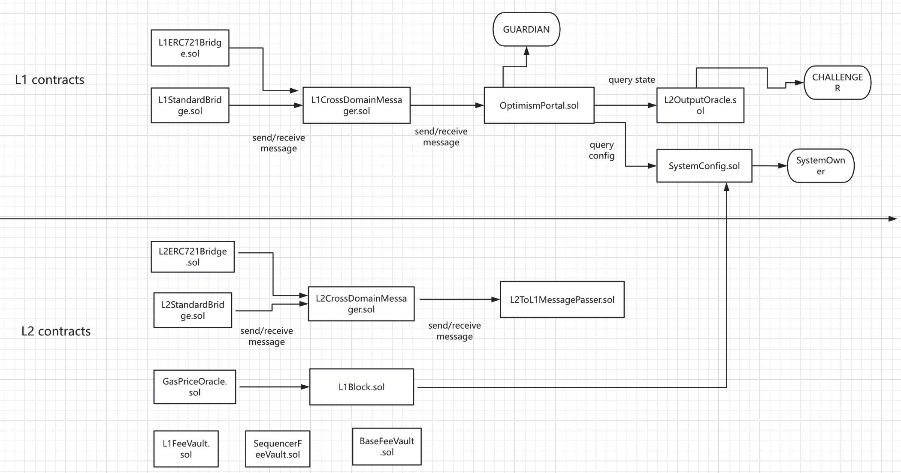

# opBNB Contract



## L1 Contract

### L2OutputOracle

L2OutputOracle 包含一个 L2 状态输出的数组，其中每个输出都是对 L2 链状态的承诺。像 OptimismPortal 这样的其他合约使用这些输出来验证有关 L2 状态的信息:
```solidity
    /// @notice OutputProposal represents a commitment to the L2 state. The timestamp is the L1
    ///         timestamp that the output root is posted. This timestamp is used to verify that the
    ///         finalization period has passed since the output root was submitted.
    /// @custom:field outputRoot    Hash of the L2 output.
    /// @custom:field timestamp     Timestamp of the L1 block that the output root was submitted in.
    /// @custom:field l2BlockNumber L2 block number that the output corresponds to.
    struct OutputProposal {
        bytes32 outputRoot;
        uint128 timestamp;
        uint128 l2BlockNumber;
    }
```
除了上述信息之外，还会记录一些重要的元数据:
```solidity
    /// @notice The number of the first L2 block recorded in this contract.
    uint256 public startingBlockNumber;

    /// @notice The timestamp of the first L2 block recorded in this contract.
    uint256 public startingTimestamp;

    /// @notice An array of L2 output proposals.
    Types.OutputProposal[] internal l2Outputs;

    /// @notice The interval in L2 blocks at which checkpoints must be submitted.
    /// @custom:network-specific
    uint256 public submissionInterval;

    /// @notice The time between L2 blocks in seconds. Once set, this value MUST NOT be modified.
    /// @custom:network-specific
    uint256 public l2BlockTime;

    /// @notice The address of the challenger. Can be updated via upgrade.
    /// @custom:network-specific
    address public challenger;

    /// @notice The address of the proposer. Can be updated via upgrade.
    /// @custom:network-specific
    address public proposer;

    /// @notice The minimum time (in seconds) that must elapse before a withdrawal can be finalized.
    /// @custom:network-specific
    uint256 public finalizationPeriodSeconds;
```
重要的方法有两个:
1. deleteL2Outputs - 删除所有在给定输出索引之后以及包括该提议的输出提议。只有 challenger 地址可以删除输出。
2. proposeL2Output - 接受一个 outputRoot 及其对应 L2 区块的时间戳，此时间戳必须等于 nextTimestamp() 返回的当前值，才能被接受，此函数只能由 Proposer 调用。

这两个函数有几个点值得记录一下：
1. deleteL2Outputs 使用了 assembly 的 solidity 语法直接调用了 EVM 的底层 SSTORE 指令进行了截断，更节省 gas。
2. deleteL2Outputs 中使用了 block.timestamp 代表的是当前 block 的时间戳，这个时间是在出块之前就确定了，只有区块上链才会生效（这个时间戳需要大于前一个block但是不会太远，这个是 L1 的共识协议完成的）。
3. proposeL2Output 中使用 require 的 solidity 语法根据 L1 block number 获取 block hash 进行判断。

还有一些点也值得说一下：
1. getL2OutputAfter - 返回对给定 L2 区块编号进行检查点的 L2 输出提议，使用二分搜索查找第一个大于或等于给定区块的输出。
2. 在 Solidity 中，constructor() 和 initialize 是用来初始化合约的不同方式，它们的关系和区别如下：
   1. constructor(): 只能在合约部署时被自动调用，用户无法直接调用。
   2. initialize: 可以通过外部调用进行触发，通常需要设置额外的访问控制，以确保该函数只能被调用一次。


### OptimismPortal

OptimismPortal 合作最核心的部分是 L1 到 L2 的质押，以及 L2 到 L1 的提现。质押核心是利用了 `emit` 关键字，提现需要与 L2OutputOracle 以及 L2上的 L2ToL1MessagePasser 合约。
是一个低级合约，没有消息的重放功能，鼓励用户使用 L1CrossDomainMessenger 以获得更高级的接口。
```solidity
    /// @notice Represents a proven withdrawal.
    /// @custom:field outputRoot    Root of the L2 output this was proven against.
    /// @custom:field timestamp     Timestamp at whcih the withdrawal was proven.
    /// @custom:field l2OutputIndex Index of the output this was proven against.
    struct ProvenWithdrawal {
        bytes32 outputRoot;
        uint128 timestamp;
        uint128 l2OutputIndex;
    }

   /// @notice Address of the L2 account which initiated a withdrawal in this transaction.
   ///         If the of this variable is the default L2 sender address, then we are NOT inside of
   ///         a call to finalizeWithdrawalTransaction.
   ///         L2 发起 withdraw tx 的地址
   address public l2Sender;
   
   /// @notice A list of withdrawal hashes which have been successfully finalized.
   mapping(bytes32 => bool) public finalizedWithdrawals;
   
   /// @notice A mapping of withdrawal hashes to `ProvenWithdrawal` data.
   mapping(bytes32 => ProvenWithdrawal) public provenWithdrawals;
```

* proveWithdrawalTransaction
  1. 主要目的是证明一个 withdrawal 交易是存在且有效的，后面在 `finalizeWithdrawalTransaction` 的时候需要用到这个证明的结果。
  2. `bytes32 outputRoot = l2Oracle.getL2Output(_l2OutputIndex).outputRoot;`，根据参数 `_l2OutputIndex` 从 L2OutputOracle 合约获取 L2（op-proposer）提交的 Output 信息。
  3. `outputRoot == Hashing.hashOutputRootProof(_outputRootProof)`，娇艳参数 `_outputRootProof` 与 L2（op-proposer）提交的信息是否相同，此时提交的信息由于间隔一定 L2 block 的原因，可以认为是确认的 block 信息。
     ```solidity
            /// @notice Struct representing the elements that are hashed together to generate an output root
           ///         which itself represents a snapshot of the L2 state.
           /// @custom:field version                  Version of the output root.
           /// @custom:field stateRoot                Root of the state trie at the block of this output.
           /// @custom:field messagePasserStorageRoot Root of the message passer storage trie.
           /// @custom:field latestBlockhash          Hash of the block this output was generated from.
           struct OutputRootProof {
           bytes32 version;
           bytes32 stateRoot;
           bytes32 messagePasserStorageRoot;
           bytes32 latestBlockhash;
           }
     ```
  4. 计算参数 `_tx`（withdrawal 交易） 的 hash，即 `withdrawalHash`。
  5. 进行 proof 校验：
      ```solidity
        bytes32 storageKey = keccak256(
            abi.encode(
                withdrawalHash,
                uint256(0) // The withdrawals mapping is at the first slot in the layout.
            )
        );
        SecureMerkleTrie.verifyInclusionProof({
                _key: abi.encode(storageKey),
                _value: hex"01",
                _proof: _withdrawalProof,
                _root: _outputRootProof.messagePasserStorageRoot
        }),
      ```
     通过参数可以看出来，这里的 proof 验证只是验证了 storage trie（记录了 withdrawal tx）。`_root` 参数是 storage trie  root，`_key` 参数是交易的 hash，所以不涉及到 account trie。
     但是，account trie 也是很重要的因为前面获取 `outputRoot` 进行校验的时候需要锚定，所以 op-geth 的 rpc 节点在 pathdb 中需要保留最近被 3600 整除的世界状态——这部分代码就是真正的原因。
  6. 将结果放入 `provenWithdrawals` 全局变量中，待 `finalizeWithdrawalTransaction` 使用
     ```solidity
     provenWithdrawals[withdrawalHash] = ProvenWithdrawal({
            outputRoot: outputRoot,
            timestamp: uint128(block.timestamp),
            l2OutputIndex: uint128(_l2OutputIndex)
     });
     ```

* finalizeWithdrawalTransaction
  1. 根据参数 withdraw tx 计算 hash，然后从 `provenWithdrawals` 获取 `ProvenWithdrawal` 信息。
  2. 根据获取的 `ProvenWithdrawal` 进行判断，比如根据时间戳判断 withdraw 是否超过 7 天等。
  3. ```finalizedWithdrawals[withdrawalHash] = true;```，将提款标记为已最终确认，以便无法重放。
  4. 调用 `SafeCall.callWithMinGas` 将 token 转入提现账户（分为 eth 和 erc20 两种）。

* depositTransaction
  1. 质押 ETH 从 L1 到 L2。
  2. 基础的 gas 校验，数据打包到 opaqueData 里面，这部分数据会完全让 L2 看到，所以这里面的数据相当于 L2 继续执行的上下文。
  3. 用 `emit` 关键字触发事件，evm 执行的时候会记录 log，op-node 会扫描到，进行派生 L2的交易。

* depositERC20Transaction
  1. 质押 ERC20 从 L1 到 L2。
  2. 在上述 `depositTransaction` 逻辑中，加上 ERC20 的逻辑，其中重点是 `_balance` 成员变量，记录了 ERC20 在L2 上的铸造量。
  3. 值得说一下的是函数参数 `_mint` 和 `_value`，前者表示 L1 账户在对应的 L2 上户上铸造量多少 token，后者表示铸造好的 token 中有多少需要转给目标账户。


语法：
1. `receive()` 方法
   1. 一个特殊的函数，用于处理接收以太币的情况。
   2. 当发送以太币的交易未指定任何数据时，receive() 函数被调用。
   3. 其消耗的 gas 与其他普通函数的消耗有所不同。它通常不执行复杂的逻辑且不接受参数，因此其 gas 消耗一般比较低。
2. `this` 关键字
   1. 在 Solidity 中，this 关键字用于引用当前合约实例，能够获取合约地址并调用合约的公共方法。
   2. 使用 this 进行函数调用时，会导致当前合约调用自身的函数，这相当于进行外部调用，因此消耗的 gas 会增加。这是因为它会被 EVM 视为一个外部调用，其中涉及到更多的开销。
   3. 因此不应在内部逻辑中频繁使用它，尤其是在循环或频繁执行的地方。
3. `emit` 关键字
   1. 用于触发（或发出）事件。事件是 Solidity 中的一种重要特性，用于日志记录和使合约与外部应用（如前端界面）进行交互。
   2. 日志记录: 当合约中的某个操作发生时，可以使用 emit 来发出一个事件，从而在以太坊区块链上记录这一操作。这些事件可以被外部应用（如 DApp）监听并处理，—— 跨链正是扫描 evm 执行的 log 完成的。


### L1CrossDomainMessenger && L1StandardBridge(L1ERC721Bridge)

这两个合约也是跨链合约，底层都是 OptimismPortal（将跨链消息写入 EVM 执行的 log 中即可，但是对端是否执行没有要求）。
1. L1CrossDomainMessenger：继承自 CrossDomainMessenger 基合约，其多态的函数 `_sendMessage` 调用了 OptimismPortal 的 `depositTransaction` 方法，其内部使用了 emit 关键字。
2. L1StandardBridge：内部有一个 L1CrossDomainMessenger 类型的成员变量，在初始化的时候具体的类型就是 OptimismPortal。

那么，他们两个的区别在哪里呢？
1. L1CrossDomainMessenger：主要用于消息传递。 
2. L1StandardBridge：主要用于资产跨链，封装了 erc20 和 eth 或者说 bnb。

但在deposit上可以认为没区别，L1StandardBridge更简单。

**注意:**
1. 这两个合约都是 L1 到 L2 的资产或者消息传递，但是对于 withdraw 只有一种方式，即走 OptimismPortal 的 `proveWithdrawalTransaction` 和 `finalizeWithdrawalTransaction`。
2. L1StandardBridge 中的 `finalizeETHWithdrawal`, `finalizeERC20Withdrawal` 是暴露给外部的方法，一般是用户在 bridge 上触发（会有校验逻辑，保证在挑战期之后），目前有部署 bot 自动化帮用户提现。


#### L1CrossDomainMessenger

CrossDomainMessenger 是 L1CrossDomainMessenger 的基合约，提供 L1 和 L2 跨链消息合约的核心逻辑。它被设计为一个通用接口，只需稍微扩展即可在每个部署链上提供低级消息传递功能。目前仅设计用于在两个配对的链之间进行消息传递，不支持一对多的交互，对此合约的任何更改必须导致继承此合约的合约进行语义版本号提升。
为了更好的理解 L1CrossDomainMessenger 合约，需要嫌对 CrossDomainMessenger 做一个基本的理解
```solidity
   /// @notice Mapping of message hashes to boolean receipt values. Note that a message will only
   ///         be present in this mapping if it has successfully been relayed on this chain, and
   ///         can therefore not be relayed again.
   mapping(bytes32 => bool) public successfulMessages;
   
   /// @notice Address of the sender of the currently executing message on the other chain. If the
   ///         value of this variable is the default value (0x00000000...dead) then no message is
   ///         currently being executed. Use the xDomainMessageSender getter which will throw an
   ///         error if this is the case.
   /// 代表当前执行的消息的发送者在 L2 上的地址
   address internal xDomainMsgSender;
   
   /// @notice Nonce for the next message to be sent, without the message version applied. Use the
   ///         messageNonce getter which will insert the message version into the nonce to give you
   ///         the actual nonce to be used for the message.
   uint240 internal msgNonce;
   
   /// @notice Mapping of message hashes to a boolean if and only if the message has failed to be
   ///         executed at least once. A message will not be present in this mapping if it
   ///         successfully executed on the first attempt.
   mapping(bytes32 => bool) public failedMessages;
   
   /// @notice CrossDomainMessenger contract on the other chain.
   /// @custom:network-specific
   /// 代表另一个链上的跨链合约
   CrossDomainMessenger public otherMessenger;
```
核心的功能有两个：
1. `sendMessage` 向对端发送消息，调用继承类的 `_sendMessage` 函数，这个函数一般会适应 emit 关键字让数据写入 evm 执行的 log 中，对端扫描 log 然后根据数据执行相应的逻辑。
2. `relayMessage` 本地执行对端的消息，基础的校验，然后调用 `afeCall.hasMinGas` 方法根据传入的参数在本地执行。

接下来我们不看一下 L1CrossDomainMessenger 合约，核心就是实现了 CrossDomainMessenger 合约的 `_sendMessage` 方法，其内部调用了 OptimismPortal 合约的 `depositTransaction` 方法，其 向 L2 质押 ETH，并使用了 emit 关键字。

L2 的 L2CrossDomainMessenger 合约收到之后会执行 CrossDomainMessenger 的 `relayMessage` 方法。
L2CrossDomainMessenger 执行的方法其实在 L1CrossDomainMessenger 调用 `sendMessage` 方法时就通过 `abi.encodeWithSelector` 编码之后写到消息的 data 部分了，
L2 扫描到这个消息就会发给相应的合约（L2CrossDomainMessenger）， 并调用其 `relayMessage` 方法。

OptimismPortal 只是在 EVM 执行过程中写了一个 log 说明这是跨链消息，然后就没有了。
L1CrossDomainMessenger 基于 CrossDomainMessenger 对 OptimismPortal 进行了一层封装，
封装的结果就是 CrossDomainMessenger 保证了对端需要有合约并且是合约的 `relayMessage` 方法执行这个消息。
其实，L1CrossDomainMessenger 还可以传递其他消息，不仅仅是资产。

#### L1StandardBridge

StandardBridge 是 L1StandardBridge 的基合约，L1StandardBridge 负责在 L1 和 L2 之间转移 ETH 和 ERC20 代币。桥的内部也是使用了 CrossDomainMessenger，本质是一样的，区别是其转门针对 erc20 和 eth 做了定制化，而不是一般的消息。

L1StandardBridge 发出去的消息 L2 收到后会调用 L2StandardBridge 进行处理，所以
1. L1StandardBridge 调用 `depositETH/depositETHTo` 发送的消息， L2StandardBridge 的 `finalizeBridgeETH` 会被执行完成资产的跨链转移。
2. L1StandardBridge 调用 `depositERC20/depositERC20To` 发送的消息， L2StandardBridge 的 `finalizeBridgeERC20` 会被执行完成资产的跨链转移。
3. `finalizeETHWithdrawal` 和 `finalizeERC20Withdrawal` 给[跨链桥](https://opbnb-bridge.bnbchain.org/deposit)使用，那边的业务会调用 OptimismPortal 的 `proveWithdrawalTransaction` 和 `finalizeWithdrawalTransaction`，这面会部署一个 withdrawbot 自动化的替用户提现金。  


#### L1ERC721Bridge

类似 L1StandardBridge 合约，但是针对 721 合约做了一些 schema 的变化，参考 L1StandardBridge 看代码应该好理解。å

### DataAvailabilityChallenge

**目前这个合约没有实际意义，一旦发起调整 bond 就会被吞，所以不会有人发起挑战，完全靠自己 sequencer 保证数据的可用性**

DataAvailabilityChallenge 合约允许对在给定区块编号处的数据承诺的可用性进行挑战。
```solidity
    /// @dev A struct representing a single DA challenge.
    /// @custom:field status The status of the challenge.
    /// @custom:field challenger The address that initiated the challenge.
    /// @custom:field startBlock The block number at which the challenge was initiated.
       struct Challenge {
          address challenger;
          uint256 lockedBond;
          uint256 startBlock;
          uint256 resolvedBlock;
       }

    /// @notice The block interval during which a commitment can be challenged.
    uint256 public challengeWindow;

    /// @notice The block interval during which a challenge can be resolved.
    uint256 public resolveWindow;

    /// @notice The amount required to post a challenge.
    uint256 public bondSize;

    /// @notice The percentage of the resolving cost to be refunded to the resolver.
    /// @dev There are no decimals, ie a value of 50 corresponds to 50%.
    uint256 public resolverRefundPercentage;

    /// @notice A mapping from addresses to their bond balance in the contract.
    mapping(address => uint256) public balances;

    /// @notice A mapping from challenged block numbers to challenged commitments to challenges.
    mapping(uint256 => mapping(bytes => Challenge)) internal challenges;
```

* challenge
  1. 校验 bondSize ，是否超过挑战窗口期
  2. 生成 `Challenge` 结构放入 `challenges` 成员变量，kkv 结构，k1 = challengedBlockNumber，k2 = challengedCommitment(挑战的信息)。

* resolve
  1. 校验工作。
  2. 根据参数 `challengedBlockNumber` 和 `challengedCommitment` 从成员变量 `challenges` 中获取 `Challenge` 信息。
  3. 根据参数 `resolveData` 计算 Keccak256（目前只支持这一种）的结果与参数 `challengedCommitment` 的 Keccak256 结果进行比对，如果一直更新 `Challenge.resolvedBlock` 表示已经解决了。
  4. 调用 `_distributeBond` 方法向 challeneger 和 resolver 分账。
     
语法：
1. `gasleft()` 全局方法，用于返回当前合约剩余的 gas 数量。
   1. 不准确性: 在合约的执行过程中，gas 消耗会受到多个因素的影响（如存储变更、访问外部合约等），因此 gasleft() 的返回值仅供参考。
   2. 调用环境: gasleft() 只能在合约的上下文中调用，不能在静态函数或视图函数外部使用。
2. `calldata` 关键字，是一种特定的数据位置，主要用于函数参数，特别是当函数被声明为 external 的时候。
   1. 只读: calldata 是一种只读的数据位置，意味着在函数内部不能修改 calldata 中的数据。这与 memory（可以被修改）和 storage（持久存储）不同。
   2. 来自外部调用: calldata 通常用于接收来自外部账户或合约的函数调用时传递的参数数据。由于其只读特性，可以在保持效率的同时防止意外修改数据。
   3. 更高效: 使用 calldata 可以减少 gas 成本，因为它避免了在 memory 中的复制操作，尤其是在处理大数组或结构体时。

### DelayedVetoable

1. 此合约在调用被转发到目标合约之前启用延迟，在延迟期间，授权的投票者（只能有一个授权者）可以否决该调用。
2. constructor 在合约初始化阶段就已经指定了 INITIATOR（事件初始化者），VETOER（投票者），TARGET（被执行者），OPERATING_DELAY（延迟）。
3. 只有 INITIATOR 和 VETOER 通过传递空数据可以来激活延迟。
4. INITIATOR 调用合约以启动一个调用， `mapping(bytes32 => uint256) internal _queuedAt;` 记录了 msghash 对应的初始化时间。
5. VETOER 否决一个屌用，从 `_queuedAt` 中删除 msghash 对应的数据。
6. 其他参与者（非 INITIATOR 和 VETOER）激发调用（如果 delay 时间超过）， `TARGET.call(msg.data)` 。

注意：无论是谁来初始化，否则，或者是激发都必须持有这个 msg，否则是不行的因为 msghash 在 `_queuedAt` 中是对不上的。


语法：
1. `fallback()` 函数
   1. 接收以太币: fallback() 函数可以在合约接收到以太币时被触发，尤其是在没有提供任何数据或函数名时。
   2. 处理未匹配的调用: 当向合约发送的函数调用没有匹配的函数时，这个函数也会被调用。
   3. 会比常规函数调用消耗更多的 gas，因为它通常用于处理不确定性的操作。所以在设计合约时应谨慎调用。
   4. 不能通过 this 来调用合约的其他函数，因为这样会导致 gas 的消耗增加。

### SystemConfig

SystemConfig 合约用于管理 Optimism 网络的配置，所有配置都存储在 L1，并作为 L2 链推导的一部分被 L2 获取。涉及到的可配置信息如下：

```solidity
/// @notice Storage slot that the unsafe block signer is stored at.
    ///         Storing it at this deterministic storage slot allows for decoupling the storage
    ///         layout from the way that `solc` lays out storage. The `op-node` uses a storage
    ///         proof to fetch this value.
    /// @dev    NOTE: this value will be migrated to another storage slot in a future version.
    ///         User input should not be placed in storage in this contract until this migration
    ///         happens. It is unlikely that keccak second preimage resistance will be broken,
    ///         but it is better to be safe than sorry.
    bytes32 public constant UNSAFE_BLOCK_SIGNER_SLOT = keccak256("systemconfig.unsafeblocksigner");

    /// @notice Storage slot that the L1CrossDomainMessenger address is stored at.
    bytes32 public constant L1_CROSS_DOMAIN_MESSENGER_SLOT =
        bytes32(uint256(keccak256("systemconfig.l1crossdomainmessenger")) - 1);

    /// @notice Storage slot that the L1ERC721Bridge address is stored at.
    bytes32 public constant L1_ERC_721_BRIDGE_SLOT = bytes32(uint256(keccak256("systemconfig.l1erc721bridge")) - 1);

    /// @notice Storage slot that the L1StandardBridge address is stored at.
    bytes32 public constant L1_STANDARD_BRIDGE_SLOT = bytes32(uint256(keccak256("systemconfig.l1standardbridge")) - 1);

    /// @notice Storage slot that the OptimismPortal address is stored at.
    bytes32 public constant OPTIMISM_PORTAL_SLOT = bytes32(uint256(keccak256("systemconfig.optimismportal")) - 1);

    /// @notice Storage slot that the OptimismMintableERC20Factory address is stored at.
    bytes32 public constant OPTIMISM_MINTABLE_ERC20_FACTORY_SLOT =
        bytes32(uint256(keccak256("systemconfig.optimismmintableerc20factory")) - 1);

    /// @notice Storage slot that the batch inbox address is stored at.
    bytes32 public constant BATCH_INBOX_SLOT = bytes32(uint256(keccak256("systemconfig.batchinbox")) - 1);

    /// @notice Storage slot for block at which the op-node can start searching for logs from.
    bytes32 public constant START_BLOCK_SLOT = bytes32(uint256(keccak256("systemconfig.startBlock")) - 1);

    /// @notice Storage slot for the DisputeGameFactory address.
    bytes32 public constant DISPUTE_GAME_FACTORY_SLOT =
        bytes32(uint256(keccak256("systemconfig.disputegamefactory")) - 1);

    /// @notice The number of decimals that the gas paying token has.
    uint8 internal constant GAS_PAYING_TOKEN_DECIMALS = 18;

    /// @notice The maximum gas limit that can be set for L2 blocks. This limit is used to enforce that the blocks
    ///         on L2 are not too large to process and prove. Over time, this value can be increased as various
    ///         optimizations and improvements are made to the system at large.
    uint64 internal constant MAX_GAS_LIMIT = 200_000_000;

    /// @notice Fixed L2 gas overhead. Used as part of the L2 fee calculation.
    ///         Deprecated since the Ecotone network upgrade
    uint256 public overhead;

    /// @notice Dynamic L2 gas overhead. Used as part of the L2 fee calculation.
    ///         The most significant byte is used to determine the version since the
    ///         Ecotone network upgrade.
    uint256 public scalar;

    /// @notice Identifier for the batcher.
    ///         For version 1 of this configuration, this is represented as an address left-padded
    ///         with zeros to 32 bytes.
    bytes32 public batcherHash;

    /// @notice L2 block gas limit.
    uint64 public gasLimit;

    /// @notice Basefee scalar value. Part of the L2 fee calculation since the Ecotone network upgrade.
    uint32 public basefeeScalar;

    /// @notice Blobbasefee scalar value. Part of the L2 fee calculation since the Ecotone network upgrade.
    uint32 public blobbasefeeScalar;

```
UNSAFE_BLOCK_SIGNER_SLOT，这个签名者的角色与区块的有效性和安全性有关。尽管它的名称中带有“不安全”，但它是协议设计的一部分，可能是在特定条件下执行一些操作的外部签名者。

### ResourceMetering

ResourceMetering 实现了一种基于 EIP-1559 风格的 gas 计量系统。其中重要的成员变量：
```solidity
    /// @notice Represents the various parameters that control the way in which resources are
    ///         metered. Corresponds to the EIP-1559 resource metering system.
    /// @custom:field prevBaseFee   Base fee from the previous block(s).
    /// @custom:field prevBoughtGas Amount of gas bought so far in the current block.
    /// @custom:field prevBlockNum  Last block number that the base fee was updated.
    struct ResourceParams {
        uint128 prevBaseFee;
        uint64 prevBoughtGas;
        uint64 prevBlockNum;
    }

    /// @notice Represents the configuration for the EIP-1559 based curve for the deposit gas
    ///         market. These values should be set with care as it is possible to set them in
    ///         a way that breaks the deposit gas market. The target resource limit is defined as
    ///         maxResourceLimit / elasticityMultiplier. This struct was designed to fit within a
    ///         single word. There is additional space for additions in the future.
    /// @custom:field maxResourceLimit             Represents the maximum amount of deposit gas that
    ///                                            can be purchased per block.
    /// @custom:field elasticityMultiplier         Determines the target resource limit along with
    ///                                            the resource limit.
    /// @custom:field baseFeeMaxChangeDenominator  Determines max change on fee per block.
    /// @custom:field minimumBaseFee               The min deposit base fee, it is clamped to this
    ///                                            value.
    /// @custom:field systemTxMaxGas               The amount of gas supplied to the system
    ///                                            transaction. This should be set to the same
    ///                                            number that the op-node sets as the gas limit
    ///                                            for the system transaction.
    /// @custom:field maximumBaseFee               The max deposit base fee, it is clamped to this
    ///                                            value.
    struct ResourceConfig {
        uint32 maxResourceLimit;
        uint8 elasticityMultiplier;
        uint8 baseFeeMaxChangeDenominator;
        uint32 minimumBaseFee;
        uint32 systemTxMaxGas;
        uint128 maximumBaseFee;
    }

    // ResourceConfig 来自于上层调用层，ResourceParams 是本地合约的成员变量
```
核心的功能是 metered - 根据请求资源的数量来限制对某个函数的访问。同时在跨 block 的时候（如果有空块还会特殊处理），会更新 gas 计算用到的一些变量值，这些变量的设置与更新遵循 EIP-1559 风格，EIP-1559 可以限制存款创建的速率，从而限制存款对 L2 系统的潜在垃圾邮件攻击。

### ProtocolVersions

ProtocolVersions 合约用于管理超级链协议版本信息，维护两个 slot，REQUIRED_SLOT 和 RECOMMENDED_SLOT。

* 强制性 vs. 建议性: REQUIRED_SLOT 是一个强制性的要求，必须满足；而 RECOMMENDED_SLOT 则是一个建议，供用户参考。
* 安全性 vs. 灵活性: REQUIRED_SLOT 主要关注安全和稳定，确保协议在一个已知的良好状态下运行；而 RECOMMENDED_SLOT 则是为了提供灵活性，鼓励用户使用更新的版本，同时保持向后兼容。

### SuperchainConfig

SuperchainConfig 合约用于管理全局超级链值的配置，维护两个 slot，PAUSED_SLOT 和 GUARDIAN_SLOT。GUARDIAN_SLOT 记录的地址有权限停止或者重启 withdrawals 操作。

* 安全控制: PAUSED_SLOT 和 GUARDIAN_SLOT 提供了一种灵活的方式来控制合约的状态和管理权限，增强了合约的安全性和可靠性。
* 灵活应对问题: 当出现潜在的安全威胁或需要进行紧急维护时，可以快速暂停合约或通过 Guardian 进行管理操作。


## L2 Contract

### L2ToL1MessagePasser

L2ToL1MessagePasser 是一个专用合约，用于存储从 L2 发送到 L1 的 withdrawal 的交易，**该合约的存储根被提升到 L2 输出的顶层**， 以减少证明发送消息存在的成本。
```solidity
    /// @notice Includes the message hashes for all withdrawals
    ///         记录 WithdrawalHash 
    mapping(bytes32 => bool) public sentMessages;

    /// @notice A unique value hashed with each withdrawal.
    ///         生成 WithdrawalTX 的用的唯一值
    uint240 internal msgNonce;

    /// @notice Sends a message from L2 to L1.
    /// @param _target   Address to call on L1 execution.
    /// @param _gasLimit Minimum gas limit for executing the message on L1.
    /// @param _data     Data to forward to L1 target.
    function initiateWithdrawal(address _target, uint256 _gasLimit, bytes memory _data) public payable {
        /// core：计算 withdraw 交易的 hash
        bytes32 withdrawalHash = Hashing.hashWithdrawal(
            Types.WithdrawalTransaction({
            nonce: messageNonce(),
            sender: msg.sender,
            target: _target,
            value: msg.value,
            gasLimit: _gasLimit,
            data: _data
            })
        );
        
        /// core：将交易的hash，存储在合约树上
        sentMessages[withdrawalHash] = true;
        
        /// core：通过 emit 关键字，让消息写入evm的log中，用于 L1 扫描
        emit MessagePassed(messageNonce(), msg.sender, _target, msg.value, _gasLimit, _data, withdrawalHash);
        
        unchecked {
            ++msgNonce;
        }
    }
```

### L2CrossDomainMessenger && L2StandardBridge && L2ERC721Bridge

同 L1CrossDomainMessenger 合约，其 `_sendMessage` 调用的是 L2ToL1MessagePasser 的 `initiateWithdrawal`。
L2ToL1MessagePasser 相当于 L1 的 OptimismPortal。

#### L2StandardBridge

结构类似 L1StandardBridge， withdraw/withdrawTo -> _initiateWithdrawal -> _initiateBridgeETH / _initiateBridgeERC20(StandardBridge 基合约的方法，同 L1StandardBridge)。

#### L2ERC721Bridge

类比 L1ERC721Bridge


### L1Block

L1Block 预部署合约使 L2 用户能够访问关于最后已知 L1 区块的信息。此合约中的值每个纪元（每个 L1 区块）更新一次，并且只能由“特殊的存款人”（op-node）账户设置。每当我们进入新的纪元时，协议会创建交易更新 L1 Block 的信息，
**仅仅在每个纪元的第一个 L2 Block 的第一笔交易会出现**。

### GasPriceOracle

本合约维护负责计算 L2 上总费用的 L1 部分的变量。在 L1Block 合约提供的基础数据之上进行计算。

### SequencerFeeVault && L1FeeVault

SequencerFeeVault 合约用于存储在交易处理和区块生成过程中支付给序列器的任何费用。L1FeeVault 累积的 L1 部分的交易费用。
FeeVault 是他们的基合约，上述两个合约的逻辑几乎没有，重点在这里。
```solidity
    /// @notice Enum representing where the FeeVault withdraws funds to.
    /// @custom:value L1 FeeVault withdraws funds to L1.
    /// @custom:value L2 FeeVault withdraws funds to L2.
    enum WithdrawalNetwork {
        L1,
        L2
    }

    /// @notice Minimum balance before a withdrawal can be triggered.
    uint256 public immutable MIN_WITHDRAWAL_AMOUNT;

    /// @notice Wallet that will receive the fees.
    address public immutable RECIPIENT;

    /// @notice Network which the RECIPIENT will receive fees on.
    WithdrawalNetwork public immutable WITHDRAWAL_NETWORK;

    /// @notice The minimum gas limit for the FeeVault withdrawal transaction.
    uint32 internal constant WITHDRAWAL_MIN_GAS = 35_000;

    /// @notice Total amount of wei processed by the contract.
    uint256 public totalProcessed;
```
只有一个 withdraw 方法，提现到指定的地址，如果是 L2 网络直接提现到 `RECIPIENT`，如果是 L1 要走跨链桥。