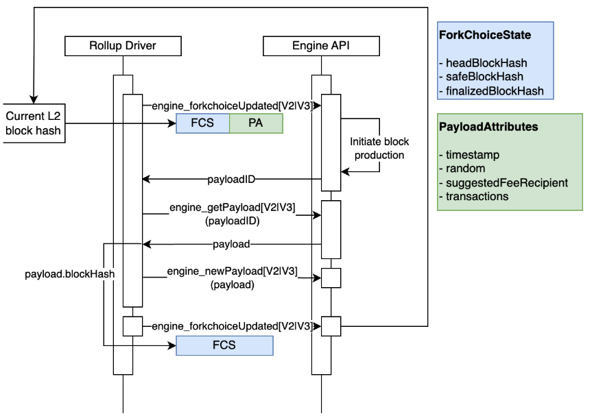

# op-node engine api

## Overview

目前 op-node 在配置的硬分叉之后，使用的都是 V3 版本的 EngineAPI，所以下面的介绍也都是基于 V3 版本。三个版本主要是针对各次的硬分叉做了一些校验，或者是版本的检查。

  

完整的 EngineAPI 控制流程大致如下：
1. op-node 向 op-geth 发送 ForkchoiceUpdate 请求，请求中包括两部分四个数据：
   1. ForkchoiceStateV1：HeadBlockHash，SafeBlockHash，FinalizedBlockHash。
   2. PayloadAttributes：从 L1 派生过来的信息，主要是 Deposit Txns，L2Block.Timestamp，GasLimit等。
   3. ForkchoiceStateV1 用于更新 L2 的元数据，HeadBlockHash，SafeBlockHash，FinalizedBlockHash。
      1. HeadBlockHash 会被用于 SetCanonical 并 writeHeadBlock，从而更新了 CurrentBlock(Unsafe)。
   4. PayloadAttributes 用于组装 Block，组装之后的 block 只有 Deposit Txns，然后给 Miner 去打包 L2 上的交易。
   5. PayloadAttributes 会 hash 的到一个 payloadID，缓存在本地。
2. op-node 向 op-geth 发送 GetPayload 请求，请求中包括上面返回的 payloadID。
   1. 从本地缓存中获取 block，并打断 miner 对这个block的打包交易流程，并返回这个组装好的 block。
   2. block 如果没有没有及时停止，会返回一个 empty block，仅含有上面的 Deposit Txns。
3. op-node 向 op-geth 发送 NewPayload 请求
   1. 将 GetPayload 返回的 payload 数据作为参数发回来，并生成 L2Block。
   2. 调用 InsertBlockWithoutSetHead，更新 state，并写入 block，此时 op-geth 的元数据没有更新（Unsafe/Safe/Finalized）。
4. op-node 向 op-geth 发送 ForkchoiceUpdate 请求，请求中只包括 ForkchoiceStateV1 部分。
   1. 校验 HeadBlockHash，并更新 L2 的元数据，SafeBlockHash/FinalizedBlockHash。
   2. 这部分数据来自 op-node 的派生。

### Notice
1. ForkchoiceUpdate 和 NewPayload 针对已经存在的 block 不会继续而是直接返回。
   1. ForkchoiceUpdate， 如果 PayloadAttributes 不为空，会从 localBlocks 查询，如果存在直接返回
   2. NewPayload 如果 block 在 chainblock 中那么也是直接返回。
   3. **这就给重入做了兼容处理，比如 op-node 发送两遍一样的数据不会重复，这样 op-node 的处理逻辑就会简单许多。**

## ForkchoiceUpdate

1. Update Unsafe Block
   1. GetBlock by HeadBlockHash
      1. if block is nil, sync by P2P, return `STATUS_SYNCING`
      2. or not, td/ptd/ttd difficulty check, if not return `STATUS_INVALID` / `INVALID_TERMINAL_BLOCK`
   2. SetCanonical(HeadBlockHash)
      1. write `CurrentBlock` L2 metadata
      2. write `CanonicalBlock` L2 metadata
2. Update Finalized Block
   1. FinalizedBlock must exit and is Canonical, or not return `STATUS_INVALID`
   2. write `FinalizedBlcok` L2 metadata
3. Update Safe Block
   1. SafeBlock must exit and is Canonical, or not return `STATUS_INVALID`
   2. write `SafeBlock` L2 metadata
4. PayloadAttributes used to generate block, if PayloadAttributes != nil
   1. make `BuildPayloadArgs` by PayloadAttributes.
   2. get `BuildPayloadArgs` from localBlocks by `PayloadID`, return the `PayloadID`.
   3. offer `BuildPayloadArgs` Miner to BuildPayload.
   4. add `BuildPayloadArgs` to localBlocks by `PayloadID`, return the `PayloadID`.

**注意：HeadBlockHash 不能为空，FinalizedHash 和 SafeBlockHash 可以为空步进行更新。**

## GetPayload

1. get `BuildPayloadArgs` from localBlocks by `PayloadID`.
2. if not exit, return `UnknownPayload`.
3. return `ExecutionPayloadEnvelope`, it resloved by Payload.

## NewPayload

1. get `BuildPayloadArgs` from localBlocks by `PayloadID`, if not rebuild by params `ExecutableData` and so on.
2. GetBlockByHash to check the block has stored to blockchain, if so, return directly.
3. ptd/ttd/gptd check.
4. check parent state by `HasBlockAndState`, if not return `INCONSISTENT`.
5. InsertBlockWithoutSetHead, only write block and state, but not update L2 metadata(Unsafe/Safe/Finalized).

## SealPayload

1. GetPayload
2. NewPayload
3. ForkchoiceUpdate，参数中 HeadBlockHash 会更新到上面 block 的hash，其他的从参数，即 op-node 获取。

SealPayload 应该是一个优化的 API，将上述流程中的后三步整合到一起了。

