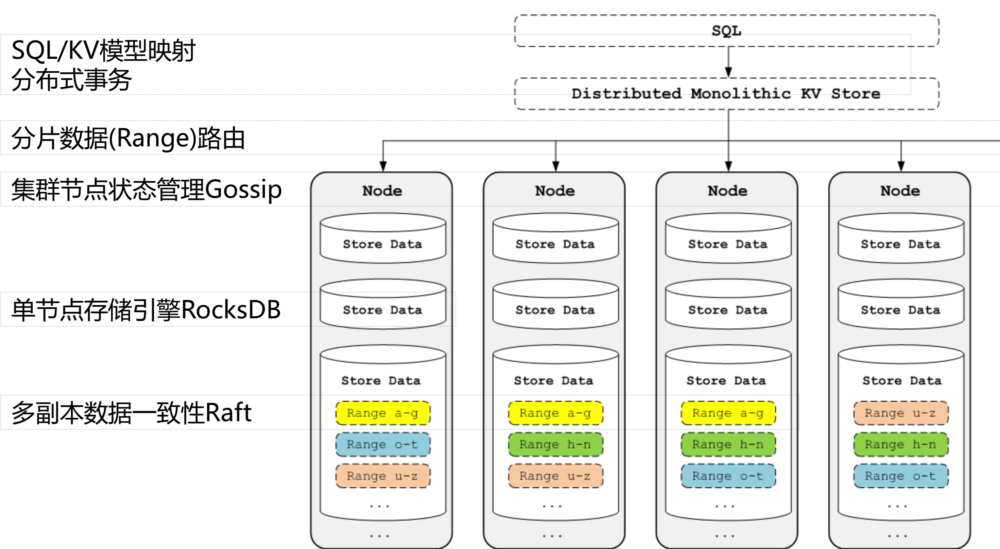

# CockroachDB概述

## 背景
[cockroachdb](https://github.com/cockroachdb/cockroach)由[Cockroach Labs](https://www.cockroachlabs.com/)开发并将社区版开源的NewSQL存储系统。NewSQL在[wiki](https://en.wikipedia.org/wiki/NewSQL)上的定义是具有NoSQL对海量数据的存储管理能力，还保持 了传统数据库支持ACID和SQL等特性，凭借性能和SQL语义的兼容备受关注，更是各大云厂商的宠儿包括Google Spanner、Amazon Azure、阿里云XDB、腾讯云TBase等。国内最早的NewSQL应该算是阿里的OceanBase，国内的开源项目TiDB在业界也有比较大的影响力。传统的SQL数据库在分布式环境下的跨行跨表事务、单机引擎性能、OLAP业务的支撑上都显得捉襟见肘，NewSQL底层使用KV存储，将事务协调、计算与存储分离等技术保证性能。

## 整体架构

如图所示，CockroachDB整体架构分为以下几层：
1. SQL映射层：负责将解析、优化SQL语义映射到底层KV存储，并且负责协调事务。
2. 路由层：CockroachDB采用二级索引的方式将路由信息存储在数据分片内，根据路由信息定位具体的KV存储节点。
3. 节点状态管理层：一个物理节点对应一个Node，CockroachDB使用Gossip协议管理节点状态和路由信息。
4. 存储引擎层：一个Node对应多个Store（一般一个物理盘对应一个Store），CockroachDB使用rocks作为单机的存储引擎,一个Store对应一个RocksDB实例。
5. 副本管理层：一个Store管理若干个Range，Range是最小的数据存储单位（64M）存储用户数据，CockroachDB使用raft强一致协议负责副本间的数据同步。
6. HLC时钟算法：数据存储使用了MVCC（多版本控制）机制存储一份数据的多个版本，数据冲突解决方案使用HLC算法（用于事务协调）。
