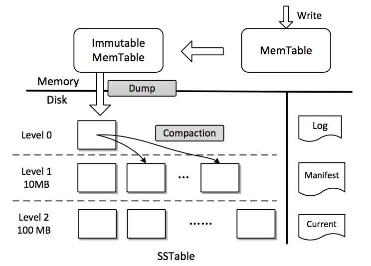

# 概述

LevelDB 是Google开源的单机KV存储引擎，很多开源项目——例如 Cassandra、SSDB、TiKV等也有很多用FB的RocksDB对LevelDB进行了一些优化（后续文章介绍）——都是用了类似架构的存储引擎。

LevelDB落盘文件是SST文件（Sort String Table），既排序的键值对，这种文件格式的优点是非常适合离线计算的批量读写操作。但是仅仅一个SST文件又是不够的，比如对某个键值对的随机写会影响性能，又或者是随机读也会影响性能，再或者是删除操作也有同样的问题。所以需要一些外围约束或者逻辑保证一些列的SST文件可供上层使用。LevelDB正是这些约束或者逻辑实现的一个开源版本，2011年3月由Google架构师 [Jeff Dean](https://ai.google/research/people/jeff)和[Sanjay Ghemawat](https://ai.google/research/people/SanjayGhemawat) 开源，他们曾是Bigtable和SST的早期架构师。


# DB文件说明

在正式介绍LevelDB之前，有必要先了解DB目录下的文件，然后在了解其主要工作流程，最后介绍其源码。

LevelDB 创建一个DB之后其dbname（创建db时制定的名字）目录下，包括如下几部分文件：

```c++
dbname/LOCK                    // 文件锁，防止一个DB被多次打开
dbname/LOG                     // LevelDB 的运行日志，例如：sst、memtable压缩信息等
dbname/LOG.old                 // 重新打开LevelDB会之前的LOG rename 为LOG.old 
dbname/MANIFEST-[0-9]+         // 记录DB的变更，例如 sst文件的删除与新增，SST文件的元信息（读请求需要先获取索引）等，格式为VersionEdit
dbname/CURRENT                 // 记录当前正在使用的MANFEST
dbname/[0-9]+.(sst|ldb)        // 记录kv的数据文件，新版本是ldb，旧版本是sst
dbname/[0-9]+.log              // 记录binlog，写操作会先写入内存，定期刷磁盘，期间日志会写入log文件
```


# 主要流程架构图



#### 写流程

写入的数据都会先写入内存的memtable（skiptable），同时将binlog追加写入.log文件，每一个写入操作都有一个seq唯一标识（后续落盘、snapshot等都需要依赖这个seq）。

当memtable写满时（大小可以设定，默认是2M），切换为Immutable。Immutable经过compact落盘到level 0，level 0 文件内key有序，但是文件之间key可能有重叠，在经过compatc过程将level 0层文件压缩到下层，level > 0 层的文件之间key无重叠。

删除操作也是写，val为tombstone，后续compact过程才会真正删除数据。

#### 读流程

读数据会先读memtable，没有命中读immutable，还没有命中读取manifest文件的索引信息（包含每个sst文件的key范围），找到最底层的key所在文件进行读（每个sst文件在内存也都有缓存，LRU）。

#### 压缩流程

level = 0，将内存的immutable文件写入磁盘的sst文件（通过builder组织成sst文件格式），同时删除binlog（memtable切换时会截断binlog），并更新manifest（追加versionedit）。

level > 0，从level中选出一个文件，通过其key范围在level + 1层选出一批相关的sst，进行合并写入level + 1（逻辑较为复杂后续源码部分会详细介绍），并更新manifest。

压缩流程在background线程执行，在每次压缩后会删除不再使用的文件（log、sst文件）。


# 源码介绍

下面针对几部分重点开一下LevelDB的实现：

1. [data struct](https://github.com/joeylichang/joeylichang.github.io/blob/master/src/leveldb/data_type.md)
2. [open db](https://github.com/joeylichang/joeylichang.github.io/blob/master/src/leveldb/open.md)
3. [compaction](https://github.com/joeylichang/joeylichang.github.io/blob/master/src/leveldb/compact.md)
4. [write and read](https://github.com/joeylichang/joeylichang.github.io/blob/master/src/leveldb/write_read.md)
5. [snapshot and iterator](https://github.com/joeylichang/joeylichang.github.io/blob/master/src/leveldb/snapshot_iterator.md)
