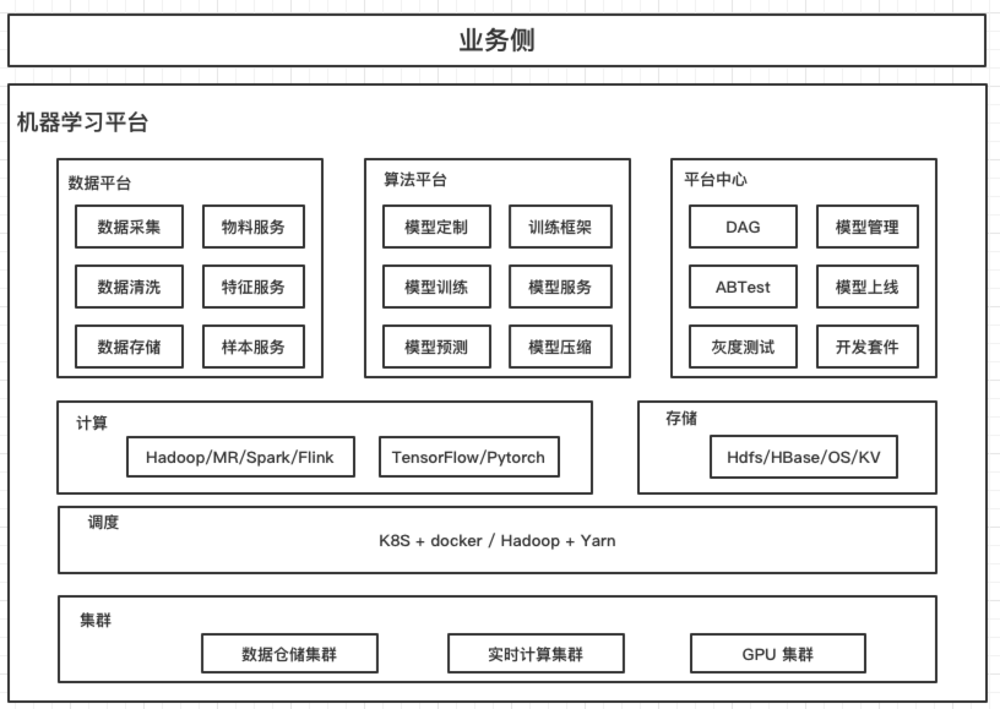

# 机器学习平台概览

## 核心目标

为 AI 能力在开发、测试、生产环境中落地提供全流程的工程化、平台化能力，提升 AI 落地效率。

难点是用平台化的通用能力支持特征（schema变更、格式等）、模型的多样化（部署环境、模型的任意搭配等）。

同时，兼顾传统互联网的工程能力（三高等），涉及 计算、存储、资源调度与编排等互联网基础设施。

## 系统划分

### 功能维度

AI  能力落地的过程大致分为一下几个步骤：

1. 特征提取：依托大数据能力，对业务数据进行特征提取（大数据清洗），既从业务数据中提取算法需要的特征，根据业务场景，可划分为离线特征提取、在线特征提取。
2. 模型训练：根据特征数据对模型进行离线训练。
3. 模型预测：训练好的模型通过测试数据集，进行预验，既测试数据作为输入通过模型的输出与预先设定的结果进行对比、量化。
4. 模型上线：将离线训练好的模型，推送到线上提供在线服务。
5. ABTest：一个项目可能会有多种算法在预先很难明确优劣，需要同时上线进行评估，然后取舍。
6. 业务评估：模型上线之后，需要有数据（最好是可视化）协助业务运营同学评估算法效果。

### 架构维度

机器学习平台围绕三部分进行建设：

1. 数据平台：负责数仓的建设，为特征提取做基础，满足特征多样化的需求。
2. 算法平台：作为机器学习平台的核心，负责模型的离线训练与预测，以模型为中心进行建设，包括：训练框架封装等。
3. 平台中心（控制平台）：负责整个平台资源调度与编排，以及在线部分，包括：模型部署、模型版本管理、ABTest、灰度发布等，同时负责保障在线服务的稳定性、可用性。

## 概念解释

模型分类：

1. 分类
2. 回归
3. 类聚
4. 深度学习
5. 自定义 Loss 损失函数

模型评估：

1. AUC
2. MSE
3. MAE
4. F1

图片标注方法：

1. labelme

通用的存储格式：coco、JOSN schema的coco格式

DAG 算子：输入、输出、特征预处理、数据集加工、机器学习模型、深度学习模型等几大类

每种类别都开发了多个不同的组件，分别支持不同的应用场景。同时为了不失去灵活性，我们也花费了一番心思，提供了多种诸如自定义参数、自动调参、自定义Loss函数等功能，尽量满足各个不同业务方向算法同学各种灵活性的需求（类似于Jupyter lab这种支持用户自定义代码的工具）。

## 实现难点

1. 分布式训练

   数据并行（数据较大）

   ​		将所有计算节点的计算结果按照某种方式合并生成最终的模型

   ​			Parameter Server：参数给中心节点，然后同步给 worker

   ​			Ring All-Reduce：worker 按方向向下循环传递梯度，每个节点收到 n- 1之后完成训练

   ​	模型并行（模型较大）

   ​		线性可分的模型

   ​			特征划分、互不干扰（还是划分数据）

   ​		非线性模型（神经网络）

   ​			通常典型深度CTR模型是**Embedding Layer + MLP**结构；对于10亿特征，Embedding Size为16的CTR模型来说Embedding模型的大小为10^9 * 16 * 4B ≈ 60GB，而MLP的大小只有几个MB。训练Embedding网络的效率将会是CTR模型训练的瓶颈所在。如果在网络中传输Embedding模型参数，整个时延和成本将是不可接受的。如何解决模型的存储及减少网路传输是关键

   ​			[HugeCTR介绍](https://link.zhihu.com/?target=https%3A//www.nvidia.cn/content/dam/en-zz/zh_cn/assets/webinars/nov19/HugeCTR_Webinar_1.pdf)中详细描述其设计方案：通过open addressing hash算法将所有的特征平均地分在所有Device上，每个Device内存中存储Embedding的一部分，通过实现reduce_scatter算子实现模型传输，all_gather进行模型合并。	

2. GPU 管理和调度（隔离）

行业难点：

 	1. 没有标准、包括数据格式
 	2. 框架、框架环境、版本多样性，导致模型训练很难通用化压缩、部署发布，目前还没有统一标准。
 	3. 对于GPU的管理、调度
 	4. 分布式训练

## 优势 vs. 劣势

优势：

1. 基础设施了解深入
2. 工程化能力、思维、意识强
3. 具备较强的技术场景适应能力，能够很好落地

劣势:

1. 对算法（业务）理解不够，框架逻辑落地经验不足

​	

## 分期建设规划

#### 初期

1. 数据平台：起步阶段业务单一，特征变化不多，需要1-2人力，支持特征提取需求和组件日常维护（组件较多：hdfs、hbase、flink、spark、mr）
2. 算法平台：作为核心，初期解决业务需要的模型框架落地、根据 DAG 完成离线训练任务，涉及多元训练框架或者工具源的动态加载、框架运行环境、server等开发工作，初期需要人力 2-3人力
3. 平台中心：作为对外的接口提供初期 DAG 的基本算子，提供模型管理、模型发布等基本功能，需要1-2人力（最好有0.5人力前端）

初期人力需求：4-7人力

初期目标：主要业务（1-2个）完成特征抽取、模型训练与模型评估、基本满足可在线上服务的标准

#### 中期

1. 数据平台：随着业务发展，特征需求量变大，围绕特征工程、数据标准化、组件稳定性和二次开发为主，业务侧开发3-4人，基础组件开发 1-2人
2. 算法平台：中期以稳定性、框架、算子多样性为主，需要 5-7人力
3. 控制平台：中期以在线服务为重点，需要 k8s、docker、模型管理等开发工作，需要3-5人力

中期人力需求：9-14人力

中期目标：通过通用性的建设基本满足业务所有的特征提取需求，模型训练支持业务常用和业界常见的所有算子或者矿建并且统一标准，平台中心完成业务流程的 DAG 并且工作流打通，支持在线模型的编排、弹性扩容、流量控制，满足上线要求（SLA，可用性达到上线要求）

### 人力安排

