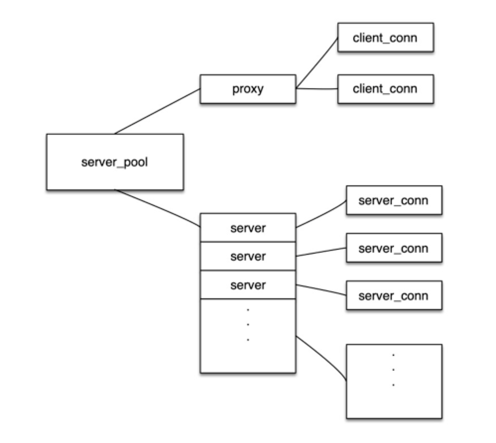
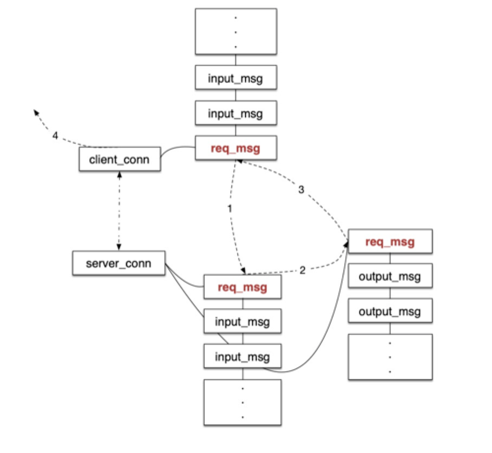

# Twemproxy介绍

Twemproxy是Twitter开源的项目，作为redis和Twemcache的代理层，工作在client与后端存储节点之间。其特点是实现上简洁高效，本文先通过介绍其核心设计让读者体会其简洁和高效，然后通过线上实践对其进行总结，让更多读者了解其特点和一些常见的优化方式。

## 主要数据结构
Twemproxy采用epoll + 回调的单线程工作模式，其主要的数据结构如下图所示：

server_pool维护后端数据节点的连接，一个server一个连接。proxy维护客户端连接，proxy和server_pool是关联关系。

Twemproxy与后端数据节点（redis、twemcache）只维护一个连接，这样做的优点是如果拓扑变更或者后端server故障可以快速反应（或者进行切换）。

Codis-proxy与后端server维护多个连接，即一个slot对应一个连接。如果一个server负责100个slot，则一个proxy需要与该server维护100个链接。
* 缺点
	* 如果发生主从切换会逐个断开100个链接与新的主重新建立连接，势必会影响服务可用性。
* 优点
	* 100个slot的请求可以并行
		* 使用Twemproxy的话100个slot的请求都会在一个队列里，队列中间或者尾部的请求可能先回来（网络、机器等环境影响），但是由于队列头的请求未返回则该请求仍不会返回给客户端（下节介绍），此时Codis-proxy的优点就显示出来了。
	* 注意：如果网络等环境稳定（先去的请求想回来），由于redis是单线程服务，100个并行的请求也需要在redis端排队处理，此时Codis-proxy的并行处理的优势相对于Twemproxy的串行并不大。

## 请求转发模型
proxy作为代理层核心功能就是接受客户端请求，然后转发给后端等待后端结果之后返回给客户端。请求在流转期间需要维护状态，才能保证求情被正确的处理，Twemproxy为了简化状态的维护使用了单线程+3queue的方式。如果采用多线程维护请求状态会加大实现复杂度和降低代码稳定性。Twemproxy请求流转模型如下图所示：

)

同一个客户端的请求先进入客户端的请求队列，通过路由分析定位到后端server的连接，然后将请求加入server连接的队列中，并向后端发送请求，之后将该请求的指针加入连接的完成队列。后端server接收到请求结果之后定位该请求在完成队列中的位置，并将其删除，同时将结果与客户端队列中的相应请求绑定，如果该请求在队列头则直接返回给客户端，如果不是则等待客户端队列中之前的请求都返回结果之后，再返回给客户端（客户端返回结果的顺序与请求来的顺序必须一致，通过客户端请求队列保证的）。

## 后记

### 优点
1. 单线程简洁高效，通过单线程+3queue的方式避免了多线程的复杂性。
2. 高性能：100Byte数据，通地域3个9的分位统计在5ms以内，qps可以达到1w以上（相对redis的10wqps较低，但是proxy是无状态可以根据需要扩容）。

### 缺点
1. 内存只分配不回收，Twemproxy内存管理的单位mbuf（Twemproxy自己实现的内存管理方式），仍然是考虑性能和简洁性，mbuf只能申请不能回收，所以内存只增不减，永远停留在峰值时刻的大小。
2. 日志影响服务可用性，由于单线程的缘故在请求量较大时日志落盘会卡主主线程，从而影响服务的耗时。
3. Twemproxy不支持reids-cluster，Twemproxy推出早于reids-cluster所以并不对其支持，常见的解决方案是另起一个线程用cluster-node命令拉去redis集群的拓扑分布用于后端server请求的路由（日志常见的优化方式也是异步线程）。
4. 请求大小受限，正如前面所述Twemproxy内存管理的最小单位是mbuf，mbuf也是接收网络数据包的大小（可配置），所以请求包的大小不能超过mbuf大小。
5. Twemproxy的性能一般情况下不如redis的性能，Twemproxy + redis架构的瓶颈会在Twemproxy而不是redis（与常见的磁盘存储有些许差异）。

### 实践
日志和支持redis-cluster都可以通过多线程进行优化和解决。根据前面介绍在保证3个9的可用性的情况下，1w qps * 512k（请求大小）= 5G内存，即使内存只增不减但是理论峰值在5G以内也是没什么问题的。在私有云的环境上对请求大小进行限制也是必要的（请求数据过大，是达不到3个9的SLA），所以Twemproxy限制请求大小也不是棘手的问题。

Twemproxy受到最大的挑战是单线程在性能上的表现（相对多线程）。这里有个误区不是单线程就代表性能一定差，多线程性能就一定好。
要分几个层面来看：
1. 场景：Redis和Twemproxy都是单线程最适合容器化，k8s+docker又是大势所趋，相比多线程更有优势。
2. 实现：多线程需要维护复杂的状态机以及多线程通信、同步等编程技术，复杂度较高。
3. 稳定性：Twemproxy社区活跃，许多大厂都有线上验证得到了工业环境的验证，业界目前还没有比较认可的多线程proxy。
