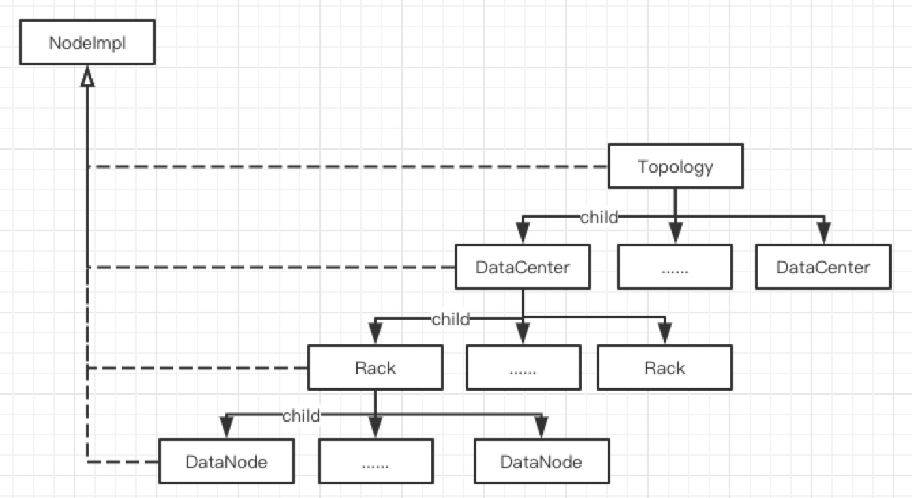

# 拓扑数据

### 类关系图



Seaweed的拓扑信息从逻辑上划分为三种节点，既DataCenter、Rack、DataNode分别于物理设备对应，所有的拓扑信息又都收敛于一个TopoLogy如上图所示，其中TopoLogy、DataCenter、Rack、DataNode又全部继承与NodeImpl结构体，NodeImpl实现了Node接口。NodeImpl 结构体内部变量nodeType用于区分四种节点类型（既TopoLogy、DataCenter、Rack、DataNode）。

###### NodeImpl

```go
type NodeImpl struct {
	volumeCount       int64			// 已经alloc的volume数量
	activeVolumeCount int64			// 可以使用的volume数量
	ecShardCount      int64			// ec编码的volume数量
	maxVolumeCount    int64			// 当前节点下的最大可申请的volume数量
	id                NodeId		// nodeID string类型
	parent            Node			// 父节点
	sync.RWMutex      // lock children	
	children          map[NodeId]Node 	// 子节点，TopoLogy、DataCenter、Rack、DataNode顺序
	maxVolumeId       needle.VolumeId 	// 当前节点最大的volumID

	//for data node, rack, data center, topology
	nodeType string
	value    interface{}			// 只想当前节点的类型（TopoLogy、DataCenter、Rack、DataNode）
}
```

拓扑信息中的节点统一继承自一个结构体的好处是可以递归计算每个节点的信息（树结构 + 相同的计算逻辑），例如：

```go
// 例如, DataNode的增加或者减少，可以递归计算父节点的实时volume的数量
func (n *NodeImpl) UpAdjustVolumeCountDelta(volumeCountDelta int64) { //can be negative
	atomic.AddInt64(&n.volumeCount, volumeCountDelta)
	if n.parent != nil {
		n.parent.UpAdjustVolumeCountDelta(volumeCountDelta)
	}
}
```


### 拓扑数据详解

[Topology](https://github.com/joeylichang/joeylichang.github.io/blob/master/src/seaweed/master/tupo/topology.md)
DataCenter
Rack
DataNode
Collection
VolumeGrowOption
VolumeLayout
