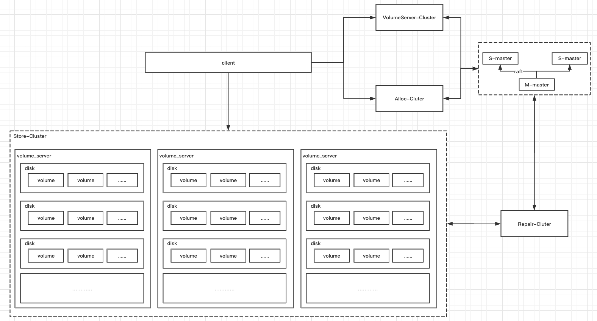

# Seaweed

## 整体架构

seaweed的整体如图所示，主要分为master和volume_server（不包含filer，后续介绍filer和ec部分）两部分。master使用raft协议管理元数据，volume_server负责数据存储。

##### master

seaweed支持按DataCenter、Rack、DataNode的物理单元管理存储单元Volume（存储数据的最小单元，默认30G），并且支持collect管理volume，collection是一个逻辑概念按client需要对volume进行逻辑划分。

本系列文章针对master主要介绍以下几部分：

1. [拓扑数据管理](https://github.com/joeylichang/joeylichang.github.io/blob/master/src/seaweed/master/tupo/tupo.md)
2. [定时任务](https://github.com/joeylichang/joeylichang.github.io/blob/master/src/seaweed/master/collect_full_and_garbage.md)
3. [master接口梳理](https://github.com/joeylichang/joeylichang.github.io/blob/master/src/seaweed/master/master_interface.md)

##### volume_server

volume_server一个进程对应一个Store，一个Store对应多个DiskLoction（对应一个磁盘，更准确是对应一个目录），一个DiskLoction对应多个Volume，一个Volume对应多个Needle，一个Needle对应一份用户的数据。一个Volume主要包含两个文件，既数据文件和索引文件（还有 Volume 元信息持久化文件 .vif）。

除了存储数据的组织外，volume还支持客户端的读写、集群内部命令，例如mount、unmout、copy、tail等。

本系列文章针对volume_server主要介绍一下几部分：

1. [存储数据结构介绍](https://github.com/joeylichang/joeylichang.github.io/blob/master/src/seaweed/volume_server/data_type/organization.md)
2. [volume_server接口梳理](https://github.com/joeylichang/joeylichang.github.io/blob/master/src/seaweed/volume_server/volume_interface.md)

##### main_process

存储系统最基本的操作是读写删除操作，seaweed的写和删除是强一致，既删除主节点数据之后向从节点同步，所有从节点的更新都成功之后才算成功，否则更新失败。

seaweed的读写都需要与master交互，写操作时向master申请fid，fid有三部分组成：volumeId + 全局递增序列号 + cookie，申请fid的结果会返回vid所在的主节点的地址，client向主节点发起写请求。读请求会像master查询fid对应的volume的分布，client收到一个volume_server的列表。

除了读写操作seaweed的心跳汇报也是值得重点介绍的，seaweed分配fid的全局递增id是不落盘的，这样一旦三个master都重启（当然概率会很小）必须保证master收到了所有volume_server的心跳，因为心跳会汇报其最大的fid，这样才能保证后续不重复。再或者用户在申请fid之后串改了中间递增id会使得fid有一定概率重复。

volume中没有使用任何存储引擎，所有的写都是追加写，删除是标记删除，如果删除的较多会有空洞造成空间浪费，seaweed的解决方案是compact。

本系列针对seaweed主要的流程做一下几部分的介绍：

1. [assign(alloc fid)](https://github.com/joeylichang/joeylichang.github.io/blob/master/src/seaweed/main_process/assign.md)
2. [read/write/delete](https://github.com/joeylichang/joeylichang.github.io/blob/master/src/seaweed/main_process/write_read_del.md)
3. [compact](https://github.com/joeylichang/joeylichang.github.io/blob/master/src/seaweed/main_process/compact.md)
4. [heartbeat](https://github.com/joeylichang/joeylichang.github.io/blob/master/src/seaweed/main_process/heart_beat.md)

##### weed_shell

以上介绍的是seaweed的核心模块逻辑，但是这个系统在一些容错场景下并不是完美的，作者提供了一些外围的工具进行补偿，命令很多选了一下几个比较重要（影响数据可靠性、可用性的场景或者说运维使用较多的命令）进行以下介绍：

1. [balance](https://github.com/joeylichang/joeylichang.github.io/blob/master/src/seaweed/weed_shell/balance.md)
2. [replication fix](https://github.com/joeylichang/joeylichang.github.io/blob/master/src/seaweed/weed_shell/fix_replication.md)
3. [move](https://github.com/joeylichang/joeylichang.github.io/blob/master/src/seaweed/weed_shell/move.md)

## 思考

#### 问题

seaweed是目前社区比较活跃的一套文件系统，主要是针对小文件（与hdfs最大的区别），在架构设计和一些实现细节上也是有提升空间的，尝试着在以下几方面提出一些问题：

* 没有数据一致性校验逻辑，更新异常时volume内数据可能不一致（对用户透明），造成空间浪费。

写数据时如果有副本写入失败，客户端重试可能master分配了新的volume，之前的replicate内多个副本之间数据有不一致虽然不影响用户数据的访问，但是造成了数据的不一致，如果量较大，空间会有一定浪费。

删除数据也会有数据不一致的情况，比如删除一个副本失败导致返回用户删除失败，用户下次如果读到主副本会查询失败。

* 没有自动化的副本一致性校验与修复逻辑，weed_shell只解决了一部分，并且只能算是外围工具。

replicate级别的完整性校验与修复以及volume级别的搬迁（容量均衡）常规的做法是在系统内部自愈，seaweed给出的解决方式周期性的运行weed_shell工具，这种方式显然不够完美，在生产环境中只能算是临时解决方案（weed_shell 也有一些设计问题，详见上面的介绍）。将系统的自愈能力做到系统内部才是真正的解决之道。

* client 读写删除都需要与master交互，master可能成为瓶颈。

seaweed的原型是FB的haystack论文，在论文中系统的前端有一层CDN缓解后端存储压力，但是在一些场景中还是会对存储造成一些压力，比如批量灌库（虽然支持一次申请多个fid，但是多个fid一定在一个volume的replicate，存储节点压力会过大），将会频繁与master交互，master是单点相应请求，很可能会成为瓶颈。

* 不支持磁盘级别的挂在、卸载，在磁盘故障期间只能整体修复replicate，保证数据副本的完整性。

文件或者对象系统，一般是大数据量低QPS的场景，所以机器数量一般不会太少（或者设计目标就是大规模集群），少则数百台多则上万台，目前BAT单机群的对象系统单机群都可以支持1-2w甚至更多，亚马逊、谷歌的单机群甚至超过10w逼近20w。磁盘故障应该是很常见的场景，进程应该支持磁盘级别的挂载与卸载，否则一旦因个别磁盘问题将影响数据恢复的收敛时间。

#### 架构优化

基于以上问题对seaweed架构有一些优化的思考，架构图如上，本部分由于篇幅问题不会介绍太多实现细节（后面单开章节详细介绍），下面针对增加的优化模块简单的展开一下。

* VolumeService-Cluster && Alloc-Cluster

VolumeService 和 Alloc主要是分担master的读写压力，VolumeService负责查询fid的路由信息，Alloc负责fid的申请。VolumeService需要支持全量 和 增量获取master的最新路由信息（volume的分布），可以是master推送或者VolumeService周期拉取，seaweed中volume的申请都是有buffer的（既预申请），频率相对较低，master推送是比较理想的方式（需要 Master 维护 VolumeService 节点信息）。

Alloc负责fid的申请，Alloc为了减少与 master 之间的交互可以一次申请一批fid中递增的id，至于fid分配到那个DataNode完全可以由Alloc负责（Alloc 掌握全局的拓扑信息），master在这里完全退化为id_alloc的服务。这里有个细节还是需要注意一下，id不能重复，所以Alloc和master需要落盘持久化，Alloc 分配的 id 保证唯一或者局部递增即可，无需全局递增且唯一（这一点可以大大简化 id_alloc 的设计复杂度）。

VolumeService 和 Alloc 目的是为了分担 master 的压力，如果还是单点显然性能没有提升，所以应该是一个集群，VolumeService是无状态服务可以无限部署。Alloc分配fid除了保证全局唯一，还需要保证多个Alloc的分配要均衡，一个简单的方案是，每个Alloc负责部分DataNode的分配，可以按collection划分或者一致性hash，不论哪种方式都有一些元数据需要master管理，所以Alloc是一个有状态的服务，相对VolumeService的设计要复杂一些。

* Repair-Cluster

Rebalance、Replicat完整性、Volume内数据一致性检验等工作可以由一个单独的模块（Repair）进行处理。Rebalance可以周期性检查并搬迁（需要考虑流控，任务均衡等细节）。Replicat的完整性同样可以Repair周期检查并执行。

Volume内数据一致性，可以扫描Replicate内副本的Needle比较是否一致，如果不一致查询客户端存储fid的系统判断该实数是否被用户删除，决定删除或者补偿数据（这里需要每个节点部署一个 repair-agent 配合完成 Needle 级别数据的校验，Repair 集群负责全集群 repair-agent 流量、速度等调度）。

如果集群规模较大，Repair同样需要一个集群，每个Repair负责一部分volume的校验，同样Repair也变成了有状态的服务，需要master进行管理元数据。
