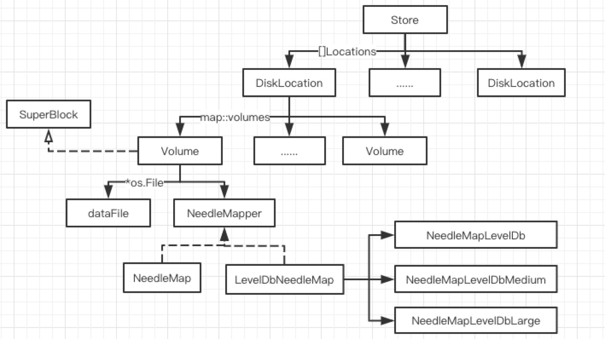

# 类关系图

[Store](https://github.com/joeylichang/joeylichang.github.io/blob/master/src/seaweed/volume_server/data_type/store.md)：一个进程对应一个store，或者一个存储节点对应一个store。

[DiskLocation](https://github.com/joeylichang/joeylichang.github.io/blob/master/src/seaweed/volume_server/data_type/disk_location.md)：一个磁盘对应一个diskloction，或者一个存储目录（volume_server启动时可以指定多个目录）对应一个diskloction。

[Volume](https://github.com/joeylichang/joeylichang.github.io/blob/master/src/seaweed/volume_server/data_type/volume.md)：一个DiskLocation对应多个volume，volume是存储数据的一个组织单元。一个volume由三部分组成，既SuperBlock、数据文件（.dat文件，存储用户上传数据）、索引文件（.inx 或者 .ldb文件）。

[SuperBlock](https://github.com/joeylichang/joeylichang.github.io/blob/master/src/seaweed/volume_server/data_type/superblock.md)：volume的元数据信息，例如ReplicaPlacement、Ttl等。

[Needle](https://github.com/joeylichang/joeylichang.github.io/blob/master/src/seaweed/volume_server/data_type/needle.md)：对应一条用户的存储数据，一个volume包含多个Needle。

[NeedleMapper](https://github.com/joeylichang/joeylichang.github.io/blob/master/src/seaweed/volume_server/data_type/needle_mapper.md)：对应一个索引文件有两种类型，既全部索引信息映射到内存（NeedleMap，.idx文件）、LevelDB（LevelDbNeedleMap，.ldb目录）。

LevelDbNeedleMap又分为三种类型。NeedleMapLevelDb、NeedleMapLevelDbMedium、NeedleMapLevelDbLarge，三种类型的区别在于LevelDB的配置参数不同包括：memtable大小、缓存大小、每层sst文件总大小（leveldb压缩 与 性能之间的权衡）。

NeedleMap 分位两种，CompactMap 和 MemDb，前者是默认的内存数据结构用于存储索引，后者主要是加载只读 Volume 时，一种纯内存的 LevelDB，目的是加载数据的读取。

##### 注意

基于 LevelDB 的索引，也是有 idx 文件的（与 LevelDB 的 wal 功能重复）。个人认为出于 copy、compact 代码复用的原因，copy 和 compact 都是基于 idx 读取源文件然后构建数据，levledb 是引入（节省内存）为了方便复用之前的copy 和 compact 逻辑，造成了上述情况，会多一次写盘（大多数情况下，对象或者小文件存储的性能要求不高）。

在 copy 之后需要进行的 mount 操作和 compact 提交之后，都会调用 volume 的 load 接口，该接口内部会根据 volume 配置的索引类型进行加载。

