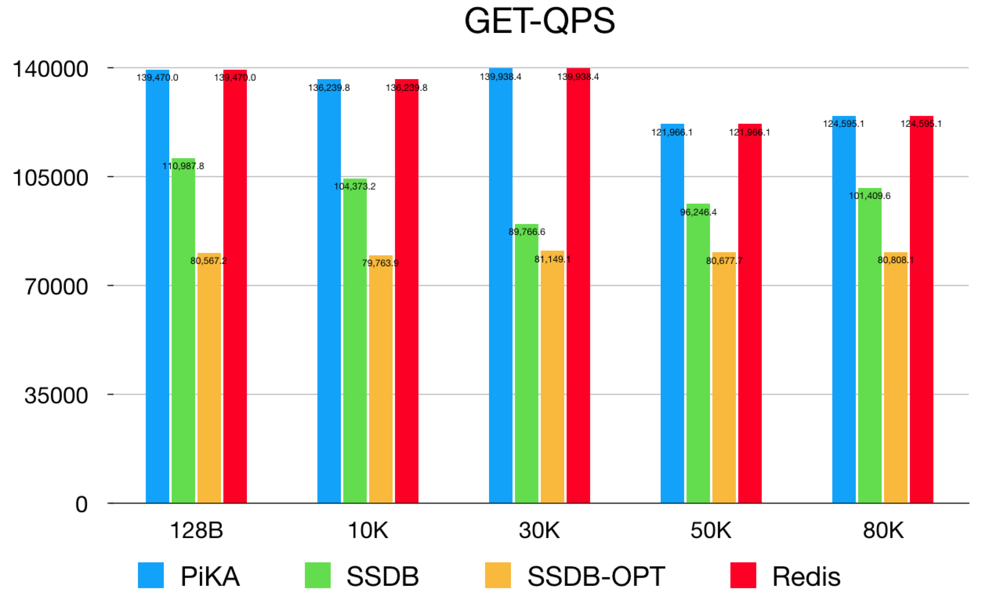
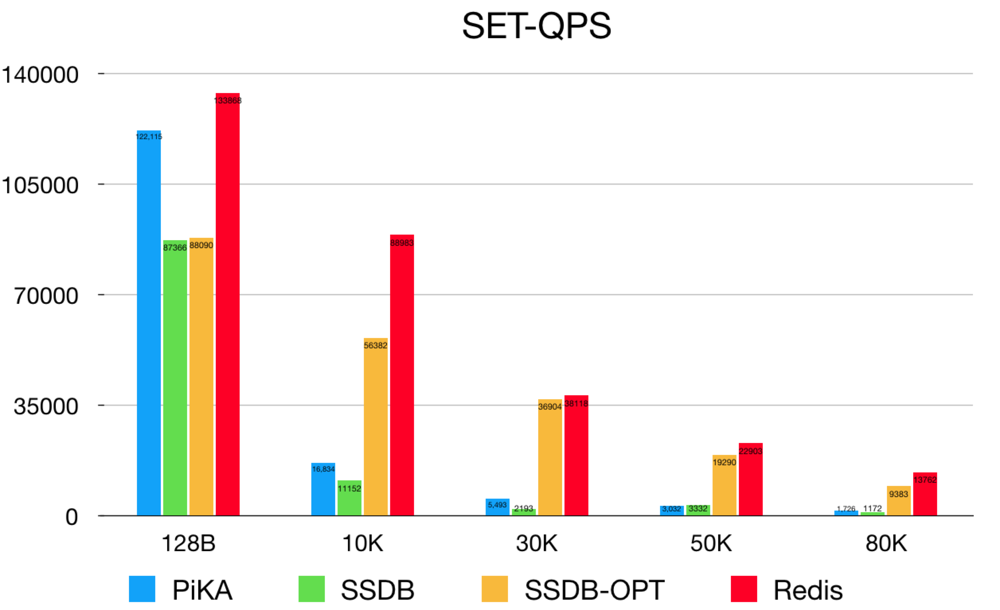
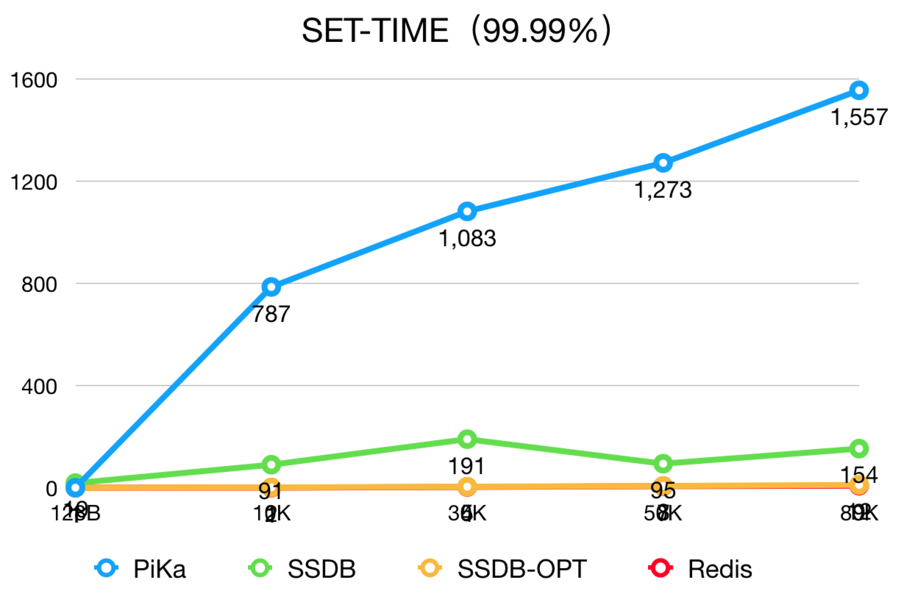

# 概述

前段时间部门项目需要一套KV存储系统存储用户的搜索结果。数据大小均值在30KB-70KB之间，QPS在1w上下。考虑到接口通用性（方便现有业务迁移）需要兼容Redis协议。考虑成本因素需要数据落盘，而不能是Redis这种纯内存存储。

 由于之前做过基于SSDB的集群解决方案，回顾了之前的一些学习内容，本系列文章正是对过往知识的总结。

# 性能测试

在选型阶段重点对比了社区的PiKa、SSDB。在我们的最终方案中对SSDB进行了一系列的优化，包括空查询、集群化等等。下面贴一组性能测试的对比数据：

## GET-QPS

## SET-QPS

## SET-分位统计（99.99%）

## 结论

读性能上PiKa接近Redis（Get的分位统计基本一致未列出），但是在大数据（10K-80K）的写性能上PiKa性能较差，且延时较高。经优化过的SSDB在性能和延时生更稳定，读性能是Redis的60%左右（8W），写性能随数据增大，下降趋势与Redis基本一致，且延时更稳定。