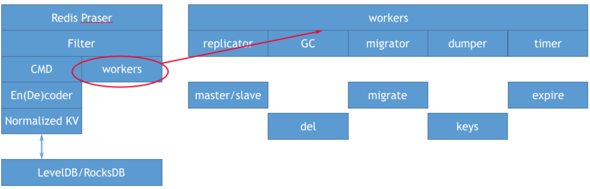

# 类关系

```c++
SSDBServer
	|_SSDBImpl::SSDB *meta		/* 对leveldb的封装，存储元数据：binlog信息、snapshot、slot等等 */
		|_[leveldb::DB
	|_SSDBImpl::SSDB *data		/* 对leveldb的封装，存储数据*/
		|_leveldb::DB
	|_BackendDump												
  		|_SSDB *ssdb
	|_BackendSync			/* slave的复制流 */ 
  		|_std::vector<Client *>
  		|_std::map<std::string, CopySnapshot *>
  		|_std::map<pthread_t, Client *> workers;
  		|_SSDBServer
		|_ExpirationHandler	/* 过期删除线程，slave没有，等待master的binlog */
  		|_SSDB *ssdb;
  		|_SSDB_BinLog
	|_SSDBCluster
  		|_ReplicationSet *migrating_slots_to[CLUSTER_SLOTS];	/* migrateing 状态的slot */
		|_ReplicationSet *importing_slots_from[CLUSTER_SLOTS];	/* importing 状态的slot */
                |_ReplicationSet *slots[CLUSTER_SLOTS];			/* 当前节点负责的slot */
                      |_ClusterNode *myself;
                      |_SSDB *db;
                      |_SSDBServer *server;
                      |_RangeMigrate *migrator;				/* 数据搬迁，按slot粒度*/
                            |_SSDB_BinLog
                            |_SSDB *ssdb;
                            |_ExpirationHandler			/* 数据搬迁期间需要关闭过期删除线程 */
                            |_Client				/* 数据搬迁期间的client，既发送端 */
                            |_Server				/* 数据搬迁期间的server，既接收端 */
	|_NetworkServer	                	/* 网络层 */
		|_Link
  		|_RedisLink			/* reids协议解析 */
		|_Fdevents							
		|_ProcWorkerPool *writer	/* 默认1个写线程 */
		|_ProcWorkerPool *reader	/* 默认10个读线程 */
  		|_ProcMap											
		|_Slave				/* 当前节点为slave时，接收binlog的逻辑，此时全局只读*/
                      |_SSDBServer						
                      |_SSDB
                      |_LinkS
	|_SSDB_BinLog	
		|_SSDB *meta		/* binlog的原信息需要记录在meta */
                      |_LogFile		/* binlog文件，binlog的格式是LogEvent*/
		      |_LogWriter	/* LogFile 默认有各1M的读写缓存，需要bind() */
        |_proc_*()			/* redis命令的处理函数，通过宏定义加proc_前缀 S*/
```

##### 注意

SSDB-OPT对于Redis的数据类型实现有了较大的变更（上述源码与开元SSDB也有较大优化，例如SSDBCluster，metaDB等），后续有时间补充关于数据类型的设计。

重点介绍以下几部分：

1. BackendDump
2. BackendSync
3. ExpirationHandler
4. SSDBCluster

# 线程模型


