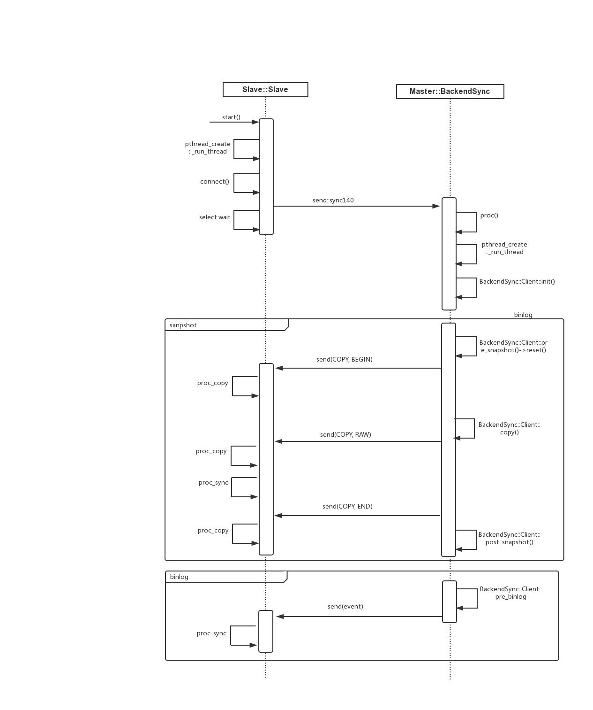

# 数据同步流程图



# 主要流程

1. slave：change_master_to 指定master的ip、port（只是指定未开始同步数据）以及last_seq、last_key。
2. slave：star_slave开始同步数据，slave会调用Slave类的start创建一个新的线程与master交互。
3. master：收到slave的sync140命令之后，调用BackendSync创新新的线程负责slave的数据同步（一个slave一个线程），sync140命令中带有last_seq、last_key，根据其判断是传输snapshot还是binlog。
4. master：传输snapshot，会分三步BEGIN、RAW、END。
   1. BEGIN：清除slave数据，重置binlog等信息（期间会关闭网络，重置之后开启）。
   2. RAW：由于用户数据使用leveldb拼装成，一个用户key可以对应多个leveldb的key，RAW表示leveldb级别的key。
   3. END：重置Slave的一些信息（last_seq、last_key清空）。
5. master：传输binlog，binlog传输的是用户级别的key，slave接收后会有相应函数处理（不能像RAW一样处理，根据数据类型处理方式有所差异）。
6. master：读取binlog需要所，如果业务写入数据过多长时间占用锁，master会像slave发送NOOP命令保持心跳。


# 重点逻辑

##### BackendSync::Client::init()

```c++
// 只保留重点逻辑
void BackendSync::Client::init(){
	// 只制定了last_seq，同步binlog
	// 如果binlog没有找到last_seq会更改为Client::COPY，重新传输snapshot
	if(last_key == "" && last_seq != 0){
		this->status = Client::SYNC
		LogEvent event(this->last_seq, BinlogType::COPY, BinlogCommand::END);
		link->send(event.repr());
	}
	// 从头开始传递数据，从snapshot开始
	else if(last_key == "" && last_seq == 0){
		this->status = Client::COPY;
	}
	// last_key 不为空，不能作为seek的标准（重复、RAW类型等），重新snapshot开始
	else{
		this->status = Client::COPY;
	}
}
```

##### EVENT类型

```c++
class BinlogType{
public:
	static const char NOOP		= 0;       \\ 保持主从之间心跳
	static const char SYNC		= 1;       \\ 同步binlog
	static const char MIRROR	= 2;       \\ 同上（弃用）
	static const char COPY		= 3;       \\ 同步snapshot
};
```

##### 同步的特殊命令

```c++
class BinlogCommand{
public:
  static const char BEGIN	= 7;           \\ 同步snapshot开始
	static const char END	= 8;           \\ 同步snapshot结束
	static const char ACK	= 9;           \\ 数据搬迁成功之后的ACK
   
	static const char STOP		= 125;     \\ binlog停止，不增加seq
	static const char DESC		= 126;     \\ binlog开始，不增加seq
	static const char ROTATE	= 127;     \\ binlog截断（转新文件），不增加seq
}
```

