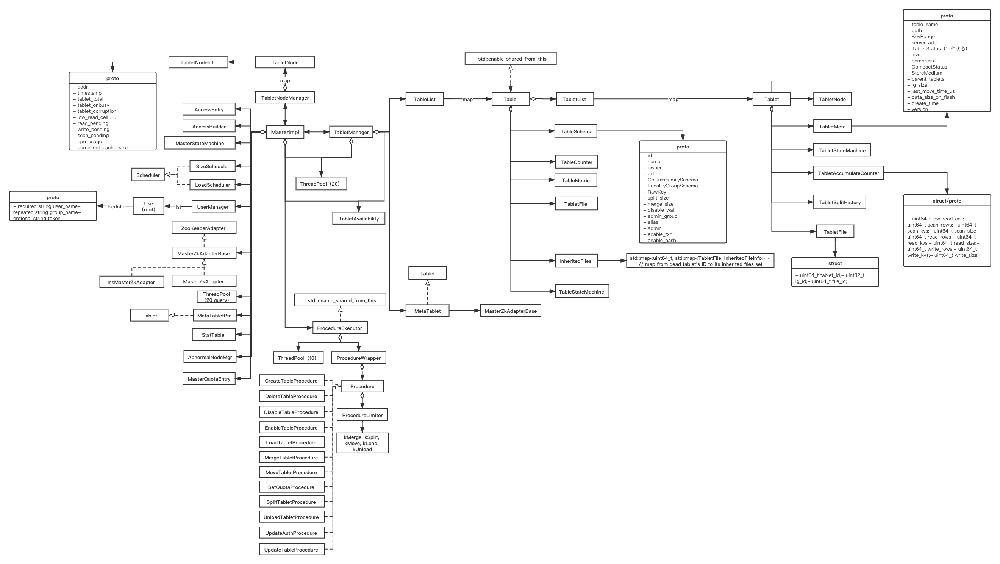
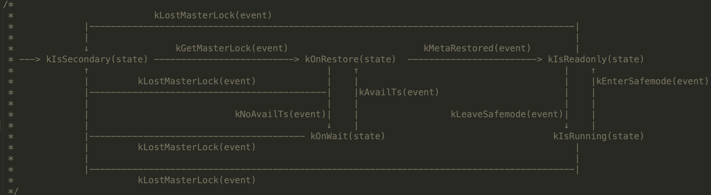
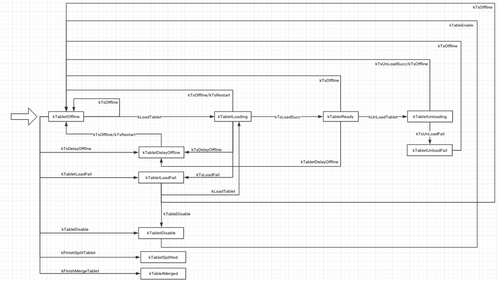
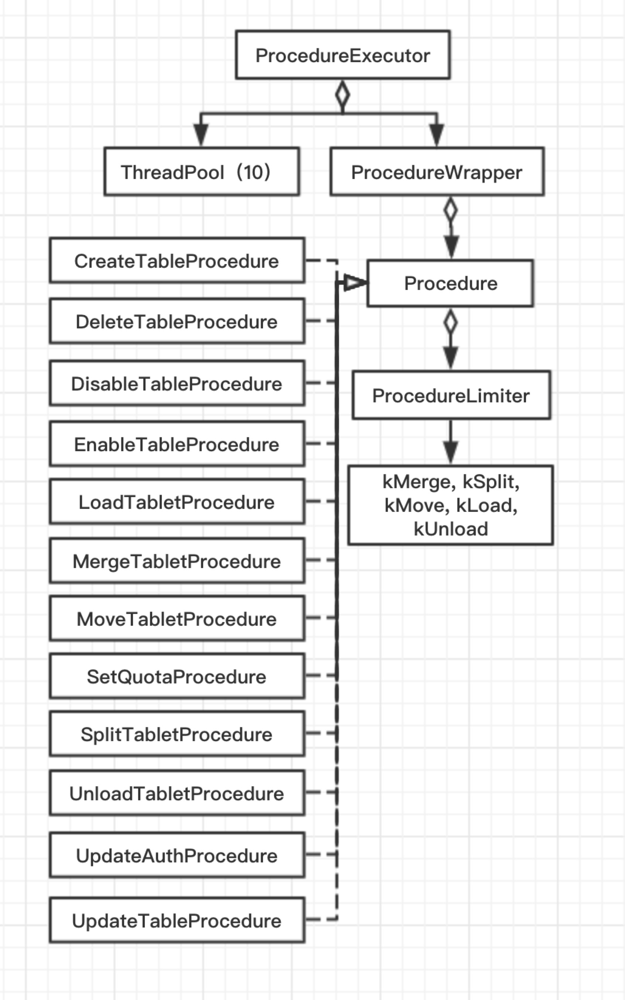

* **Navigation**
  * [Master Arch](https://github.com/joeylichang/joeylichang.github.io/blob/master/src/tera/overview/master_overview.md#master-arch)
    * [Mater Class arch](https://github.com/joeylichang/joeylichang.github.io/blob/master/src/tera/overview/master_overview.md#mater-class-arch)
    * [Master Thread arch](https://github.com/joeylichang/joeylichang.github.io/blob/master/src/tera/overview/master_overview.md#master-thread-arch)
  * [Master State Machine](https://github.com/joeylichang/joeylichang.github.io/blob/master/src/tera/overview/master_overview.md#master-state-machine)
  * [Master Init](https://github.com/joeylichang/joeylichang.github.io/blob/master/src/tera/overview/master_overview.md#master-init)
  * [Master Period Task](https://github.com/joeylichang/joeylichang.github.io/blob/master/src/tera/overview/master_overview.md#master-period-task)
    * [HeartBeat](https://github.com/joeylichang/joeylichang.github.io/blob/master/src/tera/overview/master_overview.md#heartbeat)
    * [Garbage Collection](https://github.com/joeylichang/joeylichang.github.io/blob/master/src/tera/overview/master_overview.md#garbage-collection)
    * [Load Balance](https://github.com/joeylichang/joeylichang.github.io/blob/master/src/tera/overview/master_overview.md#load-balance)
    * [Abnormal](https://github.com/joeylichang/joeylichang.github.io/blob/master/src/tera/overview/master_overview.md#abnormal)
  * [TabletNode In Master](https://github.com/joeylichang/joeylichang.github.io/blob/master/src/tera/overview/master_overview.md#tabletnode-in-master)
    * [TabletNode State machine](https://github.com/joeylichang/joeylichang.github.io/blob/master/src/tera/overview/master_overview.md#tabletnode-state-machine)
    * [TabletNode Add](https://github.com/joeylichang/joeylichang.github.io/blob/master/src/tera/overview/master_overview.md#tabletnode-add)
    * [TabletNode Delete](https://github.com/joeylichang/joeylichang.github.io/blob/master/src/tera/overview/master_overview.md#tabletnode-delete)
    * [TabletNode KickOff](https://github.com/joeylichang/joeylichang.github.io/blob/master/src/tera/overview/master_overview.md#tabletnode-kickoff)
  * [Tablet In Master](https://github.com/joeylichang/joeylichang.github.io/blob/master/src/tera/overview/master_overview.md#tablet-in-master)
    
    * [Tablet State machine](https://github.com/joeylichang/joeylichang.github.io/blob/master/src/tera/overview/master_overview.md#tablet-state-machine)
  * [Procedure Arch](https://github.com/joeylichang/joeylichang.github.io/blob/master/src/tera/overview/master_overview.md#procedure-arch)
  * [AccessControl](https://github.com/joeylichang/joeylichang.github.io/blob/master/src/tera/overview/master_overview.md#access-control)
  * [Quta](https://github.com/joeylichang/joeylichang.github.io/blob/master/src/tera/overview/master_overview.md#quta)
  
    

### Master Arch

#### Mater Class arch



Master 核心的类架构图如上所示，上述类图过于详细繁杂，下面分几大块进行介绍（后续针对各自逻辑会详细介绍）：

1. MasterImpl：Master的核心模块，也是所有功能模块初始化 和 入口的地方。在MasterEntry模块中对其进行初始化，MasterEntry 除了 MasterImpl 还有 RPC 模块的初始化，Master的核心逻辑都集中在MasterImpl。
2. TabletNodeManager：负责TabletNode管理的模块，一个 TabletNodeServer 映射为 一个TabletNode。
3. TabletManager：Tablet的管理模块，内部通过 map<table_name, Table> 映射管理所有的Table，每一个 Table 通过TabletList 管理其 Tablet。Tablet 内部有addr（所在的节点地址）与 TabletNode 进行关联。
4. ProcedureExecutor：一套任务调度的框架（后面会详细介绍），Table 的 create、disable、enable、delete、update，以及 Tablet 的 load、unload、move、spilt、merge等流程都继承自ProcedureExecutor 使用统一的调度模式。
5. Scheduler：负载均衡的框架，支持按大小（SizeScheduler）、流量（LoadScheduler）两种模式进行负载均衡（后面会详细介绍）。
6. Access*：权限相关模块（后续会详细介绍），Tera 在开源的时候阉割了百度内部使用的权限管理系统。
7. MasterQuotaEntry：Quta相关模块（后续会详细介绍）。
8. AbnormalNodeMgr：防止因网络抖动导致 TabletNode 频繁加入离开的容灾模块（后面会详细介绍）。
9. UserManager：用户管理模块。


#### Master Thread arch

有了上述模块的角色了解之后，下面看一下 Master 的线程模型。

```c++
|_MasterEntry
  |_RemoteMaster                ThreadPool_A（10）
  |_RemoteMultiTenancyService   ThreadPool_A（10）
  		|
  		|_MasterImpl                ThreadPool_B（20）
  		|_TabletManager             ThreadPool_B（20）
  				|
  				|_query_thread_pool_      ThreadPool_C（20）
```

Master 主要有三个线程池，负责 响应 Table、Tablet 的 RPC（RemoteMaster）服务 以及 响应 权限、Quta的 RPC（RemoteMultiTenancyService服务）共用一个线程池（默认10个线程）。

MasterImpl 和 TabletManager 公用一个线程池，MasterImpl主要是一些周期性任务 和 向TabletNode 发送请求等 、 TabletManager 会向 TabletNode 发送请求、各种Procedure（Table 创建、Tablet搬迁等刘海成） 会使用多线程完成，他们共一个线程池（默认20个线程）。

MasterImpl 内部 还有一个线程池 query_thread_pool_ 专门用于心跳探测，默认20个线程。加上主线程 Master模块默认使用51个线程。


### Master State Machine



Master 的状态转换图如上所示，Master 以 kIsSecondary（从）身份启动，抢占 ZK 的 master_lock 成功之后通过事件 kGetMasterLock(event)  驱动转入 kOnRestore 状态，收集所有 TabletNode 节点的信息，获取 MetaTable 的位置，然后读取 MetaTable 的元数据进行加载，健在完成后进入 kIsReadonly 状态，然后尝试 kLeaveSafemode(event) （判断故障节点的 Tablet 是否超过总数的10%），如果成功则进入 kIsRunning 状态，开始 Master 的正常运行，以上都是在 Master 的初始化部分完成（后面介绍）。

Master 抢锁成功之后，如果没有 TabletNode（新集群未加入机器），会进入 kOnWait 状态等待机器的加入。Master 在 kIsRunning 期间，如果故障节点的 Tablet 占总数的10%及以上，会进入kIsReadonly 状态。


### Master Init

1. 向所有的 TabletNode 节点发送 Query 请求，目的是更新 TableNode 的内存信息 和 获取全部的 Tablets 信息。
  
   1. 根据 ZK 中 /tera/ts 子节点的 TabletNode 信息向所有的节点发送 Query 请求，通过信号量实现同步机制，保证所有的 Query 请求都收到回复 或者 重试失败 才继续向下进行。
   
   2. Query 返回的信息主要包括两部分，一部分是 TabletNode 信息，另一部分是 TableNode 负责的 Tablets 信息，收集的 TabletNode 更新内存中 TabletNodeManager 中相应的节点信息（TabletNode 在 Master 内的元数据详情见[TabletNode元数据解析](https://github.com/joeylichang/joeylichang.github.io/blob/master/src/tera/master/data_organ/meta_data.md#tablenodes)）。
   
   3. 将所有的 TabletNode 的 Tablets 收集到一起之后放入Vector 供后续使用。
   
      **注意**：此处并没有更新 Tablet 在 Master 内存中的元数据，需要后面先加载元数据，因为元数据是要以 MetaTable 的为准（否则失去了 MetaTable 的意义），待加载完毕后与收集的信息进行对比，对于信息不一致有相应的逻辑。
   
2. 加载 MetaTable 中的元数据，在所有收集上来的 Tablets 中找到 MetaTablet 进行加载。

   1. 遍历上述收集的 Tablets 的 Vector，找到table_name == “meta_table” 的Tablet。

      注意：meta_table 加载的时候需要容错，有可能有多个 TableNode 上面有 MetaTable 的信息，可能是 MetaTable 有过搬迁但是没有 unload 成功等异常情况导致。

      1. MetaTablet 的 start_key 和 end_key 必须是 “”，既范围是正负无穷。
      2. 只有一个 MetaTablet ，如果在 Vector 中多以一个 Tablet 的 table_name 是 meta_table，也是异常情况。
      3. 针对上述异常情况，需要 unload 异常的 Tablet，如果 unload 失败，则 KickOff 节点。

   2. 如果没有找到 MetaTablet 或者有多于一个 MetaTablet 的情况，需要重新选择一个节点 load MetaTable（选取新节点的策略是 LoadBalance 中 根据容量策略进行选取的方式）。

   3. 加载 MetaTable 的元数据（也可以指定本地加载，既在本地磁盘读取文件进行加载）。

      1. Master 用 Client 的方式，向 MetaTable 发起 Scan 请求对其上的数据进行扫描。
      2. MetaTable 数据分为以下 5 种情况：
         1. key 的首字符 == '~'，表示 user 信息，LoadUserMeta。
         2. key 的首字符 == '|' 且 第二个字符是 '0'，表示是 Access 信息。
         3. key 的首字符 == '|' 且 第二个字符是 '1'，表示是 Quta 信息。
         4. key 的首字符 == '@'，表示是 Table 信息，LoadTableMeta。
         5. key 的首字符 > '@'，既table_name + ‘#’ + key_start，表示是 Tablet 信息LoadTabletMeta。
      3. [Table 以及 Tablet 在Master 内存中的元数据信息详见[Tablet元数据解析](https://github.com/joeylichang/joeylichang.github.io/blob/master/src/tera/master/data_organ/meta_data.md#tablet)

3. 加载 UserTable 的信息，根据收集上来的 Tablets 信息，对用户的 Tablets 进行处理。

   遍历第一步收集上来的 Tablets：

   1. 如果在 Master 内存中没有（既 MetaTable中没有），则 unload。

   2. 否则，绑定 Tablet 到其相应的 TabletNode（只是更新了 TabletNode 的size）。

   3. 如果 Tablet Status == kTableDisable，则将 Table 加入 disabled_tables 集合带后面统一处理。

   4. 如果 Tablet Status == kTabletUnloading || kTabletUnloading2，则进行move。

   5. 如果 Tablet Status == kTabletReady，则更新内存中 Tablet 的状态为kTabletReady。

      **注意** ：MetaTable 中存储的 Tablet 的状态都是 offline状态，在 load tablet 部分会详细介绍这其原因，其他状态都是 Master 内部维护的状态所以要根据 TabletNode 汇报的实际情况进行处理。Master 中 Tablet 的元数据 以 状态转换图见[Master中的Tablet](https://github.com/joeylichang/joeylichang.github.io/blob/master/src/tera/master/data_organ/tablet.md)。

      另外，还需要知道 TabletNode 存储的 Tablet状态有哪些，既kTabletNotInit、kTabletReady、kTabletOnLoad、kTabletUnloading、kTabletUnloading2，对于其他的状态 Master 在后面会重新加载（比较好理解，不在此赘述）。

   此时，Master 内存中的 Tablet 的元数据 ，通过了与 TableNode 上的实际情况比对并进行了一些处理，还有一些 Tablets 可能存在于 MetaTable（既 Master 内存中）但是 TabletNode 上报中没有，下面要看一下这些 Tablets。遍历 Master 内存中所有的 Tablets：

   1. 跳过 MetaTablet 和 正在执行事务的 Tablets（上述正在load 或者 move的Tablet）。
   2. 跳过非 kTabletOffline 的 Tablet（如上所述，如果 tablet 来自TabletNode 的汇报状态一定不是MetaTable 中存储的kTabletOffline）。
   3. 如果 Tablet 所述的 Table 被 Disable 了，则将 Table 加入 disabled_tables 集合带后面统一处理。
   4. 如果 Tablet 所在的 TabletNode 在 Master 内存中，TryLoadTablet。
   5. 处理 Disable 的 Table，遍历所有的 Tablet 使其转换为 Disbale状态（[Tablet转换图]([https://github.com/joeylichang/joeylichang.github.io/blob/master/src/tera/master/data_organ/tablet.md#tablet%E7%8A%B6%E6%80%81%E8%BD%AC%E6%8D%A2%E5%9B%BE](https://github.com/joeylichang/joeylichang.github.io/blob/master/src/tera/master/data_organ/tablet.md#tablet状态转换图))），然后 unload tablet。

4. 重新加载 DeadNode 节点上面的 Tablets，重新选择一个节点进行加载（根据 LoadBalance中的 SizeScheduler 策略进行选取）。

   1. 遍历 Master 内存中所有的 Tablet。
   2. 选出处于 kTabletOffline 状态，且所在节点为非Ready状态的 Tablet，进行重新选取节点进行加载（选取策略根据 LB 的容量策略）。

##### Master 初始化源码解析：

* [Master 初始化入口](https://github.com/joeylichang/joeylichang.github.io/blob/master/src/tera/master/logic/init/init_master.md#master-初始化)
* [Master 收集meta_tablet信息](https://github.com/joeylichang/joeylichang.github.io/blob/master/src/tera/master/logic/init/restore_ts.md)
* [Master 加载MeatTablet数据](https://github.com/joeylichang/joeylichang.github.io/blob/master/src/tera/master/logic/init/restore_tablet.md#master-加载meattablet数据)
* [Master 加载UserTablet信息](https://github.com/joeylichang/joeylichang.github.io/blob/master/src/tera/master/logic/init/restore_user_tablet.md)


### Master Period Task

Master 初始化的目的是加载元数据 并 开启一些任务模块保证系统正常运行（这也是协调模块的重要责任），这些任务模块大多是周期性的，所以初始化的最后需要开始周期性的任务，下面看一下Master的周期任务：

1. HeratBeat：周期10s，一定等前一轮心跳结束才会进行下一轮，有同步机制。
2. GC
   1. TabletNodeGc：周期60s，一定等前一轮心跳结束才会进行下一轮，有同步机制。
   2. CleanTrackableGcTrash：周期3600s。
3. Load Balance：心跳探测完成。
4. AbnormalNodeMgr：周期60s，尝试重新加入节点。
5. AvailabilityCheck：周期60s，tablet的可用性统计。
6. RefreshTableCounter：周期10s，统计信息。

##### HeratBeat

1. 遍历所有的 TableNode 节点发送 Query 请求，并且带有 is_gc_query 参数（启动阶段收集信息的 Query 请求不会设置该参数）。
2. 如果返回的 Response 的addr 不再 Master 内存，则跳过。
3. 如果请求失败 或者 节点状态不是 OK，则重试，超过重试次数（10次），则Kick TabletNode。
4. 遍历 Response 中返回的 Tablet 信息进行校验，然后更新内存信息：
   1. 返回的 Tablet 如果不在内存，则跳过。
   2. 返回的 Tablet 的创建时间 < Master 内存中的创建时间（可能已经迁移），则跳过。
   3. 返回的 Tablet 的 Key 范围在Master 内存相应的表中没找到 overlap，则跳过。
   4. 如果查找的 overlap 的 Tablet 大于一个，说明这是已经完成 spilt 的 Tablet，则unload。
   5. 返回的 Tablet 的 Version <  Master 内存中的 Version，且不处于 SafeMode，则unload。
   6. Master 内存中的 ReadyTime > start_query_time_，说面 Tablet 在心跳期间有变化，则跳过。
   7. 返回的 Tablet 的 Key 范围，与 Master 内存中的不符合，则跳过。
   8. 返回的 Tablet 的 路径，与 Master 内存中的不符合，则跳过。
   9. 返回的 Tablet 的状态，不是kTabletReady，则跳过。
   10. 返回的 Tablet 的addr，与 Master 内存中的不符合，则跳过。
   11. 返回的 Tablet 的 Table 被 Disable，则跳过。
   12. 通过上述校验之后，更新 Tablet 的 update_time_、data_size_on_flash_、[Counter](https://github.com/joeylichang/joeylichang.github.io/blob/master/src/tera/master/data_organ/meta_data.md#tablet)、CompactStatus。
5. 第四步中更新了 Tablet 的元数据，下面看一下 TabletNode 元数据的更新：
   1. 遍历 Master 内存中 TabletNode 所有的 Tablet。
   2. 如果 Tablet 的 UpdateTime 不等于 query_callback_start，说明这次心跳上报时没有这个 Tablet：
      1. 如果 TabletStatus == UnloadFail 且 不是 safeMode状态，则 move tablet。
      2. 如果 TabletStatus == Ready 且 Tablet 的 ReadyTime + 心跳周期 < start_query_time_，说明 Tablet 就是没有被汇报上来，则 move tablet。
   3. 如果 TabletStatus == kTabletReady 或者 kTabletLoading 或者 kTabletOffline，都是正常状态 其大小、qps 都需要累加到当前的 TabletNode 上。
6.   如果 Query 请求中带有 is_gc_query 参数，返回的结果中会带有每个 Tablet 正在使用的 sst 文件列表，Master 会记录这些文件，并对比之前的变更，对于不用的 sst 文件会在内存中维护，便于GC阶段回收。
7. 完成了 核心的元数据  （TabletNode、Tablet）更新，此时开始 ScheduleLoadBalance（后面详细介绍）。
8. 执行 DoTabletNodeGcPhase2 清理 Trash 目录（GC 部分会详细介绍）。


##### Garbage Collection

Tera 系统的 GC 严格来说分位3部分，两部分由 Master 完成，一部分由 TabletNode 完成。TabletNode 的GC 实质上是 LevelDB 的 Compact，Tera 对 LevelDB 的 Compact 进行了定制化，对于删除操作（列簇、列、行、保留固定的版本数等情况）都是标记删除，在  Compact 过程中进行删除，这部分在 TabletNode 部分进行详细介绍。下面看一下 Master 的 GC 逻辑。

###### DoTabletNodeGc

1. 遍历 Master 内存中所有的 Table，收集 dead_tablets（内存中的 Tablet 与 DFS相应目录的 Tablet进行对比，DFS 上有的，内存中没有的，定义为 dead_tablet）。
2. 遍历 dead_tablets，收集其 DFS 目录上相应的 sst 文件 或者其目录（如果sst文件为空），在内存中保存等待下一阶段的处理。

线面等着心跳结束开启 DoTabletNodeGcPhase2 部分的工作：

1. 将要删除的文件 move 到 trackable_gc_trash 目录（心跳中，已经对比过 Master 内存数据 与 TabletNode 上报的sst文件情况，将不再使用的sst文件，统一管理起来了，与第一阶段统一管理）。
2. 清理 trackable_gc_trash 目录中的文件。

**注意** ：前两个阶段分别对 Table 级别不用的 tablet 和 Tablet 级别不用的 sst 文件都进行了收集，并且放入 trackable_gc_trash目录，同时有同步机制保证这两个阶段的收集和移动一定是一轮一轮进行的保证串行。


###### DoGcTrashClean

1. 检查 trash （创建表之前会将之前同名的表目录移动到该目录）目录，里面的文件或者目录是否超过 24小时（可配置），如果超时，则删除。
2. 默认 1小时执行1次。


##### Load Balance

负载均衡实在一轮心跳探测之后进行的，先进行按容量进行负均衡，然后再按流量进行负载均衡（按流量负载均衡支持表级别的负载均衡，需要配置），每一次（一次容量负载均衡 + 一次流量负载均衡）负载均衡最多搬迁 50 个 Tablet（可配置），每种负载均衡可以指定搬迁的轮次，容量负载均衡只进行一轮，流量负载均衡是三轮，流量会直接影响用户的请求，所以频率自然高一些，容量可以慢慢进行。

###### 容量负载均衡

1. 判断是否需要进行容量负载均衡（策略再此处的判断是永远需要）。
2. 根据容量对所有的 TabletNode 进行排序，选取第一个节点作为源节点，如果相等比较addr，取较大的一个。
3. 进行搬迁（后面介绍）。
4. 容量负载均衡只进行一轮。


###### 流量负载均衡

1. 判断是否需要进行流量负载均衡，如果节点的pending_qps（读 + 写 + scan * 300）超过闸值（10亿），标记为pending_node，当pending_node比例超过10%（认为此事 dfs io会成为读的瓶颈），则认为需要进行负载均衡。
2. 对节点进行排序，先比较 read_pending，再比较 row_read_delay（cell），最后比较 table级别的qps（table_name 为空时，qps 为0）。
3. 选取第一个节点作为源节点，如果相等比较addr，取较大的一个。
4. 进行搬迁（后面介绍）。
5. 流量负载均衡只进行三轮（可以按 Table 级别进行，也可以按 TabletNode 级别进行，Table级别会遍历遍历所有的 Table 逐个进行）。


###### 搬迁过程

遍历源节点上所有的 Tablets：

1. 选取 Tablet 的备选集：
   1. 非 kTabletReady 状态 或者 MetaTable，则跳过。
   2. 先判断是否要 spilt 或者 merge tablets：
      1. Tablet 大小超过 split_size，则进行分裂。
         1. split_size 默认 521MB，可在 schema 中指定。
         2. 如果 Tablet 的写负载超过闸值（9999）且 大小超过规定最小值（64MB），split_size = max（64MB，size * ratio），ratio 默认 0.5。
      2. Tablet 小于超过 merge_size，则进行分裂。
         1. merge_size默认 0 MB，可在 schema 中指定。
         2. 如果 Tablet 创建时间超过7天，merge_size = min（split_size，16G）。
   3. 如果有 Tablet 正在 spilt，则不进行负载均衡的搬迁，直接返回。
   4. 如果 Tablet 处于 Ready 状态，则加入备选集。
2. 判断源节点是否达到搬迁的标准：
   1. 容量策略：table在该节点上的容量是否超过闸值（默认是0）。
   2. 流量策略：tabletnode 的 pending_qps（读 + 写 + scan * 300）是否超过闸值（10亿），并且table的qps是否大于0。
3. 获取目的节点，遍历 Master 内存中所有的节点：
   1. 节点必须是Ready。
   2. 如果设置了 MetaTable 是隔离部署，则跳过该节点，
   3. 容量得够用。
   4. 不能正在进行 load tablets，不能正在有节点在 move in。
   5. 节点的 read_pending_ 小于 100，将节点加入备选集，否则加入慢备选集，只有当备选集为空时，才使用慢备选集。
   6. 在备选集中选择目标节点：
      1. 容量策略：table在该节点上的容量排序。
      2. 流量策略：比较顺序tabletnode 的 read_pending、row_read_delay、table的qps（table为空，qps为0）。
4. 选取搬迁的 Tablet：
   1. 容量策略：源节点最多向目标节点搬迁自身10%容量的数据，选择tablet容量最大的，但是不能超过上述条件的tablet。
   2. 流量策略：tablet 的 read_rows + write_rows + scan_rows最大的tablet。
5. 进行搬迁（move 逻辑后续介绍）。


##### Abnormal

Abnormal 的作用是防止同一个节点频繁的加入离开引起集群不稳定（主要是防止网络抖动）。其主要思想，如下：

1. 节点删除时，将节点信息放入 Abnormal 中缓存。
   1. Abnormal 中会统计节点删除的时间序列（最近3次），进而判断节点是否是频繁的被删除 （10min 内 3次）。
   2. 如果被判定删除过于频繁，则设定一个 recovery_wait_time （10 min ~ 24h）。
2. 节点加入时，先判断节点是否是 Abnormal 节点（既是否被盘点是否频繁加入）。
   1. 如果不是的话，节点正常加入。
   2. 如果是的话，会将节点加入延迟加入队列。
3. 周期性（60s）去延迟队列扫描可以加入的节点（等待时间超过 recovery_wait_time），加入集群。


##### Master 周期任务源码解析

* [Master HeartBeat](https://github.com/joeylichang/joeylichang.github.io/blob/master/src/tera/master/logic/init/hb_master.md)

* [Master GC](https://github.com/joeylichang/joeylichang.github.io/blob/master/src/tera/master/logic/init/gc_master.md)

* [Master LoadBalance](https://github.com/joeylichang/joeylichang.github.io/blob/master/src/tera/master/logic/init/lb_master.md)

* [节点防抖动（Abnormal）](https://github.com/joeylichang/joeylichang.github.io/blob/master/src/tera/master/logic/other/abnormal_ts.md)

### TabletNode In Master

##### TabletNode State machine


##### TabletNode Add

节点加入来源两个地方：

1. Watch 到 ZK 目录 /tera/ts 子节点的变更，发现有节点加入。
2. 周期性从 Abnormal 队列取节点进行加入。

节点加入的步骤：

1. 判断节点是否是 IsAbnormalNode，如果是表名节点频繁的加入离开，需要隔离一段时间让后从Abnormal 队列取出再加入，直接返回。

2. 向 TabletNodeManager 中添加节点，此时内存中的节点（如果没有，则创建 TabletNode 对象），此时节点状态从初始化的 OffLine 转换到 Ready。

3. 更新 [TabletNode 的内存数据](https://github.com/joeylichang/joeylichang.github.io/blob/master/src/tera/master/data_organ/meta_data.md#tablenodes)。

4. 此时，需要处理一下 MetaTable，如果没有加载需要加载他。

   **注意** ：如果集群是新集群，还没有 TabletNode 不会走之前介绍的 Restore 逻辑，如果当前节点是第一个加入的节点，那么就应该先加载 MetaTable。

5. 在 TabletNodeManager 查看当前节点是否在 ReconnectTask 队列中，说明之前心跳有问题，此时应该讲任务（搬迁上面的 Tablet 任务）取消。

6. 最后，查看 Master 内存中该节点负责的 Tablet ，如果有 kTabletDelayOffline 和 kTabletOffline 状态的进行 load。


##### TabletNode Delete

节点删除的原因只有一个：Watch 到 ZK 目录 /tera/ts 子节点的变更，经过与内存对比发现节点被删除。

节点删除步骤：

1. 将节点加入 Abnormal ，判断其时候在最近的时间段频繁加入离开，是的话会设置一个隔离期。
2. 判断 Master 是否是 kOnWait（表示等待 TabletNode 加入），是的话直接返回。
3. 判断集群现在是否在 SafeMode 模式，如果在的话，对其上的 Tablet 执行 kTsDelayOffline，否则执行 kTsOffline（Tablet 状态转换见下面）。
4. 对其上的 Tablet 进行搬迁，将搬迁任务的 <ID，node_uuid> 存入 TabletNodeManager，如果节点在任务执行完之前重新加入，则应 Cancle 该任务。


##### TabletNode KickOff

Kick状态的节点，其实是一种异常状态，节点在zk注册的节点还在，还不能进行删除。但是Master与节点进行交互，比如unload_tablet、加载meta_tablet、心跳超过重试次数仍未返回结果（10次）、初始化收集节点信息超过重试次数（10次）仍未返回信息时，节点被kick。

Kick 的节点并没有对上面的 Tablet 进行搬迁，可以理解为一种不确定是否节点故障的状态（确定的唯一方法是 ZK 上节点注册的临时节点被删除）。内存的节点被 kick 之后永远都处于 kKicked 状态，直到节点重新在ZK 上注册新的临时节点。如果节点正常，当 Watch ZK 的 /tera/kick 目录先有自己相关的节点时，会去删除他，但是不会重连，此时节点在 Master 中仍是 kKickd 状态。

具体步骤：

1. 判断节点是否处于 kKicked 状态。
2. 集群是否处于 SafeMode 状态。
3. 节点状态转换为 kWaitKick 状态。
4. 判断节点目前 Tablet 的故障率是否达到 SafeMode 标准，达到则返回 kReady 状态。
5. 如果仍然不触发 SafeMode 状态，则进入 kKicked 状态。


##### 源码解析

* [Master Add TabletNode](https://github.com/joeylichang/joeylichang.github.io/blob/master/src/tera/master/logic/tablet_node/add_ts.md)
* [Master Delete TabletNode](https://github.com/joeylichang/joeylichang.github.io/blob/master/src/tera/master/logic/tablet_node/del_ts.md)
* [Master KickOff TabletNode](https://github.com/joeylichang/joeylichang.github.io/blob/master/src/tera/master/logic/tablet_node/kick_ts.md)


### Tablet In Master

##### Tablet State machine



 Tablet 状态在整个系统中是最多的，值得注意的是，上述状态都是 Master 内存中维护的 Tablet 状态，既不会持久化到 MetaTable。MetaTable 中持久化的状态只有一个，既 Offline 状态，这也是为什么 Master 重启之后会收集一遍集群的信息（TabletNode 和 Tablet 两部分信息）来恢复内存中的元数据。笔者认为这是一种复杂度 与 效率之间 权衡的结果，如果所有的状态都持久化 MetaTable 实现复杂度会很高（要考虑各种状态持久化的异常情况，且恢复过程的子阶段应该是可重复或者说是幂等的，复杂福极高），MetaTable 只持久化 Offline 状态，然后根据 TabletNode 上报的 Tablet 状态在进行处理，简化了上述的复杂度。带来的问题是，如果集群规模较大，Master 重启恢复元数据的时间会有一定的延迟，这期间集群的可用性会有一定的损失。

上面提到了收集 TabletNode 中维护的 Tablet 状态，然后根据这个状态进行处理，所以还需要知道 TabletNode 有哪些 Tablet 的状态，以及什么处理逻辑（在 Master Init 部分有介绍）。TabletNode 内部会维护Tablet 的状态分位一下几种：

1. kTableDisable，加入 disabled_tables 集合带统一处理。
2. kTabletUnloading || kTabletUnloading2，则进行move。
3. kTabletReady，则更新内存中 Tablet 的状态为kTabletReady。
4. kTabletNotInit、kTabletOnLoad，重新加载。

既，Master 上述诸多状态进行转换时，对 TabletNode 进行操作，映射到 TableNode 中只有上述 5中状态。提供了一种复杂状态简化处理的思路。


### Procedure Arch

Master对CreateTable、分裂、合并、迁移等12种操作进行了抽象，使用同一的架构进行处理，本部分对抽象的通用架构进行分析。Procedure的类图，如下图所示：



详情见[Master 通用流程处理架构]([https://github.com/joeylichang/joeylichang.github.io/blob/master/src/tera/master/logic/procedure/overview.md#master-%E9%80%9A%E7%94%A8%E6%B5%81%E7%A8%8B%E5%A4%84%E7%90%86%E6%9E%B6%E6%9E%84](https://github.com/joeylichang/joeylichang.github.io/blob/master/src/tera/master/logic/procedure/overview.md#master-通用流程处理架构))，结论是，从用户角度看，可以将流程处理看做是一个协程每一段子任务执行完毕后，调用 RunNextStage 下一个子任务。两个流程中的子任务可以使用同步机制进行同步。有了这部分知识储备方便我们后面介绍图中的12中流程处理逻辑。


### AccessControl

百度内部使用自研的 Giano 权限系统，处于开源的安全性考虑这部分被阉割掉了，系统提供了一个简化版的权限管理，模型如下：

1. user_name -> group 多对一
2. user_name -> role  一对多
3. role -> permission 一对多
4. Permission ：
   1. global ：读、写、admin
   2. namespace ：namespace_name、（读、写、admin）
   3. table ：namespace_name、table_name、cf、qua、（读、写、admin）

### Quta


