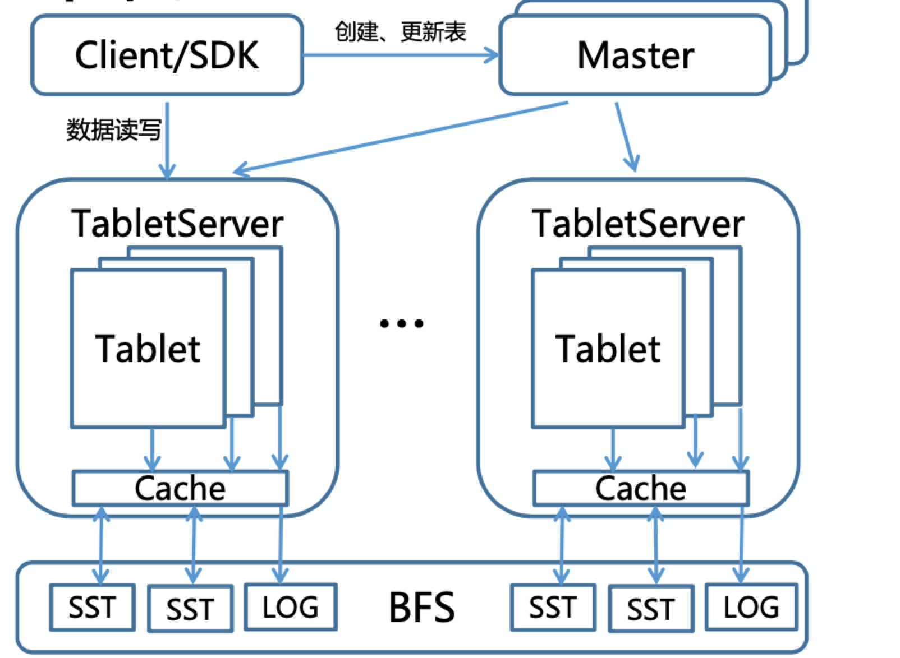
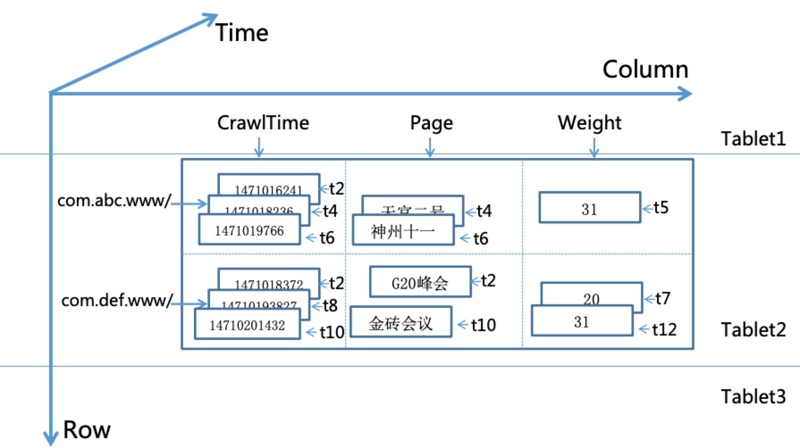

* **Navigation**
  * [System Arch](https://github.com/joeylichang/joeylichang.github.io/blob/master/src/tera/overview/overview.md#system-arch)
  * [Leveldb Character](https://github.com/joeylichang/joeylichang.github.io/blob/master/src/tera/overview/overview.md#leveldb-character)
  * [Consistency](https://github.com/joeylichang/joeylichang.github.io/blob/master/src/tera/overview/overview.md#consistency)
  * [Data schema](https://github.com/joeylichang/joeylichang.github.io/blob/master/src/tera/overview/overview.md#data-schema)
  * [Meta Data](https://github.com/joeylichang/joeylichang.github.io/blob/master/src/tera/overview/overview.md#meta-data)
    * [Zk Meta](https://github.com/joeylichang/joeylichang.github.io/blob/master/src/tera/overview/overview.md#zk-meta)
    * [MetaTable(t)](https://github.com/joeylichang/joeylichang.github.io/blob/master/src/tera/overview/overview.md#meta-tablet)
    * [Dfs Dir](https://github.com/joeylichang/joeylichang.github.io/blob/master/src/tera/overview/overview.md#dfs-dir)
    * [Persistent Cache](https://github.com/joeylichang/joeylichang.github.io/blob/master/src/tera/overview/overview.md#persistent-cache)


#### System Arch

Tera是百度开源的Table存储系统，主要用于网页和链接的存储，在链接选取、爬虫抓取、单网页计算、多网页计算、索引建库等整个搜索流程中起到非常重要的作用，在实时性 和 性能上与前一代MR + HDFS的架构有了较大提升。系统架构图如下所示：



Tera 的设计思路大部分借鉴了Google BigTable的设计思想，系统主要分为两层，底层数据的持久化基于BFS（百度内部的文件系统，内部已经用新一代的自研AFS替换了BFS）同时兼容HDFS，上层是基于分布式文件系统（例如HDFS）实现的Table存储。

TabletServer是用户数据的存储节点，内部使用了LevelDB，并进行了大量优化（或者说改动，目的是支持Tera的设计需求），将log（wal） 和 sst（用户数据）都持久化到HDFS上（leveldb优化的详情见TableServer介绍）。

Master是系统的协调节点负责table的create、disable、enable、delete、update，tablet的load、unload、spilt、merge、move，集群负载均衡，TabletNode管理，GC等。Master维护的元数据不是在内存中同样存储在TabletNode中（既底层的分布式文件系统），系统中默认会创建一个MetaTable用于存储系统中所有table的元数据（后面元数据部分有介绍）。

架构图中显示Master有多个备份，Master通过ZK选主，从Master内存并没有元数据信息，而是在主Master丢失了ZK的Lock之后，新的主Master从MetaTable加载元数据到内存。以上设计的根据正是元数据也持久化在分布式文件系统中，元数据的恢复是秒级操作（对系统可用性影响不大），同时降低了Master复杂度（避免了Raft、Paxos等一致性算法的引进）。

Client提供了事务（单行事务、全局事务）的能力，同时需要与Master交互完成元数据的获取，再进一步完成用户数据的路由，在全局事务中Client还会和ZK进行交互。

Tera 是完全由C++实现，相比HBase在性能、GC上更有优势（实时处理），社区目前基于C++的类BigTable的项目 Tera是唯一一个经过大数据量、大流量工业环境考验的系统。同时Tera 还支持BigTable 中 Locality Group 概念，相比HBase在多业务场景更有优势（例如，多业务修改表的不同列簇时，同一个业务关心的列簇被集中处理，后面会详细介绍LG）。


#### Leveldb Character

TabletNode 内部使用的leveldb作为单机的存储引擎（详情见[leveldb](https://github.com/joeylichang/joeylichang.github.io/blob/master/src/leveldb/overview.md)），对其ENV进行了分布式文件系统的扩展。TabletNode 充分了利用了 leveldb 中 sst（新版本是ldb文件） 文件不变性这一特点，既 leveldb 中的 sst 文件一旦生成不会有改动的情况发生，leveldb内部通过compact对多个sst进行多路归并生成新的sst文件，然后删除旧的sst文件，没有更改sst文件内部数据的情况发生。

Tera 正式利用了leveldb 内部 sst文件的不变性极大的减少了复杂性 和 优化了性能。TableNode 上有两层缓存，一层是内存的TableCache 和 BlockCache（leveldb原生，也有改动见后面TableNode部分介绍），另一程是基于SSD盘的PersistentCache，PersistentCache在本地缓存的sst文件永远有效（不存在失效的情况），由于sst的不变性，只要leveldb内存中的元数据（或者叫索引信息）指向了某一个sst文件且在PersistentCache中，直接读取即可，不存在PersistentCache 与 DFS（分布式文件系统）数据不一致的情况，避免了传统缓存的write back、write through带来的复杂度（BlockCache 同样）。

LevelDB 中的sst文件除了不变性，其内部的数据也是有序的，Tera利用这一点加速了Tablet（Table水平切分的单元，也是TableNode的数据组织单元）的分裂与合并。LevelDB 内存的信息用Version 和 VersionSet进行组织（详情见之前的[LevelDB介绍的文章](https://github.com/joeylichang/joeylichang.github.io/blob/master/src/leveldb/data_type.md)），Tablet加载时的内存数据通过MANFEST文件（存储在DFS）获取，TableNode维护内存数据，LevelDB的文件（SST、MANFEST、LOG、CURRENT等）都在DFS，所以Tablet加载和卸载的过程是从DFS读取元信息加载到TableNode内存（以上见之前[LevelDB](https://github.com/joeylichang/joeylichang.github.io/blob/master/src/leveldb/overview.md)介绍文章即可）。Tablet分裂时，计算出分裂位置（分裂的Key），在TableNode加载相关SST文件即可。合并的Tablets其key必须是连续的，同样加载两个Tablet的sst文件到共同的TableNode内存即可。顾Tablet的分裂 与 合并都没有文件或者数据的copy 和 move都是很轻量级的实现。

Tablet的加载、卸载、分裂、合并在后续还会重点介绍，在这里需要了解的是Tera 利用LevelDB中sst文件的不变性和有序性极大的优化了性能。这里有一个问题需要思考，两个Tablet对应leveldb两个目录，如何保证能在一个TabletNode的内存中一起加载，Tera在这里做了两部分工作，第一对Tablet目录的命名进行了设计，保证不同的目录的sst文件可以被正确的加载和获取到，第二是GC的设计保证了不会误删 和 漏删 用户的数据（后面都会详细的介绍）。


#### Consistency

###### 用户态读写一致性

Tera的数据多备份由底层的DFS进行保证（一般是3备份），Tera层的TabletNode是单副本。TabletNode可以理解为 DFS 层数据的索引数据。索引数据的加载是秒级别，并且Tablet支持快速的分裂和合并，所以单副本是完全支持业务的需求（BigTable 的设计同样如此）。所以一旦写成功，就可以读到最新的数据（可以理解为强一致模型）。

Tera 会将用户的数据以行为单位映射为KV进行存储（下面的Data Schema会详细介绍），这就会引入一个问题，既一行数据只更新了某几列，会不会读到一行数据其部分列更新了部分未更新或者更新失败的问题，Tera 内部实现上保证行级别的原子更新（后续文章有介绍）。

TabletNode 内是读写分离的，如何保证读不到残行呢（上述情况）？答案是快照（LevelDB支持快照），在每次更新时，会创建一个快照，写成功之后删除快照，写期间的读都是基于此快照。


###### Master 内存 与 MetaTable 一致性

元数据会在Master内存 和 MetaTable 都进行存储，引进来的问题是如何保证其一致性，操作都会先更新MetaTable再更新内存，更新MetaTable可以认为一定会成功，因为MetaTable异常会有限被迁移到其他TabletNode进行加载，Master可以异步更新MetaTable 并无限次重试。

存在一种情况，Master 异步更新MetaTable，然后更新了内存，还未等异步更新MetaTable成功既故障了，发生了主从切换，从MetaTable读取的meta不是最新的，这种情况会通过Master 的 心跳 以及 元数据本身进行修复（详细情况加Tablet Load的介绍）。


###### TabletNode 与 DFS 一致性

TabletNode 与 DFS的一致性，在进行更新操作时主要是两部分，第一是内存更新用户数据（可以认为不会失败），第二是log更新到DFS上（先更新log，后更新内存），log更新成功此次更新请求认为更新成功，会严格保证一致性。TabletNode 的 Cache 如上所述，利用了sst文件的不变性不存在不一致的情况。


#### Data Schema

Tera 的数据模型完全参考 BigTable，其数据组织情况如下图所示：



与传统的表模式相比，Tera支持以时间戳为版本号的多版本存储，既上述三维空间。Tablet 是可以理解为一个 Table 的水平切分，既一行数据一定在一个Tablet内。一个 TabletNode 对应多个 Tablets（可以是来自不同的Table）。一张表格可以理解为如下的多级map： 

```C++
map<RowKey, map<ColummnFamily:Qualifier, map<Timestamp, Value> > > 
```

RowKey 代表 user_key 也是 Tablet 分区管理的依据。Qualifier 是 列的概念，ColummnFamily 由多个Qualifier组成的列簇，Timestamp 代表数据的时间戳由 Client 传进来，Value是用户存储的数据。LevelDB存储的RawKey = 编码（RowKey + ColummnFamily + Qualifier + Timestamp + Type） （编码规则后续介绍）。

Tera 除了上述逻辑划分的概念 还支持 Locality Group 物理划分，Locality Group 是由多个 ColummnFamily 组成（ColummnFamily 必须属于一个 Locality Group），一个 Locality Group 对应一个 LevelDB 实例（一个LevelDB目录）。Locality Group 可以加速 经常一起处理的 ColummnFamily 性能。一个 Table 可以划分若干个   Locality Group，同一个表格里的所有 Tablets 都会有相同数量的 Locality Group，既LevelDB，每一个LevelDB内负责不同区间的RowKey。


#### Meta Data

如上述架构所述，Tera的元数据主要包括Metatable、ZK。但除此之外 DFS上的目录也是需要关注的，因为他设计到 Tablet 的 spilt 和 merge。

##### Zk Meta

##### MetaTable(t)

##### Dfs Dir


