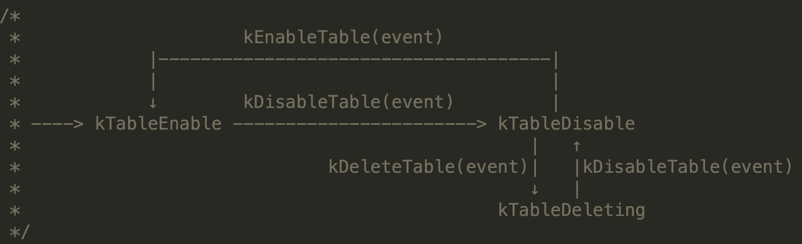

* **Navigation**
  * [Table Procedure](https://github.com/joeylichang/joeylichang.github.io/blob/master/src/tera/overview/procedure_overview.md#table-procedure)
    * [create table](https://github.com/joeylichang/joeylichang.github.io/blob/master/src/tera/overview/procedure_overview.md#create-table)
    * [disable table](https://github.com/joeylichang/joeylichang.github.io/blob/master/src/tera/overview/procedure_overview.md#disable-table)
    * [enable table](https://github.com/joeylichang/joeylichang.github.io/blob/master/src/tera/overview/procedure_overview.md#enable-table)
    * [delete table](https://github.com/joeylichang/joeylichang.github.io/blob/master/src/tera/overview/procedure_overview.md#delete-table)
    * [update table](https://github.com/joeylichang/joeylichang.github.io/blob/master/src/tera/overview/procedure_overview.md#update-table)
  * [Tablet Procedure](https://github.com/joeylichang/joeylichang.github.io/blob/master/src/tera/overview/procedure_overview.md#tablet-procedure)
    * [load tablet](https://github.com/joeylichang/joeylichang.github.io/blob/master/src/tera/overview/procedure_overview.md#load-tablet)
    * [unload tablet](https://github.com/joeylichang/joeylichang.github.io/blob/master/src/tera/overview/procedure_overview.md#unload-tablet)
    * [move tablet](https://github.com/joeylichang/joeylichang.github.io/blob/master/src/tera/overview/procedure_overview.md#move-tablet)
    * [spilt tablet](https://github.com/joeylichang/joeylichang.github.io/blob/master/src/tera/overview/procedure_overview.md#spilt-tablet)
    * [merge tablet](https://github.com/joeylichang/joeylichang.github.io/blob/master/src/tera/overview/procedure_overview.md#merge-tablet)
  * [Client Procedure](https://github.com/joeylichang/joeylichang.github.io/blob/master/src/tera/overview/procedure_overview.md#client-procedure)
    * [update(write/delete)](https://github.com/joeylichang/joeylichang.github.io/blob/master/src/tera/overview/procedure_overview.md#updatewritedelete)
    * [read](https://github.com/joeylichang/joeylichang.github.io/blob/master/src/tera/overview/procedure_overview.md#read)
    * [scan](https://github.com/joeylichang/joeylichang.github.io/blob/master/src/tera/overview/procedure_overview.md#scan)
    * [transaction](https://github.com/joeylichang/joeylichang.github.io/blob/master/src/tera/overview/procedure_overview.md#transaction)
      * [single row transaction](https://github.com/joeylichang/joeylichang.github.io/blob/master/src/tera/overview/procedure_overview.md#single-row-transaction)
      * [global transaction](https://github.com/joeylichang/joeylichang.github.io/blob/master/src/tera/overview/procedure_overview.md#global-transaction)
      

### Table procedure

#### create table

* Client

  Client 侧主要的数据结构：[TableDescImpl](https://github.com/joeylichang/tera/blob/master/src/sdk/schema_impl.h)、[LGDescImpl](https://github.com/joeylichang/tera/blob/master/src/sdk/schema_impl.h)、[CFDescImpl](https://github.com/joeylichang/tera/blob/master/src/sdk/schema_impl.h)，负责 Table、LG、CF 的 Schema 的设定，然后转换成 Request 发送给 Master。

  ```protobuf
  message CreateTableRequest {
      required uint64 sequence_id = 1;
      required string table_name = 2;    // 表名
      optional TableSchema schema = 3;   // TableDescImpl 转换的 Schema，内部包含LGDescImpl、CFDescImpl
      repeated bytes delimiters = 6;     // Tablet 水平切分的 RowKey 范围
      optional bytes user_token = 7;
      optional IdentityInfo identity_info = 8;
  }
  ```

  

* Master

  Master 侧 RPC 回调层收到请求后，会创建任务加入线程池（默认10个线程，详情见[Master Thread arch](https://github.com/joeylichang/joeylichang.github.io/blob/master/src/tera/overview/master_overview.md#master-thread-arch)），在 MasterImpl 层创建 CreateTableProcedure（继承自 [Procedure](https://github.com/joeylichang/joeylichang.github.io/blob/master/src/tera/overview/master_overview.md#procedure-arch)） 完成建表流程。线面看一下 Master 内部建表的主要步骤：

  1. Prepare
     1. 检查是否已经存在相同表名的表、校验用户是否是 RootUser、移除 DFS 同名目录。
     2. 校验 RowKey 拆分的是否正确（Tablet 水平切分的 RowKey 是否有重合）、校验是否超过了 Tablet 预分配的数量（默认 10w）、校验是否有 lg（至少一个）。
     3. 在 Master 内存中，创建 Tablet 和 Tablet。
  2. UpdateMeta
     1. 异步更新 [Table、Tablet 的元数据到](https://github.com/joeylichang/joeylichang.github.io/blob/master/src/tera/overview/overview.md#metatablet) MetaTable。
     2. 更新失败直接跳转步骤 4。
  3. LoadTablets：遍历 Table 创建的 Tablet，为每一个 Tablet 创建 LoadTabletProcedure（后面介绍），进行 Tablet 的加载。
  4. Eof：结束 RPC 请求。

* TabletNode

  TabletNode 侧针对 CreateTable ，接收到的是 LoadTablet 请求（后面详细介绍）。


##### **注意**

1. CreateTable 返回之后，LoadTablet 未必结束，此时表仍然不可用。

2. 先更新内存，然后异步更新 MetaTable（默认重试 5次），如果更新 MetaTable 失败，怎么处理？

   内存中已经有相应的元数据，只能走 Disable->Delete 流程删除 Table，然后重新创建，直接创建会失败。

3. 内存、MetaTable 更新成功，但是load tablet失败 怎么处理？

   对于 CreateTable 在内存和 MetaTable 中更新成功，则认为创建成功，至于 Tablet 是否加载成功，在LoadTablet 和 心跳探测部分有机制保证 Tablet 的正常。

4. CreateTable 成功之后，待 Tablet 加载完毕，即可使用，为什么还需要 EnableTable 操作？

   EnableTable 是与 DisableTable 对应的，在删除之前必须 DisableTable 防止误删、以及表暂停、恢复使用。


##### 源码解析

* [Master Create Table 流程]([https://github.com/joeylichang/joeylichang.github.io/blob/master/src/tera/master/logic/procedure/table/creat_table_procedure.md#master-create-table-%E6%B5%81%E7%A8%8B](https://github.com/joeylichang/joeylichang.github.io/blob/master/src/tera/master/logic/procedure/table/creat_table_procedure.md#master-create-table-流程))


#### disable table

* Table 状态机转换图



从 Table 状态转换图可知， Table 被删除之前，必须进入 Disable 状态，在 Disable 状态可以转化为 Enable（创建 Table 之后默认为 Enable 状态），所以 Disable 是一个删除之前的暂存状态，方便 Table 重新上线，也是 Delete Table 的一个缓冲状态。

* Master
  1. Prepare：权限校验，RootUser 或者 Schema 指定了的 Admin 用户。
  2. DisableTable：Table 状态机转化为 TableDisable
  3. UpdateMeta：只更新 Table 的元数据，既 TableMeta 中表的状态为 TableDisable，其他部分没变。
  4. DisableTablets：遍历 Table 中所有的 Tablet，为每一个 Tablet 创建一个 UnloadTabletProcedure（后续详细介绍） 进行卸载，值得注意的是，有同步机制保证所有的 Tablet 都卸载成功之后才会进入 Eof 阶段。
  5. Eof：结束 RPC 请求。

* TableNode：在 Disable Table 流程中，TabletNode 主要接受的请求是 UnloadTablet（后续会详细介绍）。


##### 注意

1. Disable Table 成功返回，表既不可用（与 Create Table 不同），有同步及机制保证所有的 UnloadTablet 完成再返回。

2. Disable Table  先更新内存（状态机），然后异步更新 MetaTable（默认重试 5次），如果更新 MetaTable 失败，怎么处理？

   需要先 Enable 再 Disable。

3. 如果 UnloadTablet 很慢，Disable Table 请求超时怎么办？

   UnloadTablet 正常应该是ms 级完成的操作，在一些异常情况下会有延迟。但是一旦 Master 开始 UnloadTablet 就一定会不断的重试直到所有的 Tablet Unload 成功。


##### 源码解析

* [Master Disable Table 流程](https://github.com/joeylichang/joeylichang.github.io/blob/master/src/tera/master/logic/procedure/table/disable_table_procedure.md)


#### enable table

* Master
  1. Prepare：权限校验，RootUser 或者 Schema 指定了的 Admin 用户。
  2. EnableTable：Table 状态机转化为 TableEnable
  3. UpdateMeta：只更新 Table 的元数据，既 TableMeta 中表的状态为 TableEnable，其他部分没变。
  4. EnableTablets：遍历 Table 中所有的 Tablet，为每一个 Tablet 创建一个 LoadTabletProcedure（后续详细介绍） 进行卸载。值得注意的是，此处并没有同步机制保证所有的 Tablet 都加载成功之后载进入 Eof 阶段（与 Disable 不同），与 Create Table 流程相同，既表 Enable 成功返回了，但是表会短时不可用。
  5. Eof：结束 RPC 请求。
* TableNode在 Enable Table 流程中，TabletNode 主要接受的请求是  LoadTablet（后续会详细介绍）。


##### 注意

1. Enable Table 请求返回，但是 Tablet 可能没有 Load 完成，表会存在短时不可用。

2. Enable Table  先更新内存（状态机），然后异步更新 MetaTable（默认重试 5次），如果更新 MetaTable 失败，怎么处理？

   先Disable 再重新 Enable。

3. LoadTablet 如果又失败怎么办？

   通过心跳 和 Load Balance 会对Tablet 进行迁移，保障 Tablet 可以正常提供服务。


##### 源码解析

* [Master Enable Table 流程](https://github.com/joeylichang/joeylichang.github.io/blob/master/src/tera/master/logic/procedure/table/enable_table_procedure.md)


#### delete table

* Master
  1. Prepare：权限校验，RootUser 或者 Schema 指定了的 Admin 用户。
  2. DeleteTable：从 DisableTable 状态转换为 DeletingTable。删除table 的 quta， quta 都是table级别的。
  3. UpdateMeta：只更新 Table 的元数据，既 TableMeta 中表的状态为 DeletingTable，其他部分没变。
  4. Eof：结束 RPC 请求。
* TabletNode：Disable 过程 TabletNode 已经 UnloadTablets，Delete 流程只是修改元数据，TabletNode 没有任何工作。


##### 注意

1. Delete Table  先更新内存（状态机），然后异步更新 MetaTable（默认重试 5次），如果更新 MetaTable 失败，怎么处理？

根据状态转化图可以，需要先 Disable Table，是 Table 状态转化为 Disable 之后重新 Delete。


##### 源码解析

* [Master Delete Table 流程](https://github.com/joeylichang/joeylichang.github.io/blob/master/src/tera/master/logic/procedure/table/delete_table_procedure.md)


#### update table

* Master

  1. Prepare

     1. 权限校验，RootUser 或者 Schema 指定了的 Admin 用户。
     2. 更新的 Schema 必须包含至少一个 lg。
     3. 双 buffer 更新 Table 内存中的 Schema，先更新备 Buffer。
     4. 判断 Table 必须是 Enable 状态，并且 Schema 的 CF 有变化（Schema 可以不更新CF，如果不更新不涉及到 Tablet 的变更，则没有此步骤）
        1. 遍历 Table 所有的 Tablet，抢占其 事务锁（一个 Tablet 一个）
        2. Tablet 状态必须是 kTabletReady 或者 kTabletOffline
        3. 上述两个条件有一个 Tablet 不满足，直接跳转步骤 4。

  2. UpdateMeta

     1. 异步更新 MetaTable 相应 Table 的 TableMeta。
     2. 如果Table 是 Enable 状态，并且 IsUpdateCf(table_)，跳转步骤 3。
     3. 否则切换 Master 内存中备份的 Schema 到 正式的 Buffer 中，跳转步骤 4。

  3. TabletsSchemaSyncing

     1. 遍历 Table 所有的 Tablet，对齐发送 Update 请求更新 Schema。
     2. 超过重试次数仍然失败的请求，会 kick_off 节点（Tablet 会在后面统计重新 Load）。
     3. 上述步骤有同步机制保证所有 Ready 的 Tablet 都会被更新完才能继续。
     4. 对于 Offline 的 Tablet，在处理完 Ready 的 Tablet 之后，统一一起 Load，因为此时再Load 就是使用最新的 Schema 了，无需关注 Update 逻辑。
     5. 切换 Master 内存中备份的 Schema 到 正式的 Buffer 中。

     **注意**：在 Prepare 阶段，所有的 Tablet 都必须是 Ready 和 Offline，否则请求直接返回失败。在 TabletsSchemaSyncing 阶段期间是不会 Tablet 状态的变更，因为所有的 Tablet 都上来事务锁，这个流程没有结束是不会有变更的。

  4. Eof：释放 Table 的事务锁，并结束 RPC 请求。

* TabletNode
  1. 根据请求中的 TableName、KeyRange 找到对应的 TabletIo。
  2. 更新 TabletIo 层的 Schema，以及 LG 和 CF 的映射关系（Scan 等操作会用到）。
  3. 压缩策略里面的 Schema 成员变量也进行更新。


##### 注意

1. Schema 更新除了更新 CF、LG 也可以更新其他的配置，但是需要谨慎不是所有的都能更新（比如 是否支持 Rowkey Hash等），不涉及到CF 和 LG 是不会与 TableNode 进行交互的。

2. 先更新内存备份，再更新 MetaTable（有必要的话同步更新 TableNode），然后切换内存的备份为正式。这个流程与之前的有所不同，主要就是 Schema 是在线更新，既更新的过程中 Table 仍然可用。

   1. 更新内存备份成功，更新 MetaTable 失败，会清除内存备份，使用旧的 Schema ，结束流程
   2. 同步更新 TableNode 有失败，会 KickOff 节点，完成 Ready 的 Tablet 之后，统一用最新的Schema 去 Load Tablet。

3. 之前 Table 的流程中，都是先更新内存，然后更新 MetaTable，一旦更新 MetaTable 失败，需要手动回滚。Update 的不同之处是，先更新内存备份，然后更新 MetaTable，最后切换内存，每一步的失败都在自身进行了回滚。这么做的原因也是 Update 的特殊性，因为更新期间 Table 必须保证可用。

4. Update 处理的流程中的 Tablet 必须是 Ready 或者 Offline 状态，如果 Update 期间，其状态有变化怎么办？

   由于 Table 和 Tablet 都加了事务锁，所以期间不会有流程去改变其状态。

5. 笔者理解只接收qua、col、lg的增减，不支持qua换cf 和 cf 换lg。因为 LevelDB 底层已经根据 LG 对数据进行了划分，并且 LG 内部已经根据 CF 拍好了序列。如果发生了转换，旧数据相当于抛弃不要了，没有数据转换的逻辑。


##### 源码解析

* [Master Update Table 流程](https://github.com/joeylichang/joeylichang.github.io/blob/master/src/tera/master/logic/procedure/table/update_table_procedure.md)

* [TabletNode Update](https://github.com/joeylichang/joeylichang.github.io/blob/master/src/tera/tablet_node/procedure/tn_update.md)


### Tablet procedure

##### Tablet 状态转化图


#### load tablet

* Master

  1. 初始tablet 状态一定是 offline（ <- loadfail） 和 delayoffline
  2. 如果des 为空，根据size策略选取一个节点                                     -> tablet 进入 offline
  3. 如果des down（节点为offline）：
     1. 如果是meta表，根据size 选节点，然后绑定                    -> tablet 进入 offline
     2. 非meta表，如果des 还在内存中，绑定tablet 到 node   -> tablet 进入 offline
     3. 非meta表，如果des 不在内存，且为pendingoff状态     -> tablet 进入 offline
     4. 以上都不是 ，根据size 选节点，然后绑定                         -> tablet 进入 offline
  4. offline 状态会跳转到第一步 重新选取节点继续往下，截止到这里 tablet 处于 offline 状态
  5. 如果 des 正常：
     1. 如果是meta表，load tablet                                                 -> tablet 进入 loading
     2. 非meta表，更新meta （异步更新，认为一定成功），这里会无限重试  -> 更新 MetaTable
     3. 非meta表，目标节点不处于busy状态（Load计数闸值），load tablet   -> tablet 进入 loading
     4. 非meta表，目标节点处于busy状态，打印日志，下一次循环调取去加载
  6. 截止到这里 tablet 处于 loading 状态
  7. 如果重试次数超过闸值                                                                           -> tablet 进入 LoadFail
  8. 如果 des down：
     1. 如果是meta表，根据size 选节点，然后绑定                    -> tablet 进入 offline
     2. 非meta表，如果des 还在内存中，绑定tablet 到 node   -> tablet 进入 offline
     3. 非meta表，如果des 不在内存，且为pendingoff状态     -> tablet 进入 offline
     4. 以上都不是 ，根据size 选节点，然后绑定                         -> tablet 进入 offline
     5. 会从第一部重新开始
  9. 如果已经发送load 请求，直接返回，等待下一次的调度，tablet状态不变
  10. load 成功                                                                                               -> tablet 进入 ready
  11. 如果是 ready 或者 loadfail 则流程结束，如果 tablet 不是ready，且tablet 重试次数小于闸值，则发起一个move流程

* TabletNode

  1. 在内存中（TabletManager）添加 Tablet，并创建 TabletIO。

  2. 调用 TabletIO 的 Load 接口，内部主要是 ：leveldb option 初始化（levledb配置）、调用leveldb 的 OpenDB 接口完成，LevelDB 的初始化。

     1. 根据 Schema 一个 LG 对应一个 LevelDB 实例，既LevelDB 的目录。
     2. LevelDB 的环境可以指定，可以是 DFS、Posix、MemStore等。
     3. 具体参数设置见[LevelDB 配置](https://github.com/joeylichang/joeylichang.github.io/blob/master/src/tera/tablet_node/leveldb/options.md)，其中特别说明一下 parent_tablets 参数，如果该参数只有一个成员说明这是一个 Spilt 的请求，如果是两个成员变量说明是 Merge 参数。
     4. 由于 Tera 在 DFS 上面的 LevelDB 的[路径设置]([https://github.com/joeylichang/joeylichang.github.io/blob/master/src/tera/overview/overview.md#sst-%E6%96%87%E4%BB%B6%E5%8F%8A%E8%B7%AF%E5%BE%84%E7%BB%84%E6%88%90](https://github.com/joeylichang/joeylichang.github.io/blob/master/src/tera/overview/overview.md#sst-文件及路径组成))，可以保证不同目录下的 SST 文件被正确索引，所以 Spilt 和 Merge 之后的 Tablet 文件可以来自不同的目录，然后在 Compact 阶段删除旧的 SST 文件，让新生成的 SST 文件在新的（可能是 Spilt、Merge）Tablet 目录下。

  3. Load 中的 LevelDB 配置见 [LevelDB Option](https://github.com/joeylichang/joeylichang.github.io/blob/master/src/tera/tablet_node/leveldb/options.md) 和 [TabletNode 加载Tablet 源码解析](https://github.com/joeylichang/joeylichang.github.io/blob/master/src/tera/tablet_node/procedure/tn_load_tablet.md)。

     

##### 注意

1. 整体思路：Tablet 状态从 Offline -> Loading -> Ready，如果不是 Offline 其实状态，尽量转换为 Offlien状态（根据状态转换图），如果转换不了就异常结束流程。
2. 上述流程中在异常情况下，都会先判断是否是是 MetaTable（通过表名），如果是的话，**会优先加载 MetaTable**，保证 MetaTable 是正常的，否则更新都会失败。
3. **更新 MetaTable 的 Tablet 的元数据时，认为一定会成功的**，因为默认重试次数数无限次，即使 MetaTable 异常也会有限被加载，一旦加载成功则，更新 Tablet 的元数据一定会成功，所以默认是一定会成功的。
4. **更新 MetaTable 中 Tablet 的状态一定是 Offline 状态**，不会是其他的状态，其他的状态都是 Master 内存维护的状态，一旦 Master 切换了，会收集 TabletNode 中 Tablet 状态，在 Offline 状态的基础上做一些处理逻辑（前面介绍过），这是一种简化的时机模式（用集群恢复效率 避免 状态机维护的复杂性）。
5. Load 在最后执行失败了，会执行一步move的流程，因为此时可能load 成功，但是rpc返回失败，重新move的时候回 unload 和 load，保证只有一个节点load 最终成功。**保证了 Tablet 被唯一加载**。

5. create table 成功返回，load tablets 是异步，如果有load 失败，在哪里补偿回来呢？

   Load 失败会进行 Move，保证一定会成功。

6. 如何避免，多个TN 同时加载 Tablet？

   Load 失败会进行 Move，保证 Tablet 被唯一加载。


##### 源码解析

* [Master Load Tablet 流程](https://github.com/joeylichang/joeylichang.github.io/blob/master/src/tera/master/logic/procedure/tablet/load_tablet_procedure.md)

* [TabletNode 加载Tablet 源码解析](https://github.com/joeylichang/joeylichang.github.io/blob/master/src/tera/tablet_node/procedure/tn_load_tablet.md)


#### unload tablet

* Master
  1. 初始化一定是ready（ <- kTabletUnloading、kTabletUnloadFail），如果是 kTabletDelayOffline，转 Offline，Unload 直接成功。
  2. 如果 节点 down，转 Offline，Unload 成功  -> (注意心跳，delete node 部分，应该有tablet move逻辑)
  3. 截止到目前，Tablet 状态为 Ready。
  4. 节点正常：
     1. 是否处于 UnloadBusy（并行卸载不超过 50个 Tablet），空转等下次调度。
     2. 不处于 UnloadBusy，发送 unload 。                                      Ready -> Unloading
     3. 节点故障 或者 成功 或者 range不匹配 都算unload 成功。
     4. TN 处于busy ，则重试次数++， 找过闸值则 kick off 节点。
     5. 否则，无限制重试。
  5. 到此 处于 Unloading 状态。
     1. 未结束，空转等下一次调度。
     2. 少于重试闸值，Unload 成功。
     3. 如果处于 Kick TN 状态，空转等kick结果。
     4. 否则，UnLoadfailed。
* TableNode
  1. 在 TabletManager 中获取 TabletIO 内存数据。
  2. TabletIO Unload 逻辑：
     1. try_unload_count_++，用于判断是否处于 UrgentUnload 状态（闸值时 3次）。
     2. 调用 LevelDB 的 Shutdown1 接口，内部遍历所有的 DPImpl（LG）进行，对内存中的数据进行 Flush，并等待所有的压缩任务完成，切换 MemTable 落盘到 Level 0，并处理 wal。
     3. 然后等待 LevelDB 的引用计数为 1，因为 Shutdown1 期间还可能有数据写入，循环等待（周期100ms）。
     4. 停止 TabletIO 异步的写入（TabletNode 是批量写入 LevelDB，后面介绍），期间会将所有的写 Flush 到 LevelDB。
     5. 调用 LevelDB 的 Shutdown2 接口，Flush Shutdown1 阶段的写入数据。
     6. TabletIO 一些成员遍历的析构等处理。
  3. 删除内存（TabletManager）中的 Tablet 数据。

主要两阶段关闭

##### 注意

1. Master 在 Unload 流程中值更新了内存，没有更新 MetaTable。

   unload 在 move、mergr、spilt中不需要更新因为 Load 更新了。

   unload 在 Maser 主流程 都是清理无用tablet 不需要更新。

   unload 在 disable 中 已经disable 了 table，也不需要。

2. TabletNode 的 Unlaod 过程分位两阶段 Shutdown，因为写入时异步执行，既写入 和 Unload 可以并行，第二阶段保证 Unload 期间的写入会落盘。

3. TabletNode 并没有调用 DestroyDB 接口删除相应的目录，因为 Unload 之后一般会换一个节点重新 Load ，通常没有单独删除一个 Table 中某些 Tablet 的情况（因为 DFS 上的数据是一个整体在 Tera层来看）， 一般是 DeleteTable 阶段会删除相应的目录，这种情况系统也没有删除相应的目录或者文件（应该是一种保守做法，需要外围支持），只有在 DeleteTable 之后，重新创建同名的表会移除相应的目录到trash 目录的情况。


##### 源码解析

* [Master Unload Tablet 流程](https://github.com/joeylichang/joeylichang.github.io/blob/master/src/tera/master/logic/procedure/tablet/unload_tablet_procedure.md)

* [TabletNode Unload tablet](https://github.com/joeylichang/joeylichang.github.io/blob/master/src/tera/tablet_node/procedure/tn_unload_tablet.md)


#### move tablet

* Master
  1. 初始状态：
     1. 如果是 ready 或者 unloadfail 则 unload 再 load
     2. 如果是 offline 或者 loadfail 则 直接 load
  2. UnLoadTablet：Unload 源节点，此时结束时，Tablet 必须是 Offline 状态。有同步机制保证 Unload 成功再进行下一步。
  3. LoadTablet：走 Load 流程（如上所述）加载 Tablet。
  4. Eof：结束 RPC 请求。

##### 注意

1. 没有更新 MetaTable，在 Load 流程中处理， Unload 也不会删除原有的元数据，因为 MetaTable 是一个 KV 类型的表，在 Load 阶段会更新。
2. 如果 Master 切换，Unload 成功 Load 失败，MetaTable 保存的是 Unload 之前的 元信息，此时在 收集信息部分会处理（之前有介绍）。
3. Unload 有同步机制保证成功， Load 没有，说明 Move 成功了 Tablet 未必可用（未加载完毕），同时也保障了不会有两个节点同时加载 Tablet。


##### 源码解析

* [Master Move Tablet 流程](https://github.com/joeylichang/joeylichang.github.io/blob/master/src/tera/master/logic/procedure/tablet/move_tablet_procedure.md)


#### spilt tablet

* Master

  1. 初始状态：一定是 Ready，否则失败。
  2. PreSplitTablet：spilt_key 范围校验，如果为空，会向 TabletNode 发送 ComputeSplitKey 请求，返回的结果，赋值给 spilt_key。
  3. UnLoadTablet：执行 Unload 流程，有同步机制保证，Unload 结束才进行下面步骤，
  4. PostUnLoadTablet
     1. 校验 Unload 是否完全结束，标准是查看 Tablet 的 wal 是否都消耗完毕（Split 必须保证 所有的日志都消费完）。
     2. 如果没有消费完，执行步骤7（FaultRecover），否则执行步骤5（UpdateMeta）。
  5. UpdateMeta
     1. 异步更新两个 Tablet （拆分后的两个 Tablet，主要是更改了 Key 范围）的元数据到 MetaTable（无限次重试）。
     2. 更新成功 MetaTable 之后，更新内存数据。
  6. LoadTablets：创建两个 Load 流程，加载两个子 Tablet（加载的节点相同，是拆分之前的节点）。
  7. FaultRecover：重新加载 父 Tablet，然后结束流程。
  8. Eof：结束 RPC 请求。

* TableNode

  TableNode 侧，在 Spilt Tablet 流程中主要接收三个请求，Load、UnLoad 之前都介绍过了，线面重点看一下 ComputeSplitKey ，ComputeSplitKey 的核心思想找到中间的 Key，中间的 Key 使得拆分之后 Tablet 的容量尽量均分。

  1. 在DBtable（Tablet）中对DBIpml（LG）根据大小进行排序，选择最大的DBIpml。
  2. DBIpml 调用 LevelDB 的  Version（SST 等元数据的内存维护类）类 计算（根据传入的大小占比，此处是0.5，既大容量50%的那个文件的最大key）。
  3. 从level 1（注意level 0 不算）开始，第一个文件的最大key开始往下逐层找到所有小于这个key的文件。
  4. 计算这些文件大小的和，如果小于目标容量（总容量 * 0.5），则对level 1的第二个文件的最大key最为比对，逐层往下找到所有小于他的文件进行累加。
  5. 3-4 逐层逐个文件文件计算，直到容量超过目标容量（总容量 * 0.5），返回split_key。
  6. 针对异常情况不是用容量划分，直接从key范围，根据字典序找到中间key。

  

##### 注意

1. 拆分前后的 Tablet 都在同一个节点。

2. 有一些重复，因为 Load 阶段还会更新 MetaTable。

3. Spilt 与之前的流程不同的是，先更新 MetaTable（一定成功，因为无限次重试），然后更新内存。

4. TableNode 的 ComputeSplitKey 从 Level 1 第一个文件的最大 Key 开始逐层划分的依据是， 从 Level 1 开始，文件间有序，这样划分之后的结果是，逐层划分为2，并且划分之后的两部分文件没有交集（利用了 LevelDB 中 SST 文件不变性 以及 同层 SST文件间有序且无交集）。

5. TableNode 选择容量最大的 LG 进行拆分，因为没有办法保证找到一个 Key 然所有的 LG（LevelDB实例） 都能正好分开，全局算法交复杂，涉及到跨 LevelDB 交互（跨线程）。

   这种办法可能导致拆分的结果不均匀，比如有多个 LG，最大的一个 LG 均分了，其他的 LG 根据这个 Key 拆分的结果 与 最大的拆分结果 结合，可能不是均分的。


##### 源码解析

* [Master Spilt Tablet 流程](https://github.com/joeylichang/joeylichang.github.io/blob/master/src/tera/master/logic/procedure/tablet/spilt_tablet_procedure.md)

* [TabletNodeServer Compute Split Key](https://github.com/joeylichang/joeylichang.github.io/blob/master/src/tera/tablet_node/procedure/tn_compute_spilt_key.md)


#### merge tablet

* Master
  1. 合并的两个 Tablet 必须是 Ready 状态，并且 Key 连续。
  2. UnLoadTablets
     1. 创建两个 UnloadTabletProcedure，对其进行卸载。
     2. 有同步机制保证，卸载完成才会往下进行。
  3. PostUnLoadTablets
     1. 校验两个 Tablet 是否卸载成功，主要是看 wal 是否都消费完毕（正常的卸载是一定会消费完毕的，通过两阶段完成，上面介绍过）。
     2. 如果校验没有通过直接进入 FaultRecover，否则继续。
  4. UpdateMeta
     1. 异步更新合并之后的 Tablet 的元数据到 MetaTable（无限次重试，一定成功）。
     2. 更新成功之后，修改内存元数据。
  5. LoadMergedTablet：创建 LoadTabletProcedure 加载合并之后的 Tablet。
  6. FaultRecover：重新加载两个源 Tablet。
  7. Eof：结束 RPC 请求。


##### 注意

1. 主要流程与 Spilt 流程相似。

   

##### 源码解析

* [Master Merge Tablet 流程](https://github.com/joeylichang/joeylichang.github.io/blob/master/src/tera/master/logic/procedure/tablet/merge_tablet_procedure.md)


### Client Procedure

#### update(write/delete)

* Client

  1. 客户端支持请求的异步、同步、批量写等特性，其中重要的数据结构[RowMutationImpl](https://github.com/joeylichang/tera/blob/master/src/sdk/mutate_impl.cc)、[BatchMutationImpl](https://github.com/joeylichang/tera/blob/master/src/sdk/batch_mutation_impl.h)。

  2. Tera 的更新支持以下几种（与之对应存储 LevelDB 的 Key 类型）：

     ```c++
     enum Type { 		      TeraKeyType
                           TKT_FORSEEK, // seek使用的边界，例如 start_key、end_key
     			kPut,			      TKT_VALUE          // 修改一个列
     			kDeleteColumn, 	TKT_DEL_QUALIFIER  // 删除一个列的指定版本
     			kDeleteColumns, TKT_DEL_QUALIFIERS // 删除一个列的指定范围版本
     			kDeleteFamily, 	TKT_DEL_COLUMN     // 删除一个列族的所有列的指定范围版本
     			kDeleteRow, 	  TKT_DEL            // 删除整行的指定范围版本
     			kAdd, 			    TKT_ADD            // 原子加一个Cell
     			kPutIfAbsent, 	TKT_PUT_IFABSENT   // 如果不存在才能Put成功
     			kAppend, 		    TKT_APPEND         // 追加内容到一个Cell
     			kAddInt64 		  TKT_ADDINT64       // 原子加一个Cell(int64类型)
                           TKT_TYPE_NUM       // 类型的计数
     };
     
     // TeraKey(RawKey) Encoding
     /**
      *  readable encoding format:
      *  [rowkey\0|column\0|qualifier\0|type|timestamp]
      *  [ rlen+1B| clen+1B| qlen+1B   | 1B | 7B      ]
      **/
     
     /**
      *  binary encoding format:
      *  [rowkey|column\0|qualifier|type|timestamp|rlen|qlen]
      *  [ rlen | clen+1B| qlen    | 1B |   7B    | 2B | 2B ]
      **/
     
     /**
      * support KV-pair with TTL, Key's format :
      * [row_key|expire_timestamp]
      * [rlen|8B]
      **/
     ```

  3. Client 会缓存 MetaTable 的地址，然后从 MetaTable 回去要访问的 Tablet 地址（也会缓存）。

  

* TabletNode

  1. TabletNode 在 TabletIO 层加了一个批量异步写入的逻辑（TabletWriter）。
  2. TabletWriter 使用双 Buffer 机制，当Buffer 写满 或者 周期（默认10ms）切换 buffer 写入 LevelDB，等备份 buffer 都写入 LevelDB 之后再统一返回 RPC。
  3. LevelDB 层的写入会先获取一个 Sanpshot，然后写入，写入成功之后释放 Sanpshot。

  **注意**：

  1. TabletWriter 可以设置是否批量写入，批量写入时用延迟换吞吐（平均延时增加 5ms，但是吞吐提上了），如果对延时要求较高可以不适用批量写入，但是吞吐会下降（与 DFS 之间有网络延时）。
  2. LevelDB 层的写入引入了 Sanpshot 目的是不影响正常的读操作。
  3. 写入时是行级别的原子操作，因为 Tablet 是水平切分，每个写操作可能跨 LG（LevelDB 实例），但是写入时所涉及的行都在一个进程内，且使用了 Snapshot 机制保证不会读到残行。

##### 源码解析

* [TN Write Tablet](https://github.com/joeylichang/joeylichang.github.io/blob/master/src/tera/tablet_node/procedure/tn_write_tablet.md)
* [LevelDb Write](https://github.com/joeylichang/joeylichang.github.io/blob/master/src/tera/overview/tablenode_overview.md#write)


#### read

* Client

  1. 客户端支持请求的异步、同步、批量写等特性，其中重要的数据结构，[RowReaderImpl](https://github.com/joeylichang/tera/blob/master/src/sdk/read_impl.h)。

* TabletNode

  分三种情况处理：

  1. kv读：调用leveldb Get接口。

  2. 指定col qua条件的读，调用LowLevelSeek，通过迭代器对读到的数据进行过滤。

  3. 未指定col qua条件，既读一整行，调用LowLevelScan，复用Scan的逻辑。

     **注意**：LowLevelSeek、LowLevelScan 见 Scan 部分详细介绍

  

##### 源码解析

* [TN Read Tablet](https://github.com/joeylichang/joeylichang.github.io/blob/master/src/tera/tablet_node/procedure/tn_read_tablet.md)


#### scan

* Client

  1. 客户端支持请求的异步、同步、批量写等特性，其中重要的数据结构，[ScanDescImpl](https://github.com/joeylichang/tera/blob/master/src/sdk/scan_impl.h)[ResultStreamImpl](https://github.com/joeylichang/tera/blob/master/src/sdk/scan_impl.h)。
  2. Scan 在 Client 支持 Filter （例如：针对指定的cf和qu，其下的value 大于或者小于 某个数值） 和 FilterList （Filter 的 “与”、“并” 语义的组合），使用详情见 SDK 的说明。

* TableNode

  在 TableNode Scan 分位两种大类（四小类）进行处理：

  1. BatchScan：既一次遍历需要多个RPC请求，期间需要缓存中间状态（详见[BatchScan](https://github.com/joeylichang/joeylichang.github.io/blob/master/src/tera/tablet_node/procedure/tn_batch_scan.md)介绍），内部分为 KV 和 非 KV。
  2. Scan（非Batch）：一次请求遍历完，内部分为 KV 和 非 KV。

  

  ##### BatchScan

  BatchScan 与 普通的 Scan 最大的区别是需要保留上次遍历的中间状态，便于下次从断点继续遍历，TabletNode 在此使用了 LevelDB 的 Cache 缓存 [ScanContext]([https://github.com/joeylichang/joeylichang.github.io/blob/master/src/tera/tablet_node/procedure/tn_batch_scan.md#scancontext%E8%B0%83%E5%BA%A6%E6%9C%BA%E5%88%B6](https://github.com/joeylichang/joeylichang.github.io/blob/master/src/tera/tablet_node/procedure/tn_batch_scan.md#scancontext调度机制))（记录遍历状态的数据结构），通过ScanContextManager 完成调度进而完成请求。

  在 BatchScan 中也会区分是否是 KV 类型的遍历，KV 与 非KV 之间的区别在于，非KV的一个 Cell 是由多个 LevelDB 层的 KV 对组成，这给数据的组织和过滤都带了一定的复杂度（**注意：这也是 KV 性能会优于 非 KV 的原因，所以能使用 KV 存储的尽量使用KV**）。

  ###### 非KV BatchScan

  1. 从缓存中获取  ScanContext，如果没有说明是第一个遍历的请求，初始化一个返回。
  2. 从 ScanContext 中的迭代器（LevelDB 的迭代器，上次遍历的位置）开始遍历 LevelDB 的 KV 对。
     1. 判断是否完成遍历，既是否等于 scan_end_key（保存在 ScanContext 中），如果是，则跳出循环。
     2. 判断是否超时，是则跳出循环。
     3. 判断 Key 解析之后的 col 是否在遍历的目标 CF 集合中。
     4. 调用 DefaultCompactStrategy 的 ScanDrop 判断当前的 KV 对是否在Schema（可能schema有变更）、过期 、已经被删除（如上介绍的删除类型）。
     5. 判断是否完成一整行的遍历，标准是当前解析出来的 RowKey 是否与之前的相同（向的Key一定连续存储）。
        1. 如果遍历完一整行，判断是否需要过滤该行（根据 Scan 请求中的 Filter、FilterList），col、qua是否在请求的集合中、时间戳是否过期。
        2. 都通过与之后序列化到结果的 Buffer 中。
     6. 比较相同的 RawKey（RowKey + col + qua）比较版本是否超过请求设置的情况。
     7. RowKey + col 相同，qua 不同，比较 qua 是否在 Scan 的范围内。
     8. 记录当前的结果（一个 Cell 的中间结果，既 LevelDB 的 KV 对）到 ScanContext 中。
     9. 判断是否进行 LevelDB 的 KV 对 的合并，针对 TKT_VALUE、TKT_ADD、TKT_ADDINT64、TKT_PUT_IFABSENT、TKT_APPEND 类型的 LevelDB Key。
        1. 如果有合并需要修改 ScanContext 的中间结果。
     10. 将结果放入 Buffer 中，待完成的一行结束时进行校验是否丢弃（见步骤4）。
     11. 如果 Scan 的结果大小 > 请求设置的闸值 || Sacn 的记录调试 > 请求设置的闸值 ，则跳出闸值。
  3. 检查用户设置了 Filter && 检测`Buffer' 中的最后一行数据不是一整行 && 针对行级别需要进行过滤（用户指定的规则）
     1. 满足上述条件：跳转到下一行。
     2. 不满足上述条件：上述跳出循环，可能最后一行没有进行上述步骤 2.4，在这里针对最后一行进行处理

  

  ###### KV BatchScan

  与 非KV 相比最大的区别是，直接遍历 LevelDB 层的 KV，没有合并等复杂逻辑。

  1. 判断是否完成遍历，既是否等于 scan_end_key（保存在 ScanContext 中），如果是，则跳出循环。
  2. 超时、返回包大小、请求条目是否超过闸值，是则跳出循环。
  3. 判断是否过期、已经被删除、是否在 Schema（DefaultCompactStrategy 的 ScanDrop ）。
  4. 将数据写入保存结果的 Buffer 中。

  

  ##### Scan（非Batch）

  非 Bach 类的 Scan 相对于 BatchScan 简单一些，因为不需要维护中间状态，复用了很多上面的逻辑。

  ###### 非KV Scan

  非KV 的 Scan 在进行遍历之前，初始化了一个 ScanContext 结构，并初始化相关成员变量，在遍历之后对其进行销毁。内部逻辑完全复用上述的 [非KV BatchScan]([https://github.com/joeylichang/joeylichang.github.io/blob/master/src/tera/overview/procedure_overview.md#%E9%9D%9Ekv-batchscan](https://github.com/joeylichang/joeylichang.github.io/blob/master/src/tera/overview/procedure_overview.md#非kv-batchscan))。

  

  ###### KV Scan

  KV Scan 与 KV BatchScan 逻辑基本一致，需要注意的是，请求中也可以设定返回结果的大小，如果遍历的范围超过闸值，会进行阶段。

  

##### 源码解析

* [TabletNode Batch Scan](https://github.com/joeylichang/joeylichang.github.io/blob/master/src/tera/tablet_node/procedure/tn_batch_scan.md)

* [TabletNode Scan](https://github.com/joeylichang/joeylichang.github.io/blob/master/src/tera/tablet_node/procedure/tn_scan_tablet.md)


#### transaction

经过前面的介绍可知，Tera 天然支持行级写的原子操作，显然这远远不够，事务一直是列式存储 和 NewSQL 的难点（前面的系列文章我们有过介绍过）。Tera 也为此进了设计，先是设计了单行的 ready-modfy-write（可以多次读） 事务，然后再此基础上完成了全局的跨行、跨表事务。

需要注意的是，这两种事务都需要 TabletNode 和 Client 配合完成，但是目前开源的版本中 TabletNode 并没有完成相关的开发，再此对其介绍主要是学习期设计思路（后面的文章还会对其事务进行分析，本部分还是以介绍为主）。


##### single row transaction

单行事务的核心思想：

1. 将所有需要的数据都读到 Client 本地，包括数据、删除标记、时间戳。
2. 将所有的更新写到本地的内存中。
3. commit 时，将更新的数据 、读取的数据、及其时间戳一起提交。
4. TabletNode 根据时间戳校验当前的数据（之前读的数据）是否是最新的版本，是的话进行更新，否则任务失败。

对于同一行不同 CF、qua 的两个事物是不会有影响的。同时需要注意的是，事物都是基于最新的版本进行的，不能基于历史版本进行。

上述设计避免了如下问题：

1.  脏读：事物未更新之前的数据都在 Client 本地不会提交，既 未提交的数据不会在 TableNode 上，也就读不到
2. 不可重复读：同一个数据读取一次保存在 Client 本地，一定可重复。
3. 幻读：事物未更新之前的数据都在 Client 本地不会提交，既 未提交的数据不会在 TableNode 上，也就读不到
4. 写倾斜：由于 TableNode 更新的时候会校验读数据的时间戳，保证了 读X写Y 与 读Y写X 同时进行只有一个成功。

但是上述情况保证不了更新不被丢失，既 T1（读X写Y）先开始，T2（读Z写Y）后开始，由于网络延时T2先完成了，之后被T1覆盖了，如果在更新数据时，加上对需要更新的数据加上时间戳（或者版本号-读取数据时的版本号）的校验，可以解决上述问题，保证了单行数据更新事务的串行化。 

##### 参考资料

[单行事务设计](https://github.com/joeylichang/tera/blob/master/doc/single_row_txn.md)

[事务隔离级别]([https://github.com/joeylichang/joeylichang.github.io/blob/master/src/cockroachdb/desgin_transaction.md#%E4%BA%8B%E5%8A%A1%E9%9A%94%E7%A6%BB%E7%BA%A7%E5%88%AB](https://github.com/joeylichang/joeylichang.github.io/blob/master/src/cockroachdb/desgin_transaction.md#事务隔离级别))


##### global transaction

* 全局事务设计

  * LockQua + WriteQua

    Tera 的全局事务使用了两阶段提交的方式。第一阶段抢占数据（对数据加锁），加锁的方式是给关注的 Cell 加一个额外的列 LockQua（包含时间戳，判断所有的前后顺序） 标识该数据已经加锁。第二阶段完成数据的更新，除了用户数据的更新，还需要删除数据，并且写入数据更新的索引数列 WriteQua（包含时间戳，WriteQua 与 用户数据的时间戳一致，便于下一个事务读到正确的数据）。

    1. LockQua：key = cf + qua（!L+qua），value = type + PrimaryInfo(table_name, row_key, cf, qua, gtxn_start_ts, client_session)
    2. WriteQua：key = cf + qua（!W+qua），value = type + timestamp

  * TimeOracle

    分布式事务需要跨机器网络交互，需要有一个统一的递增时间戳（上述的方案亦是如此），Tera 为此设计了 TimeOracle 模块，提供一个全局递增的是时间戳服务（保证不会回退），利用 ZK 存储全局时间戳，避免 TimeOracle 因重启，造成时钟有回滚。

  

* ApplyMutation

  ApplyMutation 是全局事务的写操作，一般数据的流程是先 Get -> Logic（业务逻辑） -> Write -> Commit。为了方便描述整个流程（Get 有事务补偿机制会涉及到写的部分），将 ApplyMutation 和 Commit 提前介绍。

  1. 校验

     1. 写入数据的总大小不能超过闸值（默认10K）。
     2. 检查schema 设定的时候是否支持 gtxn。
        1. schema 开启了enable_txn
        2. schema 中 CFschema 开启了gtxn。
        3. 写操作记录数不能为空

  2. 将更新的数据，保存到 Client 内存（writes_ 成员变量）。

     1. writes_ ： < <std::string, std::string>, std::vector < Write > >

        ​					tablename， rowkey       ，Write（cell_， type_， is_primary_ ， Serialize(PrimaryInfo) ）

        

* Commit

  1. CommitPhase1 -> prewrite

     1. prewrite_start_ts_设定。
        1. 如果是 kReadCommitedSnapshot 隔离级别，会重新获取全局时钟赋值给 prewrite_start_ts_ 。
        2. 如果是 kSnapshot 隔离级别， prewrite_start_ts_ 是 start_ts_（来自 TimeOracle，事务开始的时间，既第一次 Get 的时间）。
     2. writes_ 遍历map，从第一条std::vector<Write> 开始，逐个<tablename, rowkey>进行，（支持跨表、跨行）。
        1. 使用single_row_txn Get ,LockName(!L + qua)/WreiteName(!W + qua)/DataName(qua)
        2. 判断是否和其它的事务有冲突
           1. WriteName 的 时间戳是否大于 prewrite_start_ts_
           2. LockName 是否存在这个列cell
        3. 如果没有冲突
           1. put key = cf + LockName（!L + qua） , val = type + serialized_primary_ , timestamp = prewrite_start_ts_
           2. put key = cf + DataName(qua), val = user_value, timestamp = prewrite_start_ts_
        4. 循环将writes_ 中说有的 <tablename, rowkey> 对的 std::vector<Write> 都进行prewrite

  2. CommitPhase2 -> write

     1. commit_ts_ 获取全局时钟（大于prewrite_start_ts_）。
     2. SingleRowTxn 方式 Get LockName 版本号是 prewrite_start_ts_ 的数据
     3. 回调中执行真正的写入
        1. put key = cf + WriteName(!W + qua)， value = type + prewrite_start_ts_,   timestamp = commit_ts_ 
        2. DeleteColumns key =  cf + LockName(!L + qua)，timestamp = commit_ts_(小于这个时间的版本都删除)
     4. 循环调用 步骤3 的逻辑执行完所有的writes_内所有<tablename, rowkey> 对的 std::vector< Write >

  3. **注意**

     值得注意的是三个时间戳  start_ts_、 prewrite_start_ts_ 、commit_ts_，start_ts 是事务开始的时间戳（或者理解为事务开始时读的时间戳），prewrite_start_ts_ 是事务 Commit 开始的时间戳（既预写-CommitPhase1-的时间戳），commit_ts 是最后正式更新的时间戳（CommitPhase2 的时间戳）。在 kSnapshot 隔离级别时，prewrite_start_ts_ == start_ts。

     下面分析一下三个时间戳的使用，在 CommitPhase1 阶段，写 Lock 和 Data 使用的是 prewrite_start_ts_。在 CommitPhase2 阶段，写入 WriteName 的 Value 中使用 prewrite_start_ts_ 时间戳，目的是通过这个时间戳可以找到对应版本的 Data（Get部分有用到），但是 WriteName 这条数据本身的时间戳是 commit_ts_，然后删除所有小于 commit_ts_ 的 Lock，目的是清除之前残存的锁（可能是异常情况导致）。

  

* Get

  1. 校验

     1. 检查schema 设定的时候是否支持gtxn
        1. schema 开启了enable_txn
        2. schema 中 CFschema 开启了gtxn
     2. 不支持读整行数据
     3. 不支持读某一个版本

  2. 遍历需要 Get 的 cell 信息，加入 Clent 内存（cells向量）

     1. cells.push_back(new Cell(table, row_key, column_family, qualifier));

  3. 遍历cells，AsyncGetCell

     1. 读取的一个cell，对应三个cell，或者说三列
     2. cf + qua（!L+qua），其 value = type + PrimaryInfo(table_name, row_key, cf, qua, gtxn_start_ts, client_session)
     3. cf + qua（!W+qua），其 value = type + timestamp
     4. cf + qua（qua）   ，其 value = user_data（user_val + type + timestamp）

  4. 判断是否有其他的事务正在占用这个 cell（读取的结果中有 LockName（!L + qua） 这个cell，并且时间戳在当前事务的前面）

     1. 如果有事务占用

        1. 找到第一个时间戳小于 start_ts_ 的LockName数据，并解析lock_type 和 primary_info。—— **尚未结束的之前的事务**

        2. 去TN 重新获取数据，查看是否有一个LockName 的时间戳与 lock_ts （第一个时间戳小于 start_ts_ ）相等，没有说明前一个事务结束了。

        3. 如果有这条数据

           1. 设置了try_clean（重试了10次，1次1s）， 删除[0, start_ts_] 的所有的锁 。—— **强制删除了其他事物的锁信息** 
           2. 没有设置try_clean，并且zk 有primary（lockName的val）客户端信息，则sleep 1s。——**重试10次，10s 还未结束强制删除**
           3. 否则删除[0, start_ts_] 的所有的锁

        4. 如果没有这条数据（**说明其他事务已经结束了，或者异常了**）， 且不是当前事务 锁住了当前rowkey

           1. 找到 WriteName 的时间戳为 primary.gtxn_start_ts() （**上述Commit 中的 prewrite_ts_**）的那条数据（其它事务的写入记录）。

           2. WriteName 记录时间戳（既版本号）作为commit_ts

              **注意**：WriteName 记录时间戳 不是其val（type + timestamp）中的时间戳（**Commit 中的prewrite_ts_**），而是TN存入数据的时间戳，是数据的版本号（**上述Commit 中的 commit_ts**），数据的版本号是用户传入的，应该是写入第二阶段的的commit_ts_

           3. put cf + writename + （locktype + primary.gtxn_start_ts() ）

           4. DeleteColumns cf + LockName + commit_ts

        **注意**：4.1 - 4.4 算是一种补偿手段，其他事物异常了，但是数据可能未更新完成，此时完成上一个事务的更新操作。

     2. 如果没有事务占用，读取最近一次的更新并写入 cells 中相应的cell

        1. WriteName 的 value [type + timestamp] 中的 timestamp（**Commit 中的prewrite_ts_**） 第一个小于当前事务的开始时间 start_ts_
        2. 找到  WriteName 的 value[type + timestamp] 中的timestamp（**Commit 中的prewrite_ts_**） 等于读到的DataName 的 timestamp（**Commit 中的prewrite_ts_**） 并且类型是kPut
        3. 将 timestamp 和 val 设置到 cells中想用的cell

  5. 所有cell 读取完毕，会设置reader_impl 的 result中并调用用户回调

   

* 问题

  1. kReadCommitedSnapshot 隔离级别，写的数据如果依赖自己本身数据，会有如下问题：

     例如，事务刚开始进行读是的时间戳是 T1，业务逻辑要根据该数据做出逻辑进行判断，然后在T2时刻更新该数据（此时 start_ts = T1，prewite_ts = T2，且 T2 > T1），在 T1 与 T2 之间有一个事务完成了更新该条数据，那么当前事务出现了异常。

  2. T1 < T2 两个事务执行 CommitPhase1，都读到了没有事务未结束，并且更新了 Lock 和 Data，假设 T1 先更新被 T2 覆盖了，在  CommitPhase2 中会读取各自时间戳的 Lock，此时 T1 会失败。

  3. 不使用全局事务的正常更新也会成功，事务都是基于本版的，一个普通更新在事务期间，可能被覆盖，所以需要对 CompactStragy 进行修改（或者支持全局事务的 CF 必须使用全局事务才能更新，这也需要 TabletNode 侧进行修改，做更新、读取的校验）。


* 隔离级别

  |            | kSnapshot | kReadCommitedSnapshot | 备注                                                         |
  | ---------- | --------- | --------------------- | ------------------------------------------------------------ |
  | 丢失更新   | 解决      | 解决                  | 更新时会先读取数据的时间戳进行校验，不会出现后一个事务覆盖前一个事务 |
  | 脏读       | 解决      | 解决                  | 更新都是在本地，不会出现未提交的数据在 TabletNode，让其他事务读到，CommitPhase1阶段会出现，但是更新之前会读进行时间戳校验。 |
  | 不可重复读 | 解决      | 未解决                | 如问题1                                                      |
  | 幻读       | 解决      | 解决                  | 如脏读备注                                                   |
  | 写倾斜     | 未解决    | 未解决                | rXwY，rYwX，两个事务“一起”读完，然后进行更新，读期间会正常，但是不等同于两个事务串行的结果。 |
  | 隔离级别   | SI        | 读已提交              | SI 隔离级别，保证是基于版本号更新，但是未解决写倾斜问题。读已提交 隔离级别，保证了读到的数据是已经提交的（可能是后来的事务已经更新了），允许不可重复读的情况。 |

