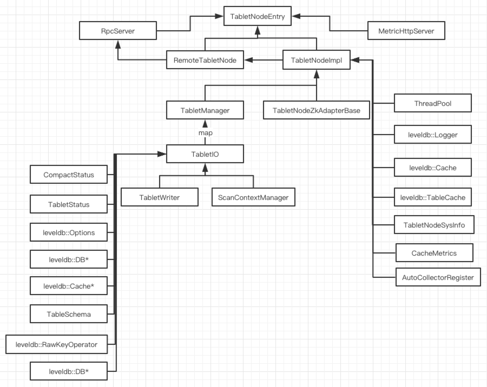
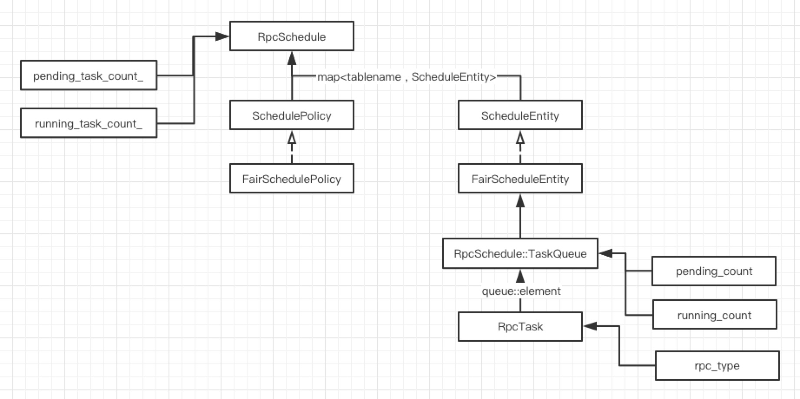

* **Navigation**
  
  * [TabletNode Arch](https://github.com/joeylichang/joeylichang.github.io/blob/master/src/tera/overview/tablenode_overview.md#tabletnode-arch)
    * [TableNode Class Arch](https://github.com/joeylichang/joeylichang.github.io/blob/master/src/tera/overview/tablenode_overview.md#tablenode-class-arch)
    * [TableNode Thread Arch](https://github.com/joeylichang/joeylichang.github.io/blob/master/src/tera/overview/tablenode_overview.md#tablenode-thread-arch)
  * [Leveldb Opt](https://github.com/joeylichang/joeylichang.github.io/blob/master/src/tera/overview/tablenode_overview.md#leveldb-opt)
    * [LevelDB Arch](https://github.com/joeylichang/joeylichang.github.io/blob/master/src/tera/overview/tablenode_overview.md#leveldb-arch)
    * [LevelDB Cache](https://github.com/joeylichang/joeylichang.github.io/blob/master/src/tera/overview/tablenode_overview.md#leveldb-cache)
    * [Read](https://github.com/joeylichang/joeylichang.github.io/blob/master/src/tera/overview/tablenode_overview.md#read)
    * [Write](https://github.com/joeylichang/joeylichang.github.io/blob/master/src/tera/overview/tablenode_overview.md#write)
    * [Compact](https://github.com/joeylichang/joeylichang.github.io/blob/master/src/tera/overview/tablenode_overview.md#compact)
    * [LevelDB 解析 && Option](https://github.com/joeylichang/joeylichang.github.io/blob/master/src/tera/overview/tablenode_overview.md#leveldb-解析--option)
  * [TabletNode RPC Arch](https://github.com/joeylichang/joeylichang.github.io/blob/master/src/tera/overview/tablenode_overview.md#tabletnode-rpc-arch)
  * [Statistic](https://github.com/joeylichang/joeylichang.github.io/blob/master/src/tera/overview/tablenode_overview.md#statistic)
    * [RemoteTabletNode 层](https://github.com/joeylichang/joeylichang.github.io/blob/master/src/tera/overview/tablenode_overview.md#remotetabletnode-层)
    * [TabletNodeImpl 层](https://github.com/joeylichang/joeylichang.github.io/blob/master/src/tera/overview/tablenode_overview.md#tabletnodeimpl-层)
    * [TabletIO 层](https://github.com/joeylichang/joeylichang.github.io/blob/master/src/tera/overview/tablenode_overview.md#tabletio-层)
    * [TabletWriter 层](https://github.com/joeylichang/joeylichang.github.io/blob/master/src/tera/overview/tablenode_overview.md#tabletwriter-层)
    * [PersistentCache 层](https://github.com/joeylichang/joeylichang.github.io/blob/master/src/tera/overview/tablenode_overview.md#persistentcache-层)
  * [TabletNode Period Task](https://github.com/joeylichang/joeylichang.github.io/blob/master/src/tera/overview/tablenode_overview.md#tabletnode-period-task)
  * [Query（HeartBeat Response）](https://github.com/joeylichang/joeylichang.github.io/blob/master/src/tera/overview/tablenode_overview.md#queryheartbeat-response)
  
  

###  TabletNode Arch

##### TableNode Class Arch



TabletNode 主要的类关系图如上所示，TabletNodeEntry 是 TabletNode 的入口，MetricHttpServer 提供 http 接口用于外部监控系统获取其统计信息，RemoteTabletNode 是 RPC 回调的入口后续介绍。

TabletNodeImpl 是 TableNode 的核心，内部主要的成员变量是 TabletManager 负责管理当前节点全部的 Tablet，TabletIO 可以理解为一个 Tablet 的对象，其主要负责与 LevelDB 的交互，涉及到读、写、Scan的核心逻辑。其他的类都是一些辅助，后续涉及到会详细介绍。


##### TableNode Thread Arch

默认配置 TabletNode 的线程分配情况如下：

1. 写请求线程池，10个线程。
2. 读请求线程池，40个线程。
3. Scan请求线程池，30个线程。
4. Compact请求线程池，30个线程。
   1. 每个 LevelDB ，既每个 lg 有8个 compact 线程。
5. lightweight_ctrl_thread_pool_，默认 10个线程。
   1. Query、Update、CmdCtrl、ComputeSplitKey、loadtablet、unloadtablet 部分情况（已经在执行，可能客户端那边有重试，ctrl_thread_pool_ 任务没有及时处理时）使用当前线程池。
6. ctrl_thread_pool_，默认20个线程。
   1. loadtablet、unloadtablet 优先使用该线程池。

加上主线程，默认情况 TabletNode 需要至少 141 + tablet_num * lg_num * 8 个线程。


##### 源码解析

* [TabletNode 类架构](https://github.com/joeylichang/joeylichang.github.io/blob/master/src/tera/tablet_node/init/tn_arch.md)
* [TabletNode RPC](https://github.com/joeylichang/joeylichang.github.io/blob/master/src/tera/tablet_node/rpc/tn_rpc.md#remotetabletnode)


### Leveldb Opt

##### LevelDB Arch


Tera 对LevelDB 进行了一些改动目的是支持系统的设计需求，上面是改动后的 LevelDB 层主要的类关系图。

主要改动如下：

1. 增加 DBTable 类继承DB，DBTable是对tablet的抽象，DBTable内部封装了DBImpl，DBImpl对lg进行抽象。
2. OpenDB 进行了改动，支持 Spilt Tablet、Merge Tablet（如果 option 有 parent_tablet 参数，说明是 Spilt（1个parent_tablet） 或者 Merge（2个parent_tablet））。
3. DBImpl 的压缩进行改动，引入压缩策略，在压缩过程删除各种类型的 Key（例如：TKT_DEL_QUALIFIER、TKT_DEL_QUALIFIERS、TKT_DEL_COLUMN、TKT_DEL、版本号等）。
4. 支持多线程Compact（默认8个线程）。
5. 对ENV进行继承，支持多套环境，包括HDFS、AFS（百度自研）、Local等（本系列关注HDFS）。
6. 增加PersistentCache，利用本地SSD磁盘缓存 SST 文件。


##### LevelDB Cache


Tera LevelDB 的缓存架构如上图所示，主要分两层三块。两层分别是 内存 和 SSD 磁盘。三块分别是 TableCache 、BlockCache、PersistentCache。其中 PersistentCache 在 SSD 磁盘上。

TableCache 存储的是 key->db_name+file_name，value->sst的索引数据。读取时从里面读，不再的时候会从dfs读出来写入。level0 落盘时，会写入。BlockCache 存储的是用户数据。读取时从里面读数据，不再的话会从DFS中读数据写入。level0 落盘时，会写入。PersistentCache 存储的是 SST 文件。

正如前面介绍过，缓存这部分利用了 SST 文件的不变性极大了减少了这部分设计的复杂度（只有淘汰，不用考虑失效的问题，避免了 Write Back 或者 Write Through 的复杂性）

详情见[Tera-LevelDB缓存]([https://github.com/joeylichang/joeylichang.github.io/blob/master/src/tera/tablet_node/leveldb/leveldb.md#tera-leveldb%E7%BC%93%E5%AD%98](https://github.com/joeylichang/joeylichang.github.io/blob/master/src/tera/tablet_node/leveldb/leveldb.md#tera-leveldb缓存))、[PersistentCache](https://github.com/joeylichang/joeylichang.github.io/blob/master/src/tera/tablet_node/leveldb/persistent_cache.md)。


##### Read

1. 在mutable和immutable中查找。

2. 在TableCache中查找(TableCache缓存的内容：key->db_name+file_name，value->sst的索引数据)。

   1. 如果在TableCache中，直接去BlockCache（缓存的用户数据）中get数据。

      1. 如果不在 BlockCache， 根据TableCache中的索引数据去sst文件中读数据。
      2. 读回的数据再重新插入BlockCache。
      3. 如果系统支持PersistentCache，并且该请求有回填选项，并且内容不是从PersistentCach获取，则调度将dfs文件读到本地。

   2. 如果不在TableCache中

      1. 打开dfs中相应的sst文件。
      2. 如果在PersistentCache中，从PersistentCache中读取index数据。
      3. 如果不在PersistentCache，或者没有使用PersistentCache，从dfs中读取sst文件的index数据。
      4. 根据读取到的索引数据，在内存中组织成Table数据结构，然后写入TableCache。

      

##### Write

1. 先判断 WriteOptions 是否设置了 disable_wal（可以设置不写 log，直接写数据），如果没有设置 disable_wal，判断 log 是否超出了设置的大小（默认 32M），如果超出则，switch log。
2. 如果没有设置 disable_wal，则先写 log
   1. Log 可以通过 WriteOptions 设置 sync 标志是否同步到磁盘（DFS也是支持的）。
   2. **注意**：目前都是在 DBTable 层的操作，既属于一个 Tablet 的所有 lg 共用一个 Log。
3. 根据写请求中的 RawKey 对其进行拆分，拆分到不同的 lg，既 DBImpl（LevelDB 实例）。
4. 遍历上述拆分的请求，分别对相应的 lg，进行写操作：
   1. 第一次遍历：调用 DBImpl 的 GetSnapshot，对所有需要更新的 lg，设置一份快照（目的是不影响写期间的读）。
   2. 第二次遍历：
      1. 先检查 memtable 是否有足够空间，没有进行切换，如果 immemtable 也是满的就等 min compact。
      2. 写入 memtable。
   3. 第三次遍历：删除之前 GetSnapshot 返回的快照。
5. 通过信号量机制，串行的进行下一个写操作。


##### Compact

除了 LevelDB 自身根据打分进行的 Compact，Tera 还支持客户端通过接口调用执行 Compact（启动新的线程，分 lg 并行进行）。


##### LevelDB 解析 && Option

LevelDB 更新详细的介绍见：

* [TabletNode中的LevelDB](https://github.com/joeylichang/joeylichang.github.io/blob/master/src/tera/tablet_node/leveldb/leveldb.md)。
* [PersistentCache](https://github.com/joeylichang/joeylichang.github.io/blob/master/src/tera/tablet_node/leveldb/persistent_cache.md)

Tera 对 LevelDB 有了较大的改动，也增加了一些配置，在对LevelDB的有了了解之后，有必要了解一下其配置，对于性能调优、线上问题定位、监控理解等方面都是有必要的。

* [LevelDB 配置](https://github.com/joeylichang/joeylichang.github.io/blob/master/src/tera/tablet_node/leveldb/options.md)

更多关于 LevelDB 的介绍见[LevelDB解析](https://github.com/joeylichang/joeylichang.github.io/blob/master/src/leveldb/overview.md)。


### TabletNode RPC Arch

在 RPC 回调层，TabletNode 针对 Read、Scan、Quta 三类请求做了一层调度模块。类架构图如下所示：



RpcSchedule 内部维护 表名 -> 调度单元的映射（既std::map<TableName, ScheduleEntity*> TableList），调度单元（ScheduleEntity）内部有有一个队列（既TaskQueue）记录RPC任务（既RpcTask），详情见[RPC的调度策略](https://github.com/joeylichang/joeylichang.github.io/blob/master/src/tera/tablet_node/rpc/tn_rpc.md)。

RpcSchedule 维护三个重要接口EnqueueRpc、DequeueRpc、FinishRpc。

1. EnqueueRpc：通过tablename 获取调度单元，再获取对应的队列，将RpcTask加入队列。如果TaskQueue的pending_count不为0，则调用FairSchedulePolicy的Enable的接口，将调度单元设置为可调度。

2. DequeueRpc：调用FairSchedulePolicy的pick接口获取要执行的RpcTask。Pick的策略是遍历std::map<TableName, ScheduleEntity*> TableList，判断当前调度单元（ScheduleEntity）是否是enable，如果是取出队列，从头部取出一个RpcTask去执行。如果调度单元的pending_count为0，则调用FairSchedulePolicy的Disable接口将调度单元（ScheduleEntity）设置为不可调度

   ##### 注意：如果一个table积压的任务较多，其他table的任务可能长时间等待，因超时饿死。

3. FinishRpc：调用FairSchedulePolicy的Done的接口，更新调度单元（ScheduleEntity）的统计数据。


### Statistic

TabletNode 中分层对一些数据进行统计，这些统计数据有的会打印到日志、有的会定期Dump到文件，用于监控，帮助排查问题、监控指标。还有的统计数据会通过心跳上报给 Master，供 Master 做系统整体协调的依据。故，有必要对了解其统计信息的含义。

##### RemoteTabletNode 层

主要是统计 RPC 接收到请求 QPS、因异常拒绝的请求 QPS、分位统计等，详情见[RemoteTabletNode 层统计数据]([https://github.com/joeylichang/joeylichang.github.io/blob/master/src/tera/tablet_node/statistic/tn_statistic.md#remotetabletnode-%E5%B1%82%E7%BB%9F%E8%AE%A1%E6%95%B0%E6%8D%AE](https://github.com/joeylichang/joeylichang.github.io/blob/master/src/tera/tablet_node/statistic/tn_statistic.md#remotetabletnode-层统计数据))。

##### TabletNodeImpl 层

主要是统计因 TabletNode 层校验失败的请求 QPS、TableCache（LevelDB）、BlockCache（LevelDB）缓存统计数据（命中率等）、压缩比等，详情见[TabletNodeImpl 层统计数据]([https://github.com/joeylichang/joeylichang.github.io/blob/master/src/tera/tablet_node/statistic/tn_statistic.md#tabletnodeimpl-%E5%B1%82%E7%BB%9F%E8%AE%A1%E6%95%B0%E6%8D%AE](https://github.com/joeylichang/joeylichang.github.io/blob/master/src/tera/tablet_node/statistic/tn_statistic.md#tabletnodeimpl-层统计数据))。

##### TabletIO 层

主要统计 LevelDB 层，读、写、SCAN 的行数、cell数等QPS。其中 StatCounter 内部的统计数据会通过心跳上报给 Master，作为 Load Banalce 的重要数据依赖，详情见[TabletIO 层统计数据]([https://github.com/joeylichang/joeylichang.github.io/blob/master/src/tera/tablet_node/statistic/tn_statistic.md#tabletio-%E5%B1%82%E7%BB%9F%E8%AE%A1%E6%95%B0%E6%8D%AE](https://github.com/joeylichang/joeylichang.github.io/blob/master/src/tera/tablet_node/statistic/tn_statistic.md#tabletio-层统计数据))。

##### TabletWriter 层

主要是统计写入 LevelDB 的耗时情况，详情见[TabletWriter 层统计数据]([https://github.com/joeylichang/joeylichang.github.io/blob/master/src/tera/tablet_node/statistic/tn_statistic.md#tabletwriter-%E5%B1%82%E7%BB%9F%E8%AE%A1%E6%95%B0%E6%8D%AE](https://github.com/joeylichang/joeylichang.github.io/blob/master/src/tera/tablet_node/statistic/tn_statistic.md#tabletwriter-层统计数据))

##### PersistentCache 层

主要是统计 PersistentCache 的带宽、写入QPS、命中率等，详情见[PersistentCache 层统计数据]([https://github.com/joeylichang/joeylichang.github.io/blob/master/src/tera/tablet_node/statistic/tn_statistic.md#persistentcache-%E5%B1%82%E7%BB%9F%E8%AE%A1%E6%95%B0%E6%8D%AE](https://github.com/joeylichang/joeylichang.github.io/blob/master/src/tera/tablet_node/statistic/tn_statistic.md#persistentcache-层统计数据))。


### TabletNode Period Task

TabletNode 周期性任务分为一下几种：

1. GC：主要是PersistentCache的GC，默认配置是30min执行一次。
2. 统计信息刷新，默认1s更新一次。
3. SysInfo信息刷洗，默认1s更新一次。
4. RPC回调层，线程池、任务等信息profile，默认1s更新一次。
5. RPC最大延迟信息输出，默认1s更新一次。

源码解析见，[TabletNode 周期任务](https://github.com/joeylichang/joeylichang.github.io/blob/master/src/tera/tablet_node/init/tn_period.md)。


### Query（HeartBeat Response）

Query 请求是 Master 周期性（默认10s）向所有 TabletNode 发送的探测请求，其返回结果中包含当前 TabletNode 的信息，详细的源码解析见[TableNodeServer Query](https://github.com/joeylichang/joeylichang.github.io/blob/master/src/tera/tablet_node/procedure/tn_query.md)。

本部分主要看一下，Query 请求的 Response 主要包含哪些信息 以及 含义：

###### QueryResponse

```protobuf
message QueryResponse {
    required uint64 sequence_id = 1;
    required StatusCode status = 2;
    optional TabletNodeInfo tabletnode_info = 3;
    optional TabletMetaList tabletmeta_list = 4;
    repeated InheritedLiveFiles inh_live_files = 5; 	// 兼容旧版本，不在此介绍
    repeated TabletInheritedFileInfo tablet_inh_file_infos = 6;
    repeated TabletBackgroundErrorInfo tablet_background_errors = 7;
    optional uint64 version = 8;
    optional uint64 quota_version = 10;
}
```


###### QueryResponse.TabletNodeInfo

```protobuf
message TabletNodeInfo {
  required string addr = 1;
  optional StatusCode status_t = 2;
  optional uint64 load = 3;
  optional uint64 timestamp = 4;
  optional uint32 tablet_total = 5;
  optional uint32 tablet_onbusy = 6;
  optional uint32 tablet_corruption = 7;

  optional uint32 low_read_cell = 11;
  optional uint32 scan_rows = 12;
  optional uint32 scan_kvs = 13;
  optional uint32 scan_size = 14;
  optional uint32 read_rows = 15;
  optional uint32 read_kvs = 16;
  optional uint32 read_size = 17;
  optional uint32 write_rows = 18;
  optional uint32 write_kvs = 19;
  optional uint32 write_size = 20;

  optional uint64 mem_used = 21;
  optional uint32 net_tx = 22;
  optional uint32 net_rx = 23;
  optional uint32 dfs_io_r = 24 [default = 0];
  optional uint32 dfs_io_w = 25 [default = 0];
  optional uint32 local_io_r = 26;
  optional uint32 local_io_w = 27;
  optional uint32 dfs_master_qps = 28 [default = 0]; // Operations through dfs's master, including close, open, delete

  optional string status_m = 31;
  optional uint32 tablet_onload = 32;
  optional uint32 tablet_onsplit = 33;
  optional uint32 tablet_unloading = 34;

  repeated ExtraTsInfo extra_info = 40;

  optional uint32 read_pending = 41;
  optional uint32 write_pending = 42;
  optional uint32 scan_pending = 43;

  optional float cpu_usage = 44;
  optional int64 process_start_time = 45;  // Unix time in us

  optional uint64 persistent_cache_size = 46;
}
```


###### QueryResponse.TabletMetaList

```protobuf
message TabletMetaList {
  repeated TabletMeta meta = 1;
  repeated TabletCounter counter = 2;
  repeated int64 timestamp = 3;  // meta update timestamp
}

// 在上一部分 Statistic 部分有介绍
message TabletCounter {
  optional uint32 low_read_cell = 1;
  optional uint32 scan_rows = 2;
  optional uint32 scan_kvs = 3;
  optional uint32 scan_size = 4;
  optional uint32 read_rows = 5;
  optional uint32 read_kvs = 6;
  optional uint32 read_size = 7;
  optional uint32 write_rows = 8;
  optional uint32 write_kvs = 9;
  optional uint32 write_size = 10;
  optional double write_workload = 11 [default = 0.0];

  optional bool is_on_busy = 15 [default = false];
  optional TabletMeta.TabletStatus db_status = 16;
}
```


###### QueryResponse.TabletInheritedFileInfo

如果 Query 请求带有 gc 参数，会获取每一个 Tablet 正在使用的 SST 文件，并通过 TabletInheritedFileInfo 汇报给 Master。

```protobuf
message TabletInheritedFileInfo {
  optional string table_name = 1;
  optional bytes key_start = 2;
  optional bytes key_end = 3;
  repeated LgInheritedLiveFiles lg_inh_files = 4;
}

message LgInheritedLiveFiles {
  required uint32 lg_no = 1;
  repeated uint64 file_number = 2;  // full file number, include tablet number
}
```


###### QueryResponse.TabletBackgroundErrorInfo

这里的 BackgroundError 值得是 LevelDB 的 Compact 错误，通过 LevelDB 的 GetProperty 接口获取其 leveldb.compaction_error 的信息，并上报。

```protobuf
message TabletBackgroundErrorInfo {
  required string tablet_name = 1;
  required bytes detail_info = 2;
}
```


