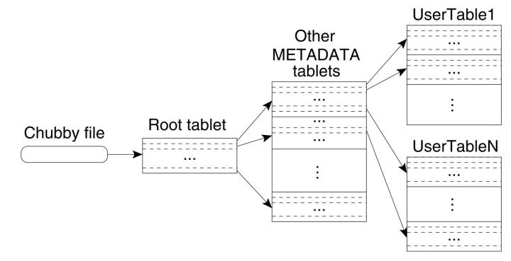

# Think In

### VS. BigTable

##### Chubby

1. Chubby 介绍
   1. Chubby 提供了一个名字空间，里面包括了目录 和 小文件（与 ZK 区别）
   2. 每个目录或者文件可以当成一个锁，读写文件的操作都是原子的。
   3. Chubby 客户端与 Chubby 通过租期保持 Session，当一个 Session 失效时，它拥有的锁和打开的文件句柄也都失效了。
   4. 当 Chubby 内部的文件或者目录有变更时，客户端会受到通知。
2. 在 BigTable 中的使用
   1. Master 选主。
   2. 存储 BigTable 数据的自引导指令的位置（类似 MetaTablet 的位置）。
   3. 查找 Tablet 服务器，以及在 Tablet 服务器失效时进行善后。
   4. 存储 BigTable 的模式信息（与 Tera 区别）。
   5. 以及存储访问控制列表。（与 Tera 区别）
3. VS. Tera
   1. ZK 不支持文件。
   2. Table Schema 信息 以及 ACL 存储在 MetaTable中。

##### MetaData

1. MetaData 三层索引
   1. 在 Chubby 中的一个 File 保存着 Root Tablet 的位置。
   2. Root Tablet（唯一且永不分裂） 保存着 MetaData Table 所有 Tablet 的位置。
   3. MetaData Table 中保存着其他所有 Table 的 Tablet 的位置。
2. VS. Tera
   1. Tera 的 MetaTablet = Root Tablet +  MetaDataTableTablets，既两层索引。
   2. Bigtable 
      1. 容量更大，METADATA 的每一行都存储了大约 1KB 的内存数据，128MB 的 METADATA Tablet 中，采用这种三层结构的存储模式，可以标识 2^34 个 Tablet 的地址（RootTablet * MetaDataTablet = 2^17 * 2^17）。
      2. 如果客户端的缓存失效，网络IO 次数最多达6次（3次失效 + 3 次请求）。
   3. Tera
      1. 同样大条记录大约 1KB 的内存数据（实际没有这么大），128MB 的 MetaTablet 能够标识 2^17 个 Tablet 的地址（同样情况下容量介绍一半）。
      2. 如果客户端的缓存失效，网络IO 次数最多达4次（2次失效 + 2 次请求）。

##### Spilt Tablet

1. Tera：Master 发起，控制全流程。
2. BigTable：TabletNode 发起，好处是更及时，甚至很多用于判断是否分裂的信息不需要再汇报给 Master 较少网络带宽。
   1. 问题：TableNode 完成分裂之后如果通知 Master 失败（网络、Master、TabletNode 故障），Master 在分配 Tablet 加载时，TableNode（不一定是之前的 TabletNode）会发现因为分裂导致加载不起来（可能是 GFS 层有变化），此时 TableNode 会上报给 Master 与 RootTablet 进行对比，完成两个 Tablet 的加载。

##### Cache

Bigtable 没有 Persistent（SSD 盘）的缓存。

##### WAL

Tera

1. 一个 Tablet 一个 wal 日志，一个 TabletNode 对应多个日志。

Bigtable

1. 一个 TabletNode 对应一个 wal 日志。
   1. 优点是减少了对 GFS 的 seek 并行度。
   2. 缺点是 Tablet 恢复会很慢。
      1. 为此对日志进行排序（table，row name，log sequence number），这样用一个 Tablet 的日志连续排在一起。
      2. 对日志进行 64MB 进行分段，每次恢复的时候由 Master 协调其他节点分段进行排序（一般 wal 日志不会过大，除非批量删除等极少数场景）。

##### 总结

1. Chubby vs. ZK
2. MetaTablet 三级索引 vs. 二级索引
3. SpiltTablet TableNode 发起 vs. Master 发起。
4. 内存耳机缓存 vs. 内存 + SSD 三级缓存。
5. WAL TabletNode 共享（排毒） vs. Tablet 共享。

### Disaster

##### Master 高可用

Tera Master 在部署上有多备份，但是备份在初始化阶段，如果抢主失败时会继续重试直到抢主成功，顾备份的内存中没有元数据，更不会执行 Master 的 HB、GC、LB 等逻辑，所以备份不会承接任何流量分摊主 Master 的压力。由于元数据同其他用户数据一样，通过 TabletNode 持久化在 DFS 上，Master 即使故障发生主从切换，只要从 DFS 上读取之后加载起来就好，所以 Master 之间并没有数据同步和一致性协议，Master 的高可用主要依赖 备份对主 Master 可用性的监控 + 持久化的元数据。缺点是恢复的速度较慢（Scan 元数据 + 收集所有节点信息），优点是实现复杂度较低、充分利用了持久化、降低了线上维护成本。

##### TableNode 高可用

Tera TabletNode 中负责的 Tablet 是单副本，这么做的原因有两点。第一，可以理解为 TabletNode 负责存储索引，真正的数据存储在 DFS，数据的可靠性由 DFS 保证（一般是三副本）。第二，TabletNode 故障时，Tablet 可以快速被迁移，这样才不能影响集群的可用性。正常 Tablet 迁移过程主要涉及 Unload 与 Load 的流程，由于 Load 所需的元数据都存储在 DFS，加载时只需要恢复内存数据即可，正常在秒级。但是 Master 判断节点故障（分钟级别的判断周期）到上面全部 Tablet 被迁移走（控制并发度），至少也是分钟级别（要看Tablet 的个数）。

##### Master 元数据一致性

Tera Master 元数据持久化到 DFS 索然避免了 Master 小集群内数据一致性的问题，但是引入了 Master 内存中的元数据与 DFS 上持久化的元数据的一致性问题。元数据存储与 Master 分离的架构中，总是无法避开的需要重点讨论的问题。

元数据主要包括两部分：TableMeta 和 TabletMeta，这两部分涉及到了集群的拓扑（权限、用户、Quota 等未涉及到集群的拓扑，暂不讨论）。针对 TableMeta 的更新，设计的方案都是先更新内存，再更新 MetaTable，更新  MetaTable 失败（超过了重试次数），则流程失败，但是内存中并没有回滚，针对 Table 的所有流程（create-> disable->delete，create-> disable->enable）都可以通过前一个操作（比如：Disable，更新 MetaTable 失败，则可以 Enable 回滚内存数据）进行回滚内存中的数据。

TabletMeta 的设计方案有些复杂。首先 Tablet 的状态较多，如果每个状态都存储在 MetaTable 中，当 Master 恢复内存元数据时读取状态，恢复内存的状态机继续从故障前的状态开始。异常情况会非常多，故障前持久化到 MetaTable 和 故障后恢复内存数据 导致异常情况直接翻倍，加之状态多达 10 种，又让异常情况成指数级增长，对于容灾的实现上复杂度极高。Tera 的解决方案只持久 Offline 一种状态，恢复元数据时，在 Scan 完 MetaTable 之后会先收集一遍节点上 Tablet 的状态（相当于从状态机源点开始重放），相结合然后恢复 Tablet 的处理流程。这种方案大大的较少了实现的复杂度（需要一定的恢复延时）。

TabletMeta 只有在 Load 时进行进行持久化（Offline 状态），且无限重试，一定会成功（因为MetaTablet 如果一场一定会有限被加载，无限次重试之后一定成功）。在 Unload 时不会持久化，因为 Unload 时一定会选一个其他的节点进行 Load，否则 Table 的分区就不全，新 Load 时会更新 MetaTable（上述原因，也是 MoveTablet 不会更新元数据的原因）。

针对 Spilt 和 Merge 场景，先更新 MetaTable（无限次重试，一定成功） 然后更新内存，最后异步发起 Load 流程（只有这两个流程是先更新 MetaTable，后更新内存）。笔者认为这么设计的原因是，两个流程都是先 Unload ，然后再 Load（之前的场景是先 Unload 再 Load），并且 Load 之前已经 Check 了 Unload 成功完成（消费完全部 wal）不会发生回滚情况（FaultRecove 详情见之前的介绍），集群认为此时的拓扑就是拆分后的拓扑，只不过有两个（Spilt 是两个，Merge 是一个）Tablet 是 Unload 的状态，一定集群在此时故障应该按这个最新的拓扑进行恢复，所以需要先持久化。

最后，上述 TabletMeta 用恢复延迟换取实现复杂度中，提到只持久化最原始的 Offline 状态，通过收集节点上 Tablet 的状态从状态机的源点开始恢复，在实现上这也是比较困难的因为状态机从源点开始恢复需要状态机的驱动事件链，这个事件链是没有持久化的。在实现上 TabletNode 只存储了少量的集中状态，Master 收集之后可以即刻做出简单的判断来决策使用什么流程让集群尽快可用，至于其他的复杂流程（比如：搬迁、分裂、合并等）Master 会重新开始各自的流程。

##### 防抖动

TabletNode 上面负责很多 Tablet，频繁的节点加入离开会导致 Tablet 大量的迁移，进而影响集群的可用性。Tera 在节点离开时会将节点加入一个集合，当节点加入时会判断节点是否在集合中，如果在且离开的时候没有超过闸值，认为节点有抖动的情况，会延迟一段时间将节点加入集群（观察期）。

### Question

##### HDFS vs. AFS

Tera 经过工业环境万亿级别的考验，在社区项目中是很有价值的，但是底层 DFS 只兼容 HDFS，在百度内部使用的自研文件系统 AFS，这将是最大的风险点。百度的文件系统 与 HDFS 最大的差别是针对小文件进行存储，针对小文件 HDFS（为大文件而设计，典型场景追加写方式存用户日志，用于分析和模型计算） 的表现并不是很让人满意，比如：HDFS 针对小文件的读延迟会很不稳定，延迟抖动的比较明显，针对这个问题很多成规模的公司也进行了大量优化 （客户端缓存、分摊 NN 流量等）。针对 HDFS 解决小文件（SST 文件一般都不会很大）的问题，也不是无计可施，针对公司的实际情况分析具体的瓶颈点，可以有明显的优化效果。

##### Load Balance

Tera 的 LB 策略并不是十分完美，每次都是选择“最优的节点”（容量或者流量最小的节点）进行搬迁，然后进行校验（搬进搬出是否超过闸值等，默认闸值是 1），可以理解为加入限制条件的基础搬箱算法，如果空节点上线会一值选他作为目标节点直到触发限制条件，如果节点故障仍会持续向这个节点发起搬迁任务（Master 判断节点故障并进行下线会有一个分钟级的延迟），此时的搬迁都会失败，当前算法的感知（通过失败次数）也不是很及时（搬迁慢或者失败率高，在机器裁撤等运维场景会成为瓶颈）。针对上述问题，可以引入概率算法，让每次选取的节点都是以大概率选“最优的节点”（容量或者流量最小的节点），“不够优秀的节点”选取的概率较小，既容量或者流量越小，被选取的概率越大，反之亦然。

##### 事务不够完善

单行事务 和 全局事务之前介绍过，都是需要 TabletNode 做一些逻辑，但是目前开源的版本还没有，只是完成了客户端部分的逻辑，所以严格来说事务还不具备上线的能力（前面的介绍有提到过）。

Tera 完全参照 BigTable 论文实现（具体实现根据依赖组件情况有偏差，但是设计的根本宗旨是一样的），BigTable 在设计上天然不支持全局事务，Tera 应该是在实现 BigTable 的基础上后期开始考虑全局事务，在设计之初就没有考虑全局事务，当然在后期的设计上必然会有捉襟见肘的地方。首先，全局时钟的设计不够严谨，依赖 ZK 保存全局时钟可用性一般，业界针对全局时钟做了很多工作，比如：向量时钟、物理时钟 + 向量时钟、硬件CPU支持时钟永不回滚 + 分布式等解决方案。

##### 权限验证

Tera 开源阶段考虑安全性阉割了内部使用的 Ganio 系统（这也是自然），实现了一套简单的权限系统，但是并不完善，用户与权限并没有关联上，既权限验证只验证了用户，并没有验证用户对应的权限。

##### ZK vs. ETCD

ZK 自身实现的类 Paxos 算法比较重，维护起来比较困难，加上 Watch 并不是可靠 Watch（有丢的风险）。近些年随着 ETCD 的出现，因其更轻便（Raft）、可靠 Watch、支持版本号等有限更多项目选择 ETCD。

更多的项目在轻量级的配置会选择 ZK，必须超时时间、集群部署机房等轻量级的配置选择 ZK，并且少量 Watch（及时 Watch 丢失，也不会影响集群可用性），至于 TabletNode Addr 等重要的集群拓扑信息，选择 ZK 有待于商榷。

### Q&A

以下问题均来自 Tera 的说明文档，应该是内部同学串讲的问题，在这里根据对系统的学习和线上实际情况进行解答，目的是更好地理解 Tera。

1. locality group的作用？

   LG 主要是根据业务需要进行制定，业务可以从一下几方面进行考量：

   1. LG 对应一个 LevelDB 实例，合理设置 LG、CF、QUA 从属关系，对于经常一起读的列放在一个 LevelDB 实例内，可以提高读性能。
   2. 可以根据 LG 指定存储介质，提高性能。
   3. LG 的压缩算法也可以指定，根据数据特点提高压缩比。

2. master在gc时怎么知道哪些数据可以删除？

   1. 通过 DFS 获取磁盘有哪些 Tablet，对于不用的 Tablet（与内存中 Ready 的相对比）。
   2. 对于不用的 Tablet 删除所有文件，除 SST 文件（Spilt、Merge 可能还在用）。
   3. 通过 HB 收集上来的 Tablet 还在使用的 SST 集合，与其进行对比，将步骤 2 中的 SST 文件集合进行对比，获取到真正不用的 SST 文件。
   4. 将真正不用的 SST 移到 Trash 目录。

3. 性能相关（读写瓶颈、io/cpu/mem等资源细节、zk和hdfs压力、各类cache等等）？

   1. 写瓶颈：与 DFS 交互的操作（写日志文件，immutable memtable写sst文件，compact操作）。
   2. zk：Clinet 缓存 MetaTable（地址和数据）、Table的一些元数据等。
   3. HDFS：批量写、限流（HDFS 客户端缓存元数据，还未做）。
   4. Cache：主要是消耗在 TableCahce、BlockCache。
   5. 系统资源：DFS 主要是网络IO、CPU主要是扫描。

4. 一致性保证（master的mem与meta；ts与tablet）？

   1. master的mem与meta，如上所述。
   2. ts与tablet，用户只有写 DFS 返回才返回给客户端，其次 Tablet 是单副本，最后 TableNode 利用了 SST 文件的不变性，没有一致性的问题。

5. client读写时如何寻找对应ts？

   1. Client -> zk -> MetaTablet -> UserTablet

6. tera的读操作在leveldb中的流程？

   1. seek 到行首，进行遍历 Cell，读到有效数据。
   2. RawKey 中 type 为 TKT_FORSEEK 会seek 到行首，因为 TKT_FORSEEK = 0；

7. ts挂掉一台后，上面的tablet多久能够恢复服务（ts挂掉的，tera内部的流程）？

   1. Master 最多 10s （tera_zk_timeout） Watch 到，TabletNode 与 ZK 的超时时间 tera_zk_timeout。
   2. Master等待60（tera_master_tabletnode_timeout）秒，进行分配。
   3. 当正在load的tablet大于或等于5（tera_master_max_load_concurrency）个时，剩下的tablet就要排队了。
   4. 结论：至少分钟级恢复，Tablet 越多恢复越慢，不让更多的 Tablet 同时迁移，主要是考虑对 DFS 的压力。

8. bloomfilter加载到内存是在什么时刻进行的，数据特别多时内存不够用怎么办？

   1. TableCahce 管理 bloomfilter，打开 SST 文件时加载。
   2. TableCahce 根据 LRU 淘汰。

9. 一致性如何保证，即如何保证一个区间只由一个ts提供服务（例如load超时）？

   1. Load 失败，会进行 Move。

10. 如何踢掉ts?

    1. ts监听自己在zk节点的变化事件；
    2. master把ts在zk的节点移动到kick目录；
    3. ts发现自己被移到kick了，就主动退出服务；
    4. ts先打印一行日志，然后以FATAL错误的方式退出，所以不存在因某种原因卡住而没有及时退出的问题；

11. 何时使用kv存储，何时使用表格模型存储？

    1. 随机读、扫描等简单操作的性能会明显优于表格模式，cpu的利用效率也会更高（前面介绍过）。
    2. 优先 KV 存储。

12. 表格存在明显的读写热点情况如何处理？

    1. 如果热点不是非常集中的情况下，可以将对应tablet进行拆分，分散压力。
    2. 读热点，极端情况下，可能一行的读取压力（每秒数万以上）将cpu占满，此时需要客户端进行适当缓存。
    3. 写热点，开启内存compact功能，可大幅提升写性能。

13. 按某一列进行扫描时，cpu消耗很高，而且速度很慢？

    1. 当某表列很多时，只扫描其中一列，会将所有列数据扫描一遍，速度会很慢，cpu也会消耗很高。
    2. 此时可以针对不同列的扫描需求，将不同列拆分至不同Locality Groups，进行IO隔离，扫描时访问所需列数据，节省资源，提高性能。

 
