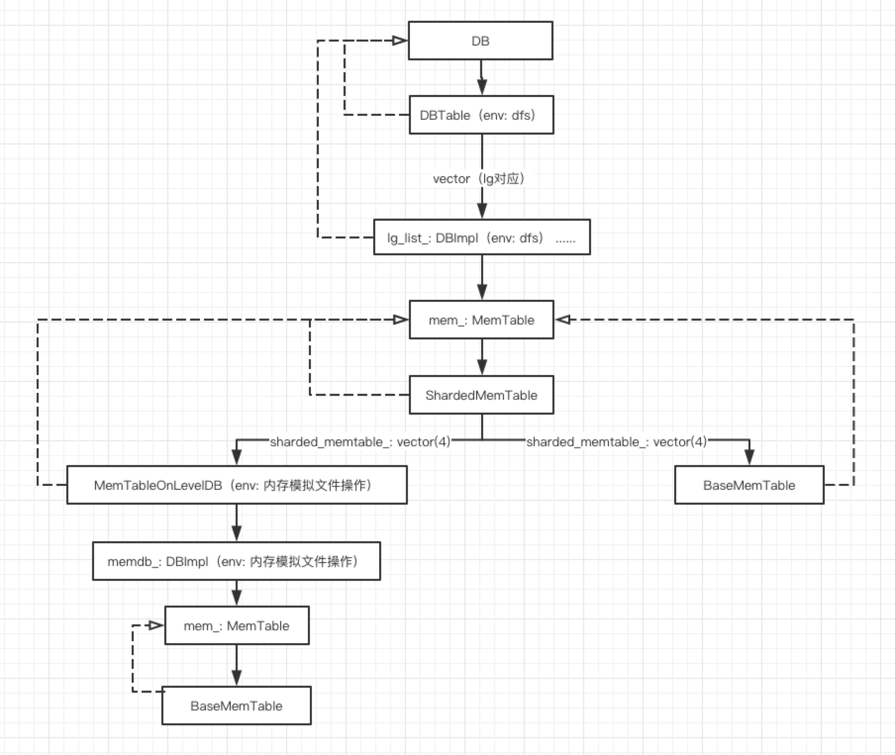
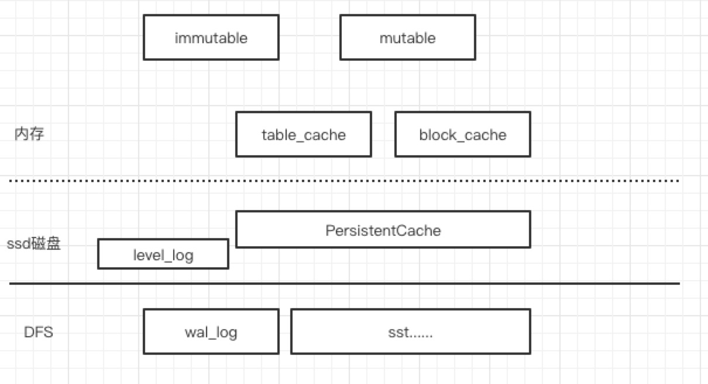

# TabletNode中的LevelDB

Tera 对leveldb 进行了大量的优化，主要包括一下几部分：

1. 增加DBTable类继承DB，DBTable是对tablet的抽象，DBTable内部封装了DBImpl，DBImpl对lg进行抽象。
2. 增加PersistentCache，相对于DFS利用本地SSD磁盘的缓存。
3. 对ENV进行继承，支持多套环境，包括HDFS、NFS（百度自研）、Local等（本系列关注HDFS）。
4. 支持多线程Compact。
5. 其他，包括TableCache、MemTableOnLevelDB等。

之前对LevelDB有了详细的介绍（[leveldb](https://github.com/joeylichang/joeylichang.github.io/blob/master/src/leveldb/overview.md)），本系列文章只针对Tera优化 和 Tera需要关注但之前不是重点介绍的部分进行阐述。

### Tera-LevelDB类图

##### ENV

Tera由于支持DFS，所以对env进行了扩展支持多种系统环境，在梳理Tera-LevelDB的时候一定要区分当前类在什么ENV环境处于整个代码架构的什么位置，图中针对ENV进行了标注（只关注后端使用DFS情况）。LevelDB的日志就是在本地，多以其ENV就是Posix。

#####DB

上层访问level的对外接口（通过open接口），一个tablet 对应一个 DB。

##### DBTable

继承自DB，是tera对leveldb的扩展部分。内部针对tera中局部群组（LocalityGroup）概念，为每一个lg实例化一个DBImpl，所有的lg共用一个wal日志文件。

##### DBImpl
一个leveldb引擎的具体实现，一个DBImpl包含一个mutable（MemTable类型）、一个immutable（MemTable类型），和若干sst文件用于存储用户数据。

##### ShardedMemTable
继承自MemTable（内存中的用户数据），用vectore组织的多个（默认配置4个）BaseMemTable 或者 MemTableOnLevelDB，循环vector往里add数据。

ShardedMemTable分片的数量，默认值是4。如果是KV结构则，不使用ShardedMemTable，而是MemTableOnLevelDB或者BaseMemTable，配置是0。KV需要Get接口，其他接口时通过迭代器获取（因为ShardedMemTable组装了多个TableCache）数据。所以ShardedMemTable，不支持Get。MemTableOnLevelDB 和 BaseMemTable 支持Get接口。

##### MemTableOnLevelDB

继承自MemTable，env是基于内存的（即用内存模拟了一套操作系统环境，只模拟了文件的部分操作），MemTableOnLevelDB可以理解为基于内存的一个levevldb引擎，包含一个BaseMemTable，和若干sst文件（内存模拟的文件）。是否使用MemTableOnLevelDB，可以进行配置，默认使用BaseMemTable。

##### BaseMemTable
继承自MemTable，传统 leveldb 中的mutable内存结构，用跳跃表实现的table。

### Tera-LevelDB缓存

Tera-LevelDB的数据存储分布如上图所示。内存中除了mutable 和 immutable存储用户的写入数据，还有table_cache 和 block_cache缓存用户数据（开源leveldb也有，tera进行了一些定制化），相对远程访问的DFS，在本地SSD盘上支持PersistentCache。数据的wal 日志也会写入DFS，用于数据恢复，LevelDB的业务日志是在本地。

##### TableCache

存储的是 key->db_name+file_name，value->sst的索引数据。读取时从里面读，不再的时候会从dfs读出来写入。level0 落盘时，会写入。

##### BlockCache
存储的是用户数据。读取时从里面读数据，不再的话会从DFS中读数据写入。level0 落盘时，会写入。

##### PersistentCache 

详见[PersistentCache](https://github.com/joeylichang/joeylichang.github.io/blob/master/src/tera/tablet_node/leveldb/persistent_cache.md)

##### DfsReadThreadLimiter

读文件的流量控制机制，通过信号量，限制读取dfs的sst文件。在ReadBlock（读取sst的数据）会校验，默认的限制是 35

### 主要流程

##### 读操作

1. 在mutable和immutable中查找。
2. 在TableCache中查找(TableCache缓存的内容：key->db_name+file_name，value->sst的索引数据)。
   1. 如果在TableCache中，直接去BlockCache（缓存的用户数据）中get数据。
      1. 如果不在 BlockCache， 根据TableCache中的索引数据去sst文件中读数据。
      2. 读回的数据再重新插入BlockCache。
      3. 如果系统支持PersistentCache，并且该请求有回填选项，并且内容不是从PersistentCach获取，则调度将dfs文件读到本地。
   2. 如果不在TableCache中
      1. 打开dfs中相应的sst文件。
      2. 如果在PersistentCache中，从PersistentCache中读取index数据。
      3. 如果不在PersistentCache，或者没有使用PersistentCache，从dfs中读取sst文件的index数据。
      4. 根据读取到的索引数据，在内存中组织成Table数据结构，然后写入TableCache。

#####  写入

batch写入，会把千秋分配到不同的lg上进行。日志log写dfs，数据写内存。

##### 压缩

level0刷入磁盘时会写TableCache 和 BlockCache, 然后写入dfs的sst文件中。

##### scan（开源leveldb相同思路）

1. 复合的迭代器：mutable + immutable + level0 + level1 + ... + levelN
2. level0 有重叠，所以每一个file 有一个迭代器，并且是TableCache的迭代器，如果数据不再cahce中，会走FindTable流程与读流程类似。
3. level1 + ... + levelN 使用LevelFileNumIterator 和 TwoLevelIterator进行封装完成遍历，底层依然使用TableCache迭代器。

### 注意

LevelDB的多层Cache（内存 + 磁盘）都是利用了LevelDB自身的不变性，既写入sst的数据不会被随机更改，只会通过压缩进行合并和删除，在查询时根据version_set去查找目标文件进行再查询用户数据，可以理解为version_set确定的文件就是业务需要的文件不存在脏和过期的问题，所以缓存中的数据没有过期和脏的问题，这大大减少了远程交互的繁琐逻辑。

