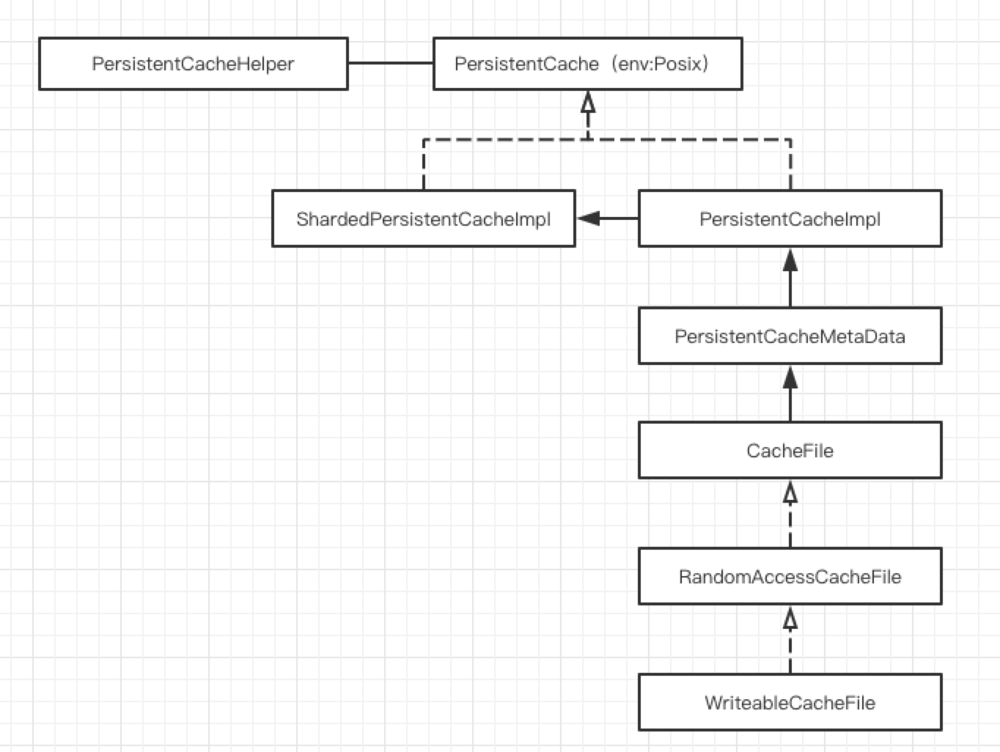

# PersistentCache

### 类介绍

PersistentCache 涉及的类图关系如图所示：

##### PersistentCacheHelper

对外的接口类，主要包括三个接口：

1. ScheduleCopyToLocal：调度DFS的sst文件到本地ssd磁盘，作为本地cache。
2. DoCopyToLocal：ScheduleCopyToLocal内部调用。
3. TryReadFromPersistentCache：从本地ssd磁盘缓存读取数据。

##### ShardedPersistentCacheImpl

继承自PersistentCache虚类，对PersistentCacheImpl进行了一层封装。PersistentCache可包含多个目录，统一在ShardedPersistentCacheImpl对其进行了封装，并且ShardedPersistentCacheImpl内部还记录了一个map接口用于记录file 与 index（PersistentCacheImpl）的对应关系。

PersistentCacheImpl的选取原则（写入一个文件时会选择一个目录，既PersistentCacheImpl，用于存文件）：

1. 选取总容量在90%一下的集合为备选集。
2. 如果备选集为空，则选择剩余容量最大的目录用于存储。
3. 如果备选集不为空，所及选。

##### PersistentCacheImpl

继承自PersistentCache虚类，与ShardedPersistentCacheImpl是组合关系，代表一个目录下的PersistentCache。

PersistentCache会根据磁盘的空间调整缓存的文件，如果磁盘空间不足会强制淘汰文件。强制淘汰逻辑与GC类似后面介绍。

内部维护PersistentCacheMetaData，表示本地缓存的sst为元数据。元数据的修改、数据的写入等都是在ShardedPersistentCacheImpl层完成。

##### PersistentCacheMetaData

内部维护了两个hash，既cache_file_index 和 cache_id_index，用于完成key -> cache_id，cache_id->cache_file的映射，相应的数据通过本地的leveldb持久化在本地，用于重启。

内部还维护了evictable_files_变量，淘汰数据时会从中取（如果引用为0，如果应用全部为0，则无文件可淘汰）。

### 主要流程

##### ScheduleCopyToLocal

1. 调用时机
   1. TableCache中有缓存数据（即sst的索引数据），但是 BlcokCache 中没有数据（用户数据），调用ScheduleCopyToLocal。
   2. 读取BlcokCache数据时，会预读数据，预读时会调用TryReadFromPersistentCache尝试从本地ssd读取，如果读取失败，则调用ScheduleCopyToLocal。
2. 调用过程
   1. 线程池（默认10个线程）去执行从远程DFS读取数据的任务，并且限制pending的请求数在10以内（默认值），内部调用DoCopyToLocal实现。
   2. DoCopyToLocal
      1. 打开远程DFS的相应sst文件。
      2. 内部调用ShardedPersistentCacheImpl的NewWriteableCacheFile选择一个磁盘（策略见上面）创建一个本地文件（.rc后缀），PersistentCacheImpl内部会维护PersistentCacheMetaData的两个Hash。
      3. 从DFS一次读取1MB数据写入本地。

##### TryReadFromPersistentCache

1. 调用时机
   1. TableCache在FindTable时如果本地没有缓存，会调用Table的open内部需要一些sst的元数据，此时会调用TryReadFromPersistentCache先看看本地是否有该文件（调用两次，一次是footer信息，一次是读index_block信息）。
   2. 读取BlcokCache数据时，会预读数据，预读时会调用TryReadFromPersistentCache尝试从本地ssd读取。
2. 调用过程
   1. 调用ShardedPersistentCacheImpl的Read从cache_index_中找到key对应的PersistentCacheImpl（定位到目录）。
   2. 调用PersistentCacheImpl的Read，通过PersistentCacheMetaData 进行两次Hash查找，找到对应文件，然后读本地文件。

##### Evict File

##### 强制淘汰

1. 外部强制淘汰一个文件，经过ShardedPersistentCacheImpl和PersistentCacheImpl的路由在PersistentCacheMetaData中删除元数据。
2. 删除本地文件。

##### GC

1. 调用时机
   1. TabletNodeImpl调用PersistentCache的GarbageCollect()。
2. 调用过程
   1. 遍历PersistentCacheImpl（目录）获取evictable_files_中的文件（获取过程中，从PersistentCacheMetaData删除，并且引用计数为0的才会被选出）。
   2. 遍历获取的文件进行本地删除。